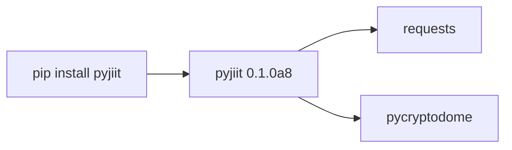
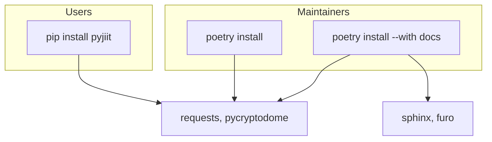

# Installation

pyjiit 0.1.0a8 on Python 3.9 or newer. Poetry for contributors. First call: [Quick start guide](2.2-quick-start-guide).

## PyPI

```bash
pip install pyjiit
```

That installs:

| Dist | Constraint | Role |
| --- | --- | --- |
| `pyjiit` | `0.1.0a8` | Client |
| `requests` | `>=2.32.3,<3.0.0` | HTTP |
| `pycryptodome` | `>=3.22.0,<4.0.0` | AES-CBC |



Check the import:

```python
from pyjiit import Webportal
from pyjiit.init import __version__
print(__version__)  # 0.1.0a8
print(Webportal())  # Driver Class for JIIT Webportal
```

`__version__` lives in `pyjiit/init.py`, not `__init__.py`. `__init__.py` only imports `Webportal`.

## Virtualenv

```bash
python3 -m venv .venv
source .venv/bin/activate
pip install pyjiit
```

On Windows, run `.venv\Scripts\activate`.

## From git

Fork used for these docs:

```bash
git clone https://github.com/tashifkhan/pyjiit.git
cd pyjiit
pip install .
```

Upstream:

```bash
git clone https://github.com/codelif/pyjiit.git
```

`pyproject.toml` `[project.urls]` still lists `https://github.com/codelif/pyjiit`.

## Poetry (maintainers)

```bash
pip install poetry
poetry install
```

Runtime deps only. Docs extra:

```bash
poetry install --with docs
```

That pulls Sphinx `>=7.4.7` and Furo `^2024.8.6` from `[tool.poetry.group.docs.dependencies]`. Build backend is `poetry.core.masonry.api`.



## Constraints that bite

- Python older than 3.9 fails `requires-python`.
- `pycryptodome` is not `pycrypto`. README.rst says the pin is explicit.
- Docs are RST, not Markdown. There is no `README.md`.
- `docs/requirements.txt` only pins `furo==2024.8.6`. CI uses Poetry's docs group instead.

## Network

Every live call needs `https://webportal.jiit.ac.in:6011`. Campus or home, TLS on 6011 has to work. The client does not pin certificates beyond what `requests` does.

## Verify

```python
from pyjiit import Webportal
from pyjiit.default import CAPTCHA
from pyjiit.encryption import generate_key, generate_local_name

assert generate_key()  # 16 bytes for today
assert generate_local_name()
w = Webportal()
# student_login needs real credentials
```

If `from pyjiit import WebPortal` fails, that is expected. The class name is `Webportal`.
