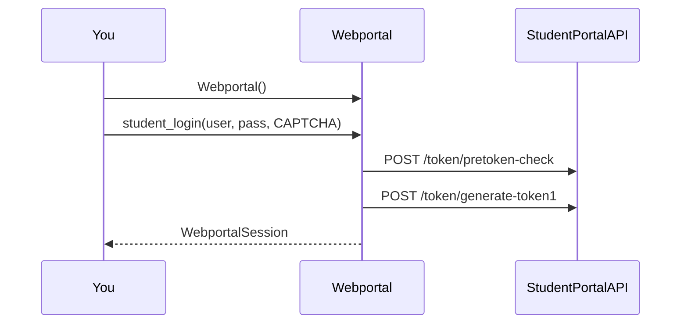
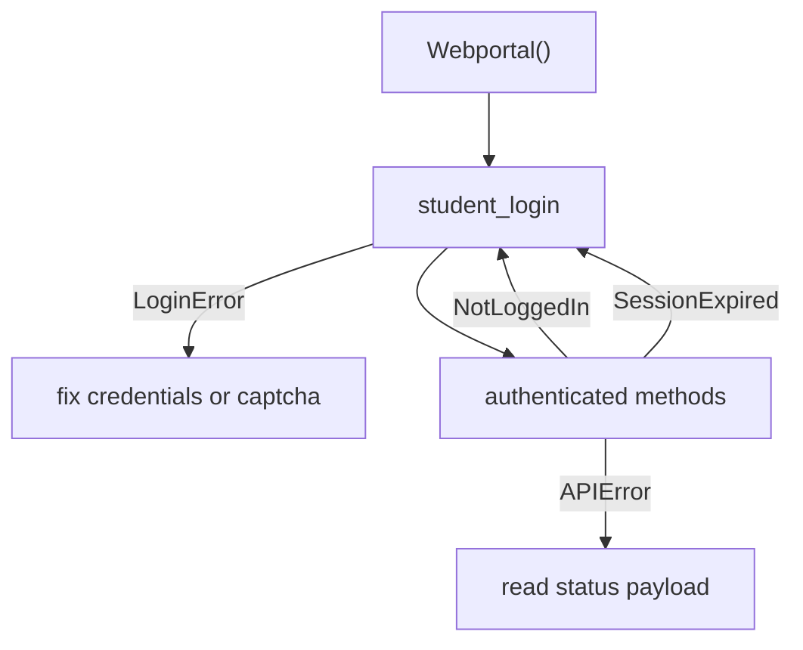

# Quick start guide

Copy these snippets after `pip install pyjiit`. Login internals: [Authentication flow](2.3-authentication-flow). Method catalog: [Core API reference](3-core-api-reference).

## Instantiate

```python
from pyjiit import Webportal

w = Webportal()
print(w)
# Driver Class for JIIT Webportal
assert w.session is None
```

## Log in

```python
from pyjiit import Webportal
from pyjiit.default import CAPTCHA

w = Webportal()
session = w.student_login("username", "password", CAPTCHA)
print(session.clientid)   # often JAYPEE
print(session.name)
print(session.memberid)
print(w.session is session)  # True
```

The third argument is required. Type is `Captcha` from `pyjiit.tokens`. `pyjiit.default.CAPTCHA` is a solved sample (`captcha="phw5n"`, plus `hidden` and a PNG).



## Attendance

```python
meta = w.get_attendance_meta()
header = meta.latest_header()
sem = meta.latest_semester()
data = w.get_attendance(header, sem)
print(data["currentSem"])
print(data["studentattendancelist"][0]["LTpercantage"])  # portal typo
```

Pick other rows from `meta.headers` and `meta.semesters` if you are not on the latest semester. Expect a long wait on `get_attendance`.

## Registration

```python
semesters = w.get_registered_semesters()
sem = semesters[0]
reg = w.get_registered_subjects_and_faculties(sem)
for subject in reg.subjects:
    print(subject.subject_code, subject.employee_name, subject.credits)
print(reg.total_credits)
```

## Exam schedule

```python
sems = w.get_semesters_for_exam_events()
events = w.get_exam_events(sems[0])
schedule = w.get_exam_schedule(events[0])
print(schedule)
```

Use `get_semesters_for_exam_events`, not `get_registered_semesters`, for this path. The portal keeps separate semester lists.

## Marks PDF

```python
sems = w.get_semesters_for_marks()
pdf = w.download_marks(sems[0])
with open("marks.pdf", "wb") as f:
    f.write(pdf)
```

## Grade card and GPA

```python
sems = w.get_semesters_for_grade_card()
card = w.get_grade_card(sems[0])
gpa = w.get_sgpa_cgpa()
print(gpa)
```

## Fees

```python
summary = w.get_fee_summary()
try:
    fines = w.get_fines_msc_charges()
except Exception:
    # empty queue often comes back as Failure / APIError
    fines = None
```

## Password

```python
w.set_password("old_password", "new_password")
```

Failures raise `AccountAPIError`.

## Catch login mistakes

```python
from pyjiit import Webportal
from pyjiit.default import CAPTCHA
from pyjiit.exceptions import LoginError, NotLoggedIn, SessionExpired, APIError

w = Webportal()
try:
    w.student_login("username", "password", CAPTCHA)
    meta = w.get_attendance_meta()
except LoginError as e:
    print("portal rejected login", e)
except NotLoggedIn:
    print("called an authenticated method too early")
except SessionExpired:
    print("token 401")
except APIError as e:
    print("other portal failure", e)
```



## Default captcha vs live captcha

```python
from pyjiit import Webportal
from pyjiit.default import CAPTCHA

w = Webportal()
live = w.get_captcha()
# live.image is base64 PNG, live.captcha is empty until you fill it
# CAPTCHA is already filled and is what the usage docs recommend
```
