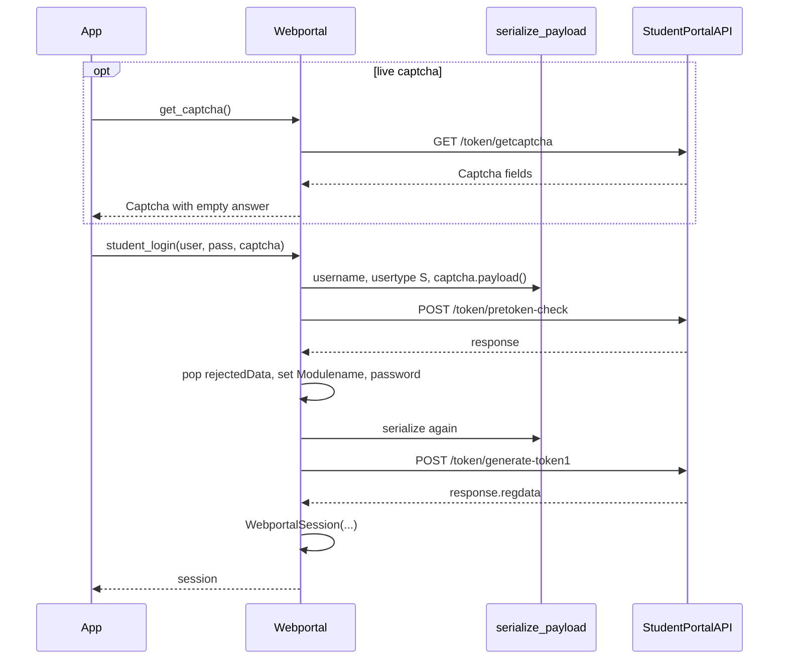
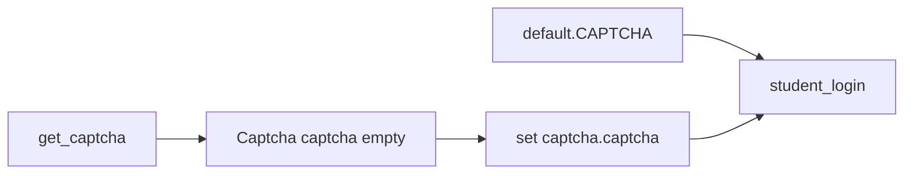
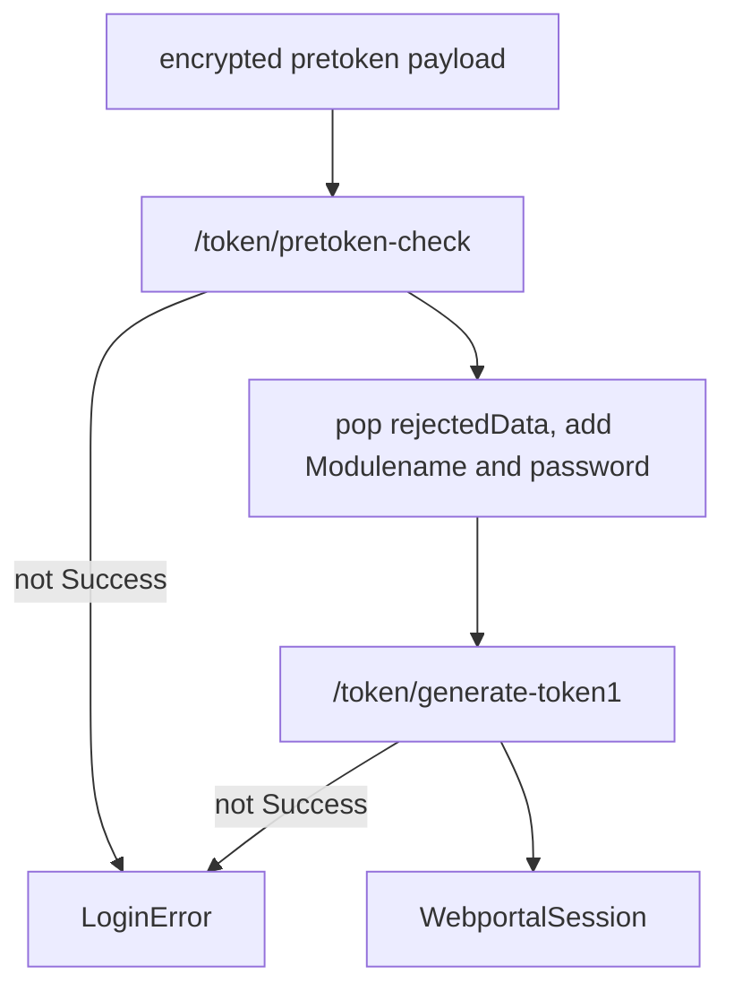
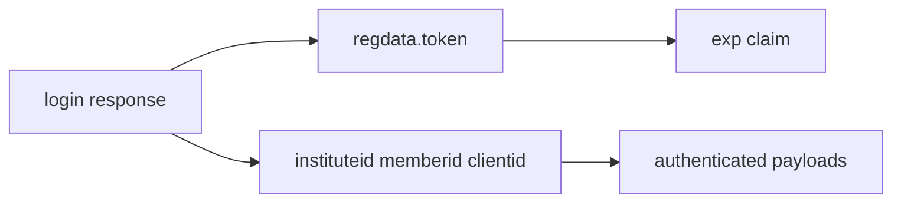

# Authentication flow

`Webportal.student_login` is two encrypted POSTs plus a `Captcha`. Session use after that: [Session management](3.2-session-management). Payload crypto: [Encryption system](4.1-encryption-system).

## Pieces

| Piece | Where |
| --- | --- |
| Username | enrollment / portal id |
| Password | sent as `passwordotpvalue` in phase 2 |
| `Captcha` | `captcha` + `hidden` via `Captcha.payload()` |
| `LocalName` | every request, from `generate_local_name()` |
| Encrypted body | `serialize_payload` |



## Captcha

`Captcha` in `pyjiit/tokens.py`:

| Field | Meaning |
| --- | --- |
| `captcha` | answer text |
| `hidden` | id string |
| `image` | base64 PNG |

`payload()` returns `{"captcha": ..., "hidden": ...}`. Image is display-only.

`get_captcha` GETs `/token/getcaptcha` through `__hit` (unauthenticated, still sends `LocalName`) and returns `Captcha.from_json(resp["response"])`.

`pyjiit.default.CAPTCHA` is a solved instance (`captcha="phw5n"`). Sphinx usage says you can send that premade object because captcha is not really tied to client state.



## Phase 1: pretoken-check

Endpoint: `POST /token/pretoken-check`.

Plain dict before encryption:

```python
{
    "username": username,
    "usertype": "S",
    "captcha": captcha.payload(),
}
```

`serialize_payload` dumps JSON with `separators=(',', ':')`, AES-CBC encrypts, base64-encodes. `__hit` uses `data=payload` and `exception=LoginError`.

On success, `resp["response"]` is the seed for phase 2. `rejectedData` is popped and discarded.

## Phase 2: generate-token1

Endpoint: `POST /token/generate-token1`.

Mutations on the phase 1 response:

- drop `rejectedData`
- `Modulename = "STUDENTMODULE"`
- `passwordotpvalue = password`

Encrypt again. Same `LoginError` path. `self.session = WebportalSession(resp["response"])`.



`test_signin.py` does the same two calls without `Webportal`, reading `UID` and `PASS` from the environment (the script message says USERNAME and PASSWORD; the actual keys are `UID` and `PASS`).

## WebportalSession after login

JWT `token` is split on `.`, payload base64-decoded, `exp` turned into `datetime`. `get_headers()` later sends `Authorization: Bearer {token}` and a new `LocalName`.



## What is not checked

`@authenticated` does **not** compare `session.expiry` to now. That block is commented because the portal's expiry is wrong for cookies that still work. You only see `SessionExpired` if `__hit` gets integer `status == 401`.

There is no cached-session constructor. README.rst still lists `Webportal` instantiation with `WebportalSession` as future work.
