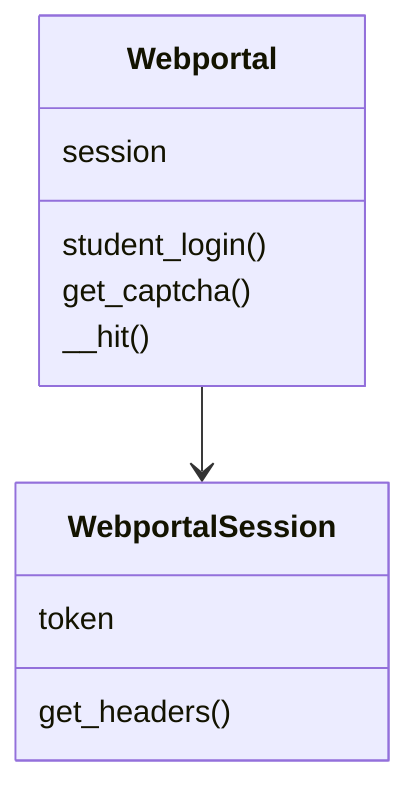
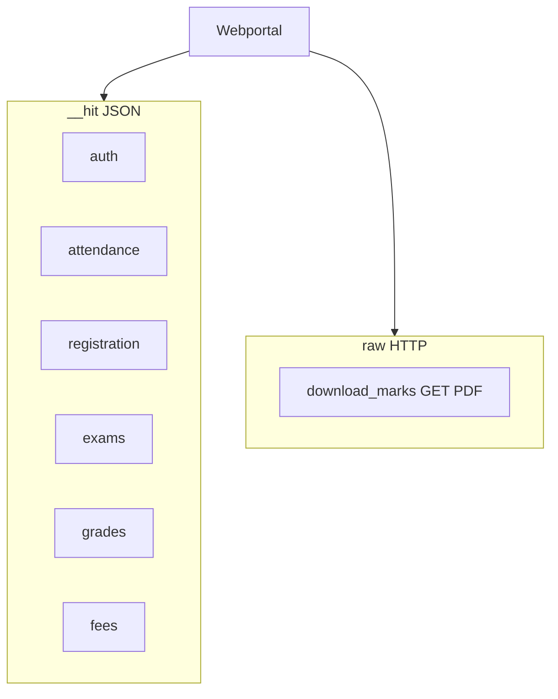
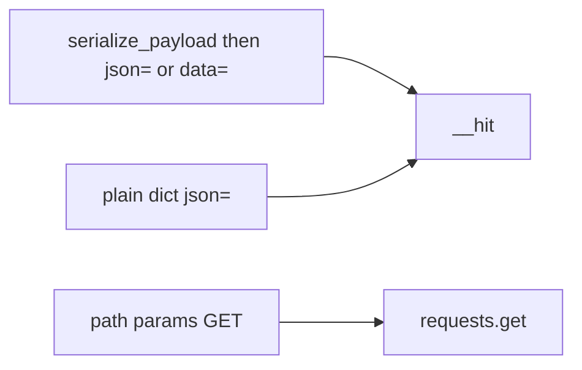
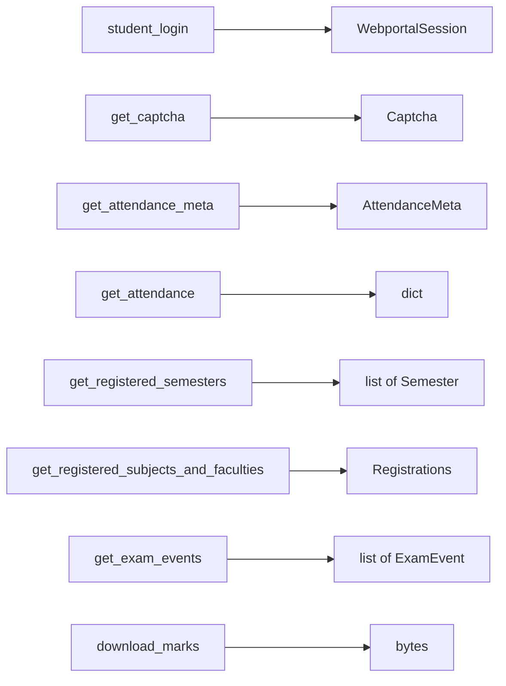
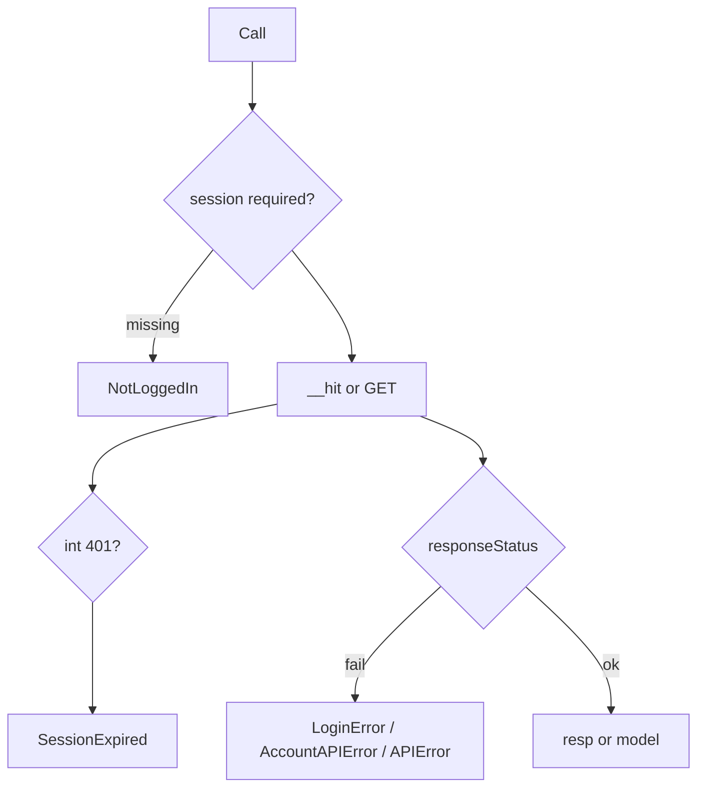

# Core API reference

`Webportal` and `WebportalSession` live in `pyjiit/wrapper.py`. Models are separate modules. Class detail: [Webportal class](3.1-webportal-class). Session fields: [Session management](3.2-session-management).

Base URL:

```
https://webportal.jiit.ac.in:6011/StudentPortalAPI
```



## Init

```python
from pyjiit import Webportal
w = Webportal()  # session is None
```

## `__hit`

Private. All JSON endpoints go through it except `download_marks`.

| kwarg | Effect |
| --- | --- |
| `exception` | class to raise on failed `responseStatus` (default `APIError`) |
| `authenticated` | merge `session.get_headers()` |
| `headers` | extra headers, then LocalName / Bearer merged in |

`requests.request(*args, **kwargs).json()`. Integer `401` raises `SessionExpired`.

## `@authenticated`

Raises `NotLoggedIn` when `self.session is None`. Copies the wrapped method's docstring.

## Method catalog

### Auth

| Method | HTTP | Endpoint | Encrypt body | Returns | Raises |
| --- | --- | --- | --- | --- | --- |
| `get_captcha()` | GET | `/token/getcaptcha` | no | `Captcha` | `APIError` |
| `student_login(username, password, captcha)` | POST, POST | `/token/pretoken-check`, `/token/generate-token1` | yes | `WebportalSession` | `LoginError` |

### Attendance

| Method | Endpoint | Encrypt | Returns |
| --- | --- | --- | --- |
| `get_attendance_meta()` | `/StudentClassAttendance/getstudentInforegistrationforattendence` | no | `AttendanceMeta` |
| `get_attendance(header, semester)` | `/StudentClassAttendance/getstudentattendancedetail` | yes | dict |

### Registration

| Method | Endpoint | Encrypt | Returns |
| --- | --- | --- | --- |
| `get_registered_semesters()` | `/reqsubfaculty/getregistrationList` | yes | `list[Semester]` |
| `get_registered_subjects_and_faculties(semester)` | `/reqsubfaculty/getfaculties` | yes | `Registrations` |
| `get_subject_choices(semester)` | `/studentchoiceprint/getsubjectpreference` | yes | dict |

### Exams

| Method | Endpoint | Encrypt | Returns |
| --- | --- | --- | --- |
| `get_semesters_for_exam_events()` | `/studentcommonsontroller/getsemestercode-withstudentexamevents` | yes | `list[Semester]` |
| `get_exam_events(semester)` | `/studentcommonsontroller/getstudentexamevents` | yes | `list[ExamEvent]` |
| `get_exam_schedule(exam_event)` | `/studentsttattview/getstudent-examschedule` | yes | dict |

`get_exam_events` sends `registationid` (portal spelling).

### Marks and grades

| Method | Endpoint | Notes |
| --- | --- | --- |
| `get_semesters_for_marks()` | `/studentcommonsontroller/getsemestercode-exammarks` | encrypted, `list[Semester]` |
| `download_marks(semester)` | GET `/studentsexamview/printstudent-exammarks/{instituteid}/{registration_id}/{registration_code}` | raw PDF bytes, not `__hit` |
| `get_semesters_for_grade_card()` | `/studentgradecard/getregistrationList` | encrypted |
| `get_grade_card(semester)` | `/studentgradecard/showstudentgradecard` | calls `__get_program_and_branch_id` first |
| `get_sgpa_cgpa(stynumber=0)` | `/studentsgpacgpa/getallsemesterdata` | encrypted dict |

`__get_program_and_branch_id` POSTs `/studentgradecard/getstudentinfo`.

### Fees and account

| Method | Endpoint | Encrypt | Returns |
| --- | --- | --- | --- |
| `get_fines_msc_charges()` | `/collectionpendingpayments/getpendingpaymentsdata` | yes | dict |
| `get_fee_summary()` | `/studentfeeledger/loadfeesummary` | no | dict |
| `get_student_bank_info()` | `/studentbankdetails/getstudentbankinfo` | no | dict |
| `set_password(old_pswd, new_pswd)` | `/clxuser/changepassword` | no | None, raises `AccountAPIError` |



## Payload patterns



Encrypted examples: login, `get_attendance`, most semester lists, exam schedule, grade card, SGPA, fines, subject choices.

Plain JSON: `get_attendance_meta`, `get_student_bank_info`, `set_password`, `get_fee_summary`.

Login uses `data=` (raw body). Most later encrypted calls pass the ciphertext string as `json=`.

## Return types



## Exception flow


