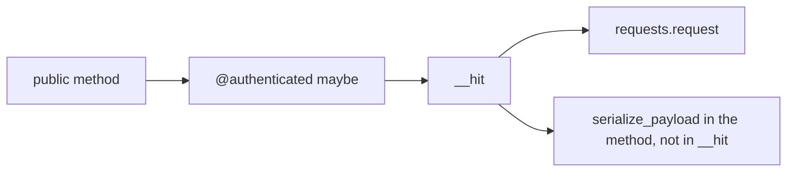
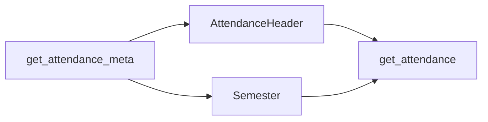
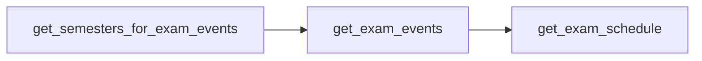
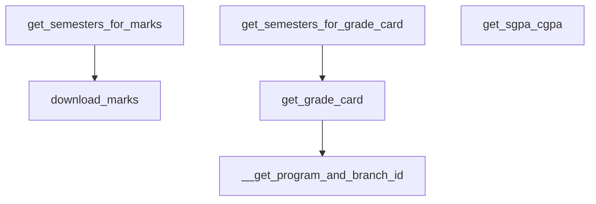
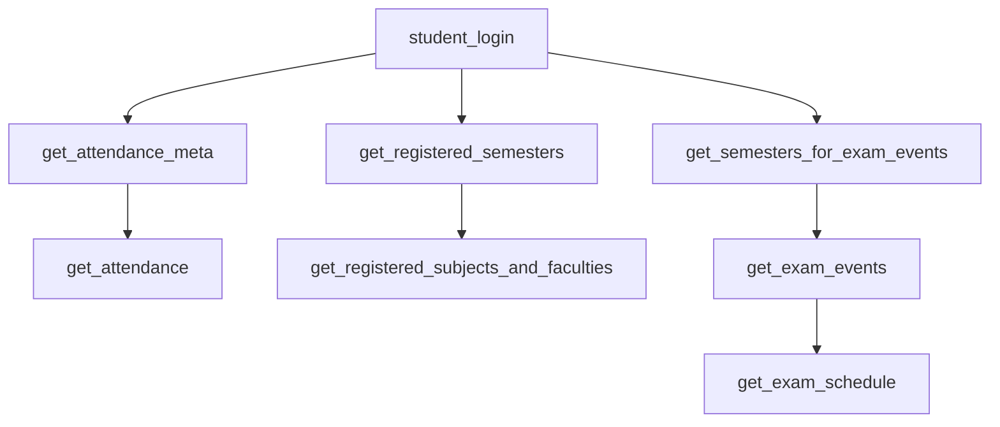

# Webportal class

`Webportal` in `pyjiit/wrapper.py` is the client. `from pyjiit import Webportal` is the public name. Session object: [Session management](3.2-session-management). Models: [Data models](3.3-data-models).

```python
Webportal()
```

`self.session` starts as `None`. `__str__` is `"Driver Class for JIIT Webportal"`. API constant:

```python
API = "https://webportal.jiit.ac.in:6011/StudentPortalAPI"
```

## Internals



Encryption happens in the caller (`student_login`, `get_attendance`, …). `__hit` only attaches headers and parses JSON.

### `__hit`

```python
def __hit(self, *args, **kwargs):
    exception = kwargs.pop("exception", APIError)
    # authenticated -> session.get_headers(), else LocalName only
    resp = requests.request(*args, **kwargs).json()
    if type(resp["status"]) is int and resp["status"] == 401:
        raise SessionExpired(resp["error"])
    if resp["status"]["responseStatus"] != "Success":
        raise exception("status:\n" + pformat(resp["status"]))
    return resp
```

### `@authenticated`

```python
def authenticated(method):
    @wraps(method)
    def wrapper(self, *args, **kwargs):
        if self.session is None:
            raise NotLoggedIn
        return method(self, *args, **kwargs)
    wrapper.__doc__ = method.__doc__
    return wrapper
```

The JWT expiry check is commented out.

## Auth methods

### `student_login(username, password, captcha: Captcha) -> WebportalSession`

Two POSTs. Raises `LoginError`. Sets `self.session`. See [Authentication flow](2.3-authentication-flow).

### `get_captcha() -> Captcha`

Unauthenticated GET `/token/getcaptcha`.

## Account

### `get_student_bank_info()`

Authenticated. Plain JSON `instituteid`, `studentid` (`memberid`). POST `/studentbankdetails/getstudentbankinfo`. Returns `resp["response"]`.

### `set_password(old_pswd, new_pswd)`

Plain JSON: `membertype`, `oldpassword`, `newpassword`, `confirmpassword` (same as new). POST `/clxuser/changepassword`. `exception=AccountAPIError`. No useful return.

## Attendance

### `get_attendance_meta() -> AttendanceMeta`

Plain JSON: `clientid`, `instituteid`, `membertype`. POST `/StudentClassAttendance/getstudentInforegistrationforattendence`.

### `get_attendance(header: AttendanceHeader, semester: Semester) -> dict`

Encrypted: `clientid`, `instituteid`, `registrationcode`, `registrationid`, `stynumber`. POST `/StudentClassAttendance/getstudentattendancedetail`.



## Exams

### `get_semesters_for_exam_events() -> list[Semester]`

Encrypted: `clientid`, `instituteid`, `memberid`. Parses `response.semesterCodeinfo.semestercode`.

### `get_exam_events(semester) -> list[ExamEvent]`

Encrypted: `instituteid`, `registationid` (typo in the portal). Parses `response.eventcode.examevent`.

### `get_exam_schedule(exam_event: ExamEvent) -> dict`

Encrypted: `instituteid`, `registrationid`, `exameventid`. POST `/studentsttattview/getstudent-examschedule`.



## Registration

### `get_registered_semesters() -> list[Semester]`

Encrypted: `instituteid`, `studentid`. Parses `response.registrations`.

### `get_registered_subjects_and_faculties(semester) -> Registrations`

Encrypted: `instituteid`, `studentid`, `registrationid`. POST `/reqsubfaculty/getfaculties`.

### `get_subject_choices(semester) -> dict`

Encrypted: `instituteid`, `clientid`, `registrationid`. POST `/studentchoiceprint/getsubjectpreference`.

## Marks and grades

### `get_semesters_for_marks() -> list[Semester]`

Encrypted: `instituteid`, `memberid`. Parses `response.semestercode`.

### `download_marks(semester) -> bytes`

GET with Bearer + LocalName. Path includes institute id, registration id, registration code. HTTP 200 returns `response.content`. Else `APIError` with status and text.

### `get_semesters_for_grade_card() -> list[Semester]`

Encrypted: `{ "instituteid": ... }`. Parses `response.registrations`.

### `__get_program_and_branch_id() -> dict`

Private. Encrypted `{ "instituteid": ... }`. Returns `{"programid", "branchid"}` from `response.studentinfo`.

### `get_grade_card(semester) -> dict`

Calls `__get_program_and_branch_id`, then encrypted POST `/studentgradecard/showstudentgradecard` with `branchid`, `instituteid`, `programid`, `registrationid`.

### `get_sgpa_cgpa(stynumber: int = 0) -> dict`

Encrypted: `instituteid`, `studentid`, `stynumber`. POST `/studentsgpacgpa/getallsemesterdata`.



## Fees

### `get_fines_msc_charges() -> dict`

Encrypted: `instituteid`, `studentid`. POST `/collectionpendingpayments/getpendingpaymentsdata`. Empty pending list is a Failure from the portal, so `__hit` raises `APIError`.

### `get_fee_summary() -> dict`

Plain JSON `{ "instituteid": ... }`. POST `/studentfeeledger/loadfeesummary`.

## Typical order



```python
from pyjiit import Webportal
from pyjiit.default import CAPTCHA

w = Webportal()
w.student_login("username", "password", CAPTCHA)
meta = w.get_attendance_meta()
att = w.get_attendance(meta.latest_header(), meta.latest_semester())
```
