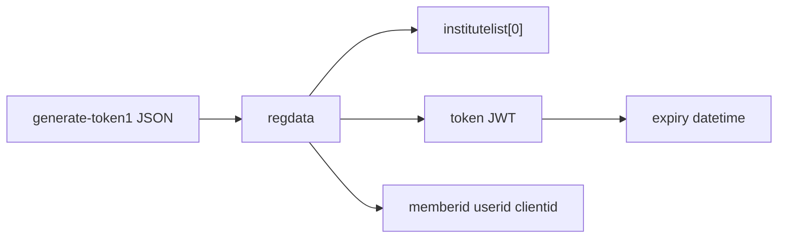
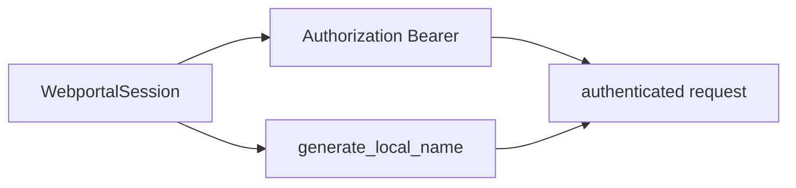
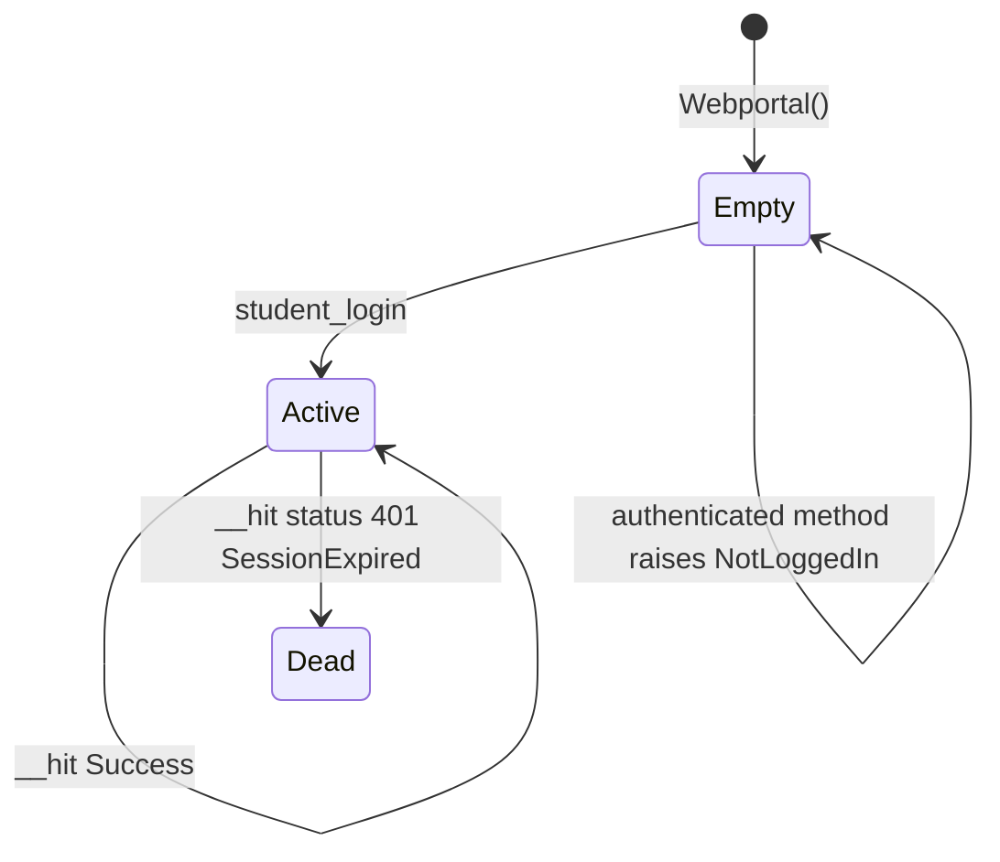
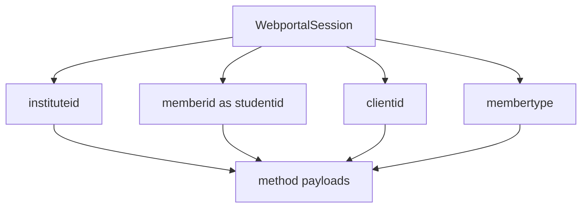
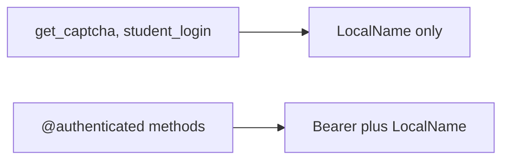

# Session management

`WebportalSession` is created from the login JSON and stored on `Webportal.session`. Login steps: [Authentication flow](2.3-authentication-flow). Decorator and `__hit`: [Webportal class](3.1-webportal-class).

## Construction

```python
class WebportalSession:
    def __init__(self, resp: dict) -> None:
        self.raw_response = resp
        self.regdata = resp["regdata"]
        institute = self.regdata["institutelist"][0]
        self.institute = institute["label"]
        self.instituteid = institute["value"]
        self.memberid = self.regdata["memberid"]
        self.userid = self.regdata["userid"]
        self.token = self.regdata["token"]
        expiry_timestamp = json.loads(base64.b64decode(self.token.split(".")[1]))["exp"]
        self.expiry = datetime.fromtimestamp(expiry_timestamp)
        self.clientid = self.regdata["clientid"]
        self.membertype = self.regdata["membertype"]
        self.name = self.regdata["name"]
```



There is no public constructor from a saved token. README.rst still wants `Webportal` init with a cached `WebportalSession`.

## Headers

```python
def get_headers(self):
    return {
        "Authorization": f"Bearer {self.token}",
        "LocalName": generate_local_name(),
    }
```

`LocalName` is new on every call. It is four random chars + date sequence + five random chars, AES-encrypted, base64.



## Lifecycle



`@authenticated` only checks `self.session is None`. It does not read `expiry`. Comments in `wrapper.py` say the portal's expiry is wrong.

`SessionExpired` still exists and fires from `__hit` when `status` is the integer `401`. After that, call `student_login` again.

## IDs reused in payloads

| Field | Typical use |
| --- | --- |
| `instituteid` | almost every POST |
| `memberid` | as `studentid` or `memberid` |
| `clientid` | attendance meta, exam semesters, subject choices |
| `membertype` | attendance meta, `set_password` |
| `token` | Bearer header only |



## Unauthenticated vs authenticated



`download_marks` calls `self.session.get_headers()` itself and uses `requests.get`, so it still sends both headers.

## Persistence

Nothing writes the session to disk. Keep the `Webportal` instance in memory. If you pickle `WebportalSession`, you are on your own. The JWT still has to be accepted by the portal.
