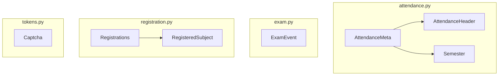
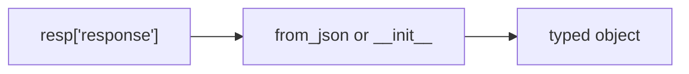
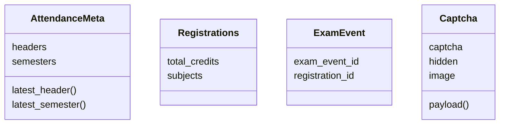

# Data models

Typed wrappers around portal JSON. Attendance: [Attendance models](3.3.1-attendance-models). Exams: [Exam models](3.3.2-exam-models). Registration: [Registration models](3.3.3-registration-models). Captcha: [Tokens and captcha](3.3.4-tokens-and-captcha).

Many methods still return raw `dict` (`get_attendance`, `get_exam_schedule`, grade card, fees). Models exist where the wrapper bothers to parse.

## Factories

Every dataclass except `AttendanceMeta` and `Registrations` has `from_json(resp: dict)`. Those two take the full `response` object in `__init__` and map child lists.

## Where they show up

| Model | Produced by |
| --- | --- |
| `Captcha` | `get_captcha`, `Captcha.from_json` |
| `WebportalSession` | `student_login` (not a dataclass) |
| `AttendanceMeta` | `get_attendance_meta` |
| `AttendanceHeader`, `Semester` | inside `AttendanceMeta`; `Semester` also from several semester-list methods |
| `Registrations` / `RegisteredSubject` | `get_registered_subjects_and_faculties` |
| `ExamEvent` | `get_exam_events` |

`Semester` is defined in `attendance.py` even when used for exams, marks, and grade cards.

## Field mapping style

Portal keys are lowercase mashed words (`registrationid`, `employeename`, `exameventid`). Python attributes use underscores (`registration_id`, `employee_name`, `exam_event_id`). `from_json` is the only translation layer.

## What is not modeled

Bank info, fee summary, fines, attendance detail rows, exam schedule, grade card, SGPA/CGPA, subject choices. Those stay as the portal's dicts, typos included (`LTpercantage`, `registationid` on the way out).
