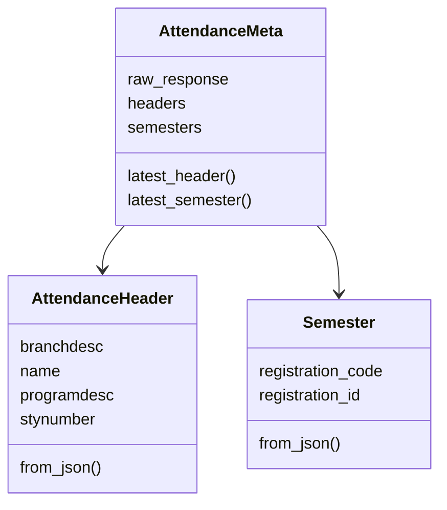
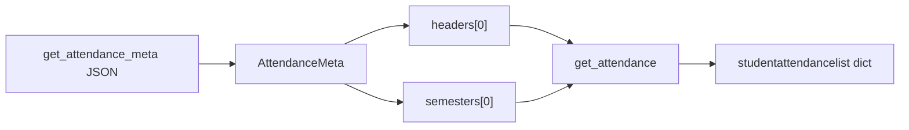

# Attendance models

`pyjiit/attendance.py`. Used by `get_attendance_meta` and `get_attendance`, and `Semester` is reused across the wrapper.

## AttendanceHeader

Dataclass from each `headerlist` row.

| Attribute | JSON key |
| --- | --- |
| `branchdesc` | `branchdesc` |
| `name` | `name` |
| `programdesc` | `programdesc` |
| `stynumber` | `stynumber` |

`get_attendance` sends `stynumber` in the encrypted body.

## Semester

| Attribute | JSON key |
| --- | --- |
| `registration_id` | `registrationid` |
| `registration_code` | `registrationcode` |

Same class is built from:

- `AttendanceMeta.semesters` (`semlist`)
- `get_registered_semesters` (`response.registrations`)
- `get_semesters_for_exam_events` (`response.semesterCodeinfo.semestercode`)
- `get_semesters_for_marks` (`response.semestercode`)
- `get_semesters_for_grade_card` (`response.registrations`)



## AttendanceMeta

```python
class AttendanceMeta:
    def __init__(self, resp) -> None:
        self.raw_response = resp
        self.headers = [AttendanceHeader.from_json(i) for i in resp["headerlist"]]
        self.semesters = [Semester.from_json(i) for i in resp["semlist"]]

    def latest_header(self):
        return self.headers[0]

    def latest_semester(self):
        return self.semesters[0]
```

`latest_*` is "first element", not a date sort. Empty lists would IndexError.



## Detail rows

`get_attendance` does **not** wrap rows. You get the portal dict. Usage docs show keys like `LTpercantage`, `Lpercentage`, `Lsubjectcomponentcode`.

```python
meta = w.get_attendance_meta()
data = w.get_attendance(meta.latest_header(), meta.latest_semester())
rows = data["studentattendancelist"]
```
