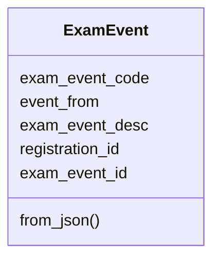
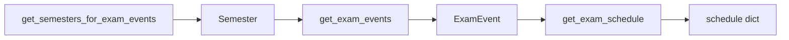

# Exam models

`ExamEvent` is the only exam dataclass (`pyjiit/exam.py`). Schedules stay as dicts.

```python
@dataclass
class ExamEvent:
    exam_event_code: str
    event_from: int
    exam_event_desc: str
    registration_id: str
    exam_event_id: str
```

| Attribute | JSON key |
| --- | --- |
| `exam_event_code` | `exameventcode` |
| `event_from` | `eventfrom` |
| `exam_event_desc` | `exameventdesc` |
| `registration_id` | `registrationid` |
| `exam_event_id` | `exameventid` |

`from_json` passes those five values positionally.



## Call chain



`get_exam_events` POSTs encrypted `{ "instituteid", "registationid": semester.registration_id }` to `/studentcommonsontroller/getstudentexamevents` and maps `response.eventcode.examevent`.

`get_exam_schedule` POSTs encrypted `{ "instituteid", "registrationid": exam_event.registration_id, "exameventid": exam_event.exam_event_id }` to `/studentsttattview/getstudent-examschedule`.

Do not mix this `Semester` list with `get_registered_semesters`. The portal has a dedicated exam-events semester endpoint.

```python
sems = w.get_semesters_for_exam_events()
events = w.get_exam_events(sems[0])
schedule = w.get_exam_schedule(events[0])
```
