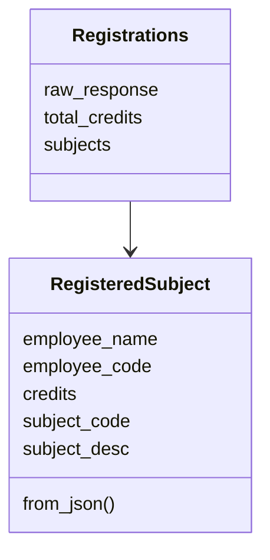
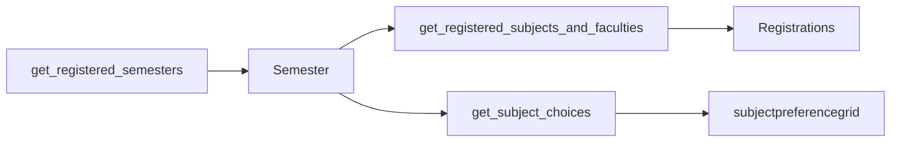

# Registration models

`pyjiit/registration.py`. `get_registered_subjects_and_faculties` returns `Registrations`. Subject choice print is a raw dict.

## RegisteredSubject

| Attribute | JSON key |
| --- | --- |
| `employee_name` | `employeename` |
| `employee_code` | `employeecode` |
| `minor_subject` | `minorsubject` |
| `remarks` | `remarks` |
| `stytype` | `stytype` |
| `credits` | `credits` |
| `subject_code` | `subjectcode` |
| `subject_component_code` | `subjectcomponentcode` |
| `subject_desc` | `subjectdesc` |
| `subject_id` | `subjectid` |
| `audtsubject` | `audtsubject` |

`from_json` is positional, same order.

## Registrations

```python
class Registrations:
    def __init__(self, resp: dict) -> None:
        self.raw_response = resp
        self.total_credits = resp["totalcreditpoints"]
        self.subjects = [RegisteredSubject.from_json(i) for i in resp["registrations"]]
```



## How you get them



```python
sem = w.get_registered_semesters()[0]
reg = w.get_registered_subjects_and_faculties(sem)
print(reg.total_credits)
print(reg.subjects[0].employee_name, reg.subjects[0].subject_code)
```

Usage docs show credits as floats (`4.0`, `22.5`) even though the annotation is `int`.

## Subject choices

`get_subject_choices(semester)` is not a model. Comment in `wrapper.py`: if a subject is allocated, `resp["response"]["subjectpreferencegrid"]` is a list of dicts with `subjectrunning == "Y"`.
