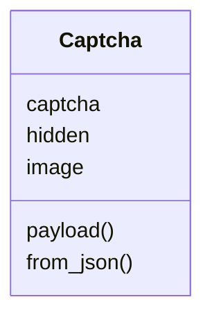
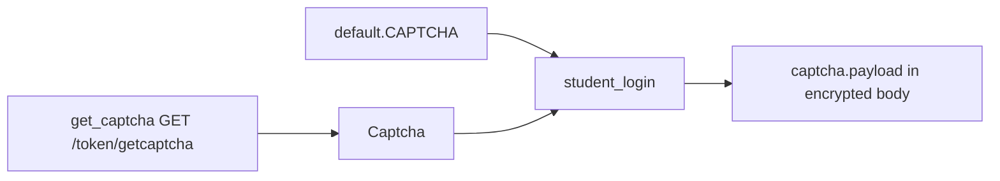
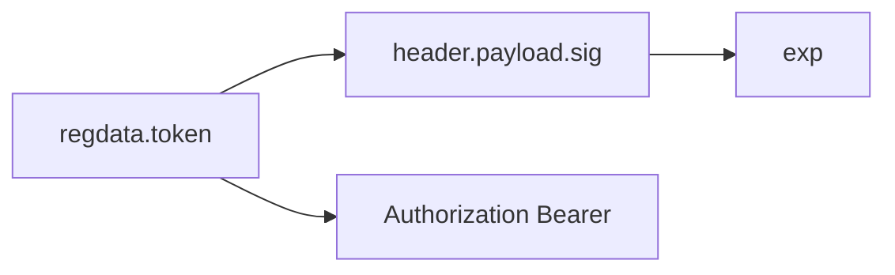

# Tokens and captcha

Login tokens live on `WebportalSession` (`regdata["token"]`, a JWT). The captcha type is `Captcha` in `pyjiit/tokens.py`. A filled sample is `CAPTCHA` in `pyjiit/default.py`.

## Captcha

```python
@dataclass
class Captcha:
    captcha: str
    hidden: str
    image: str
```

| Field | Role |
| --- | --- |
| `captcha` | answer sent to pretoken-check |
| `hidden` | captcha id sent with the answer |
| `image` | base64 PNG, not included in `payload()` |

```python
def payload(self) -> dict:
    return {"captcha": self.captcha, "hidden": self.hidden}

@staticmethod
def from_json(resp: dict) -> "Captcha":
    return Captcha(
        resp["captcha"]["captcha"],
        resp["captcha"]["hidden"],
        resp["captcha"]["image"],
    )
```



## Webportal usage



`get_captcha` returns a challenge with an empty answer until you set `captcha.captcha`. `student_login` requires the object. There is no overload that skips it.

Default sample: `captcha="phw5n"`, `hidden="gmBctEffdSg="`, plus a long PNG. Sphinx usage says this is enough in practice.

## JWT on the session

Not a separate class. `WebportalSession` splits `token` on `.`, base64-decodes the payload, reads `exp`. That timestamp is stored as `expiry` and currently unused for access control.


