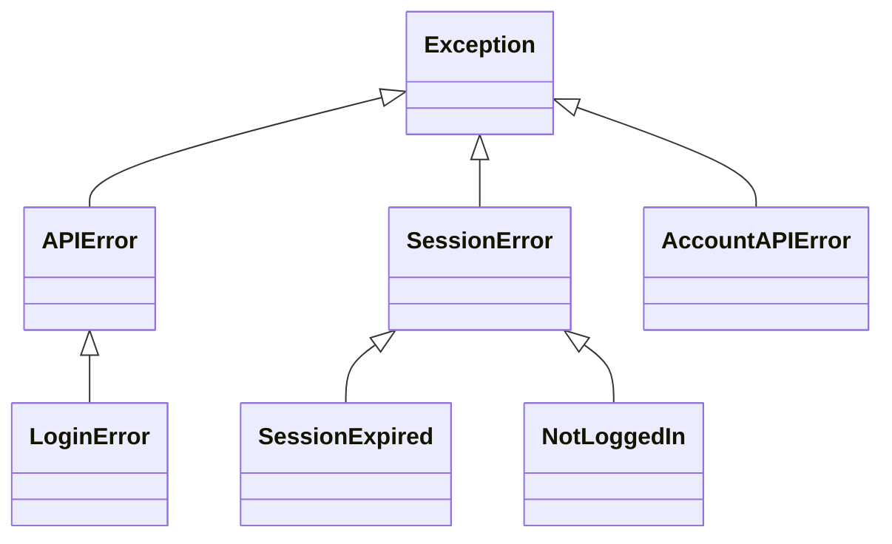
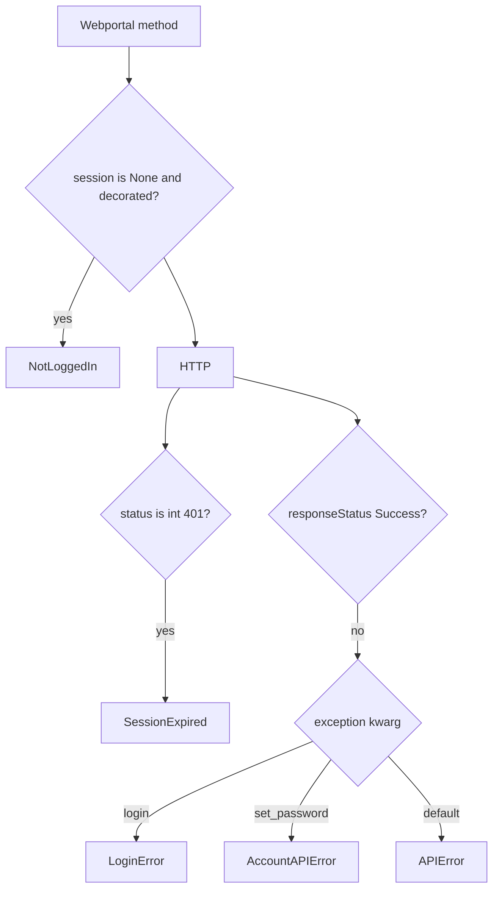
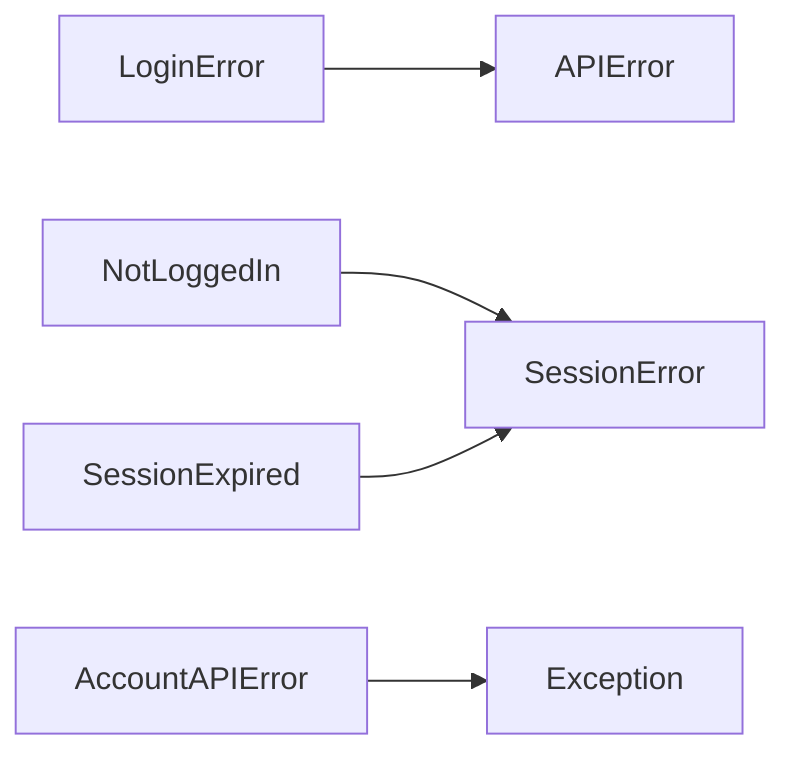

# Exception handling

All custom types are in `pyjiit/exceptions.py`. They are empty subclasses. Messages come from `__hit` (`pformat` of `status`) or from `download_marks`.



`SessionError` is not raised directly. Catch it to cover both `NotLoggedIn` and `SessionExpired`. `APIError` does **not** catch session errors.

## APIError

Default for `__hit` when `responseStatus != "Success"`. Also raised by `download_marks` on non-200.

Typical: bad parameters, portal Failure payloads, empty fines queue (`NO APPROVED REQUEST FOUND`).

## LoginError

Subclass of `APIError`. Passed as `exception=LoginError` on both login POSTs. Bad password, bad captcha, locked account, anything those endpoints put in `status`.

## SessionError

Base for session problems. Unused as a raise type.

## SessionExpired

`__hit` when `type(resp["status"]) is int and resp["status"] == 401`. Message is `resp["error"]`. The decorator's expiry check is commented out, so this is the live path.

## NotLoggedIn

`@authenticated` when `self.session is None`. No message.

## AccountAPIError

`set_password` only (`exception=AccountAPIError`). Sibling of `APIError`, not a subclass. Catch both if you treat all portal failures the same.



## Catching

```python
from pyjiit.exceptions import (
    APIError,
    LoginError,
    SessionError,
    SessionExpired,
    NotLoggedIn,
    AccountAPIError,
)

try:
    w.student_login(user, password, captcha)
    w.get_attendance_meta()
    w.set_password(old, new)
except LoginError:
    ...
except NotLoggedIn:
    ...
except SessionExpired:
    ...
except AccountAPIError:
    ...
except APIError:
    ...
except SessionError:
    ...
```

Order matters: `LoginError` before `APIError`. `NotLoggedIn` / `SessionExpired` before `SessionError`.


