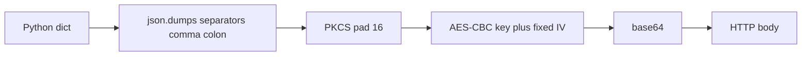
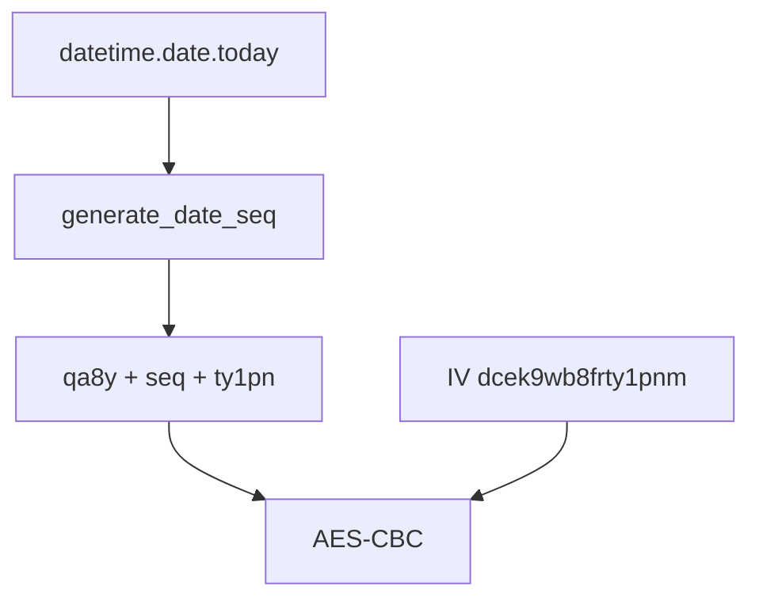
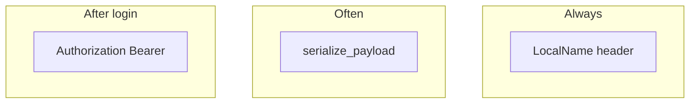

# Security and encryption

The portal encrypts several request bodies with AES-CBC and a key that changes with the calendar date. pyjiit copies that scheme in `pyjiit/encryption.py`. Implementation: [Encryption system](4.1-encryption-system). Caveats: [Security considerations](4.2-security-considerations).

arvindpunk reverse-engineered the payload crypto. README.rst credits that work.

## What is encrypted

`LocalName` is a second ciphertext: random + date sequence + random, encrypted, base64. Every `__hit` request sends it, login included.

TLS is ordinary HTTPS to port 6011. The library does not add certificate pinning.

## Daily key

Comment in `generate_key`: the key resets every day at 0000 IST. `generate_date_seq` uses `datetime.date.today()` on the local machine unless you pass a `date`.

## Login vs later calls

Login **must** encrypt. Several later POSTs encrypt too (`get_attendance`, semester lists, exams, grades, fines, subject choices). Some authenticated calls send plain JSON (`get_attendance_meta`, bank info, `set_password`, `get_fee_summary`). Bearer token plus `LocalName` still go out.

## Threat model in one paragraph

This is a client for a campus portal that already ships a fixed IV and a date-derived key in JavaScript. pyjiit is not a new cryptosystem. Anyone who can run the portal in a browser already has the same constants. Use it on a machine you trust. Do not log payloads. Do not commit `UID` / `PASS`.
