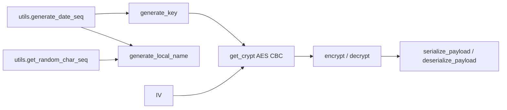
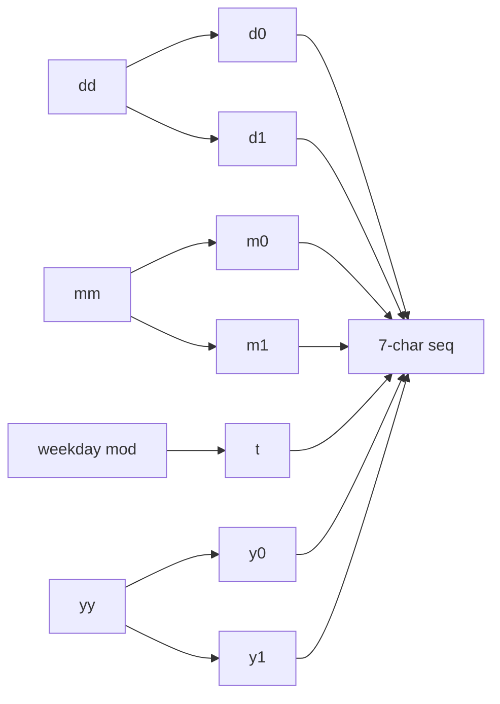
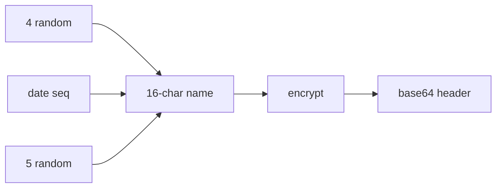
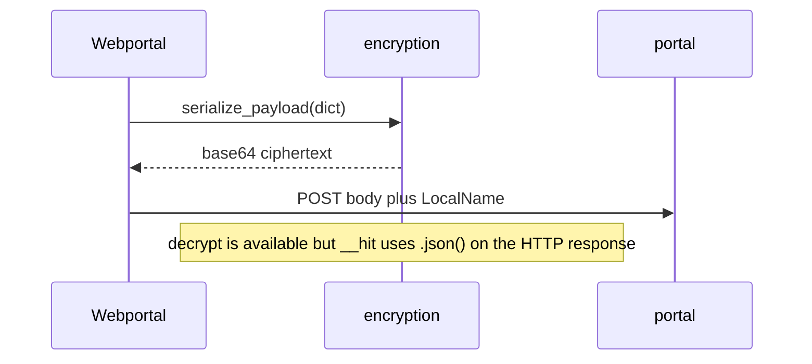

# Encryption system

`pyjiit/encryption.py` plus `pyjiit/utils.py`. How `__hit` uses headers: [Webportal class](3.1-webportal-class). Risks: [Security considerations](4.2-security-considerations).



## Constants

```python
IV = b"dcek9wb8frty1pnm"  # 16 bytes, never rotated
```

AES mode is CBC. Padding is Crypto.Util.Padding `pad` / `unpad` with block size 16.

## Date sequence

`generate_date_seq(date=None)` in `utils.py`:

1. Day and month zero-padded to 2 digits, year last two digits, weekday `(date.weekday()+1) % 7` (Sunday becomes 0).
2. Interleave: `day[0] + month[0] + year[0] + weekday + day[1] + month[1] + year[1]`.

Tuesday 5 March 2024: day `05`, month `03`, year `24`, weekday `2`. Sequence `0+0+2+2+5+3+4` = `0022534`.



## Key

```python
def generate_key(date=None) -> bytes:
    return ("qa8y" + pyjiit.utils.generate_date_seq(date) + "ty1pn").encode()
```

16 ASCII bytes, so AES-128, not 32-byte AES-256. Docstrings that say 32-byte are wrong.

## LocalName

```python
def generate_local_name(date=None) -> str:
    name_bytes = (
        pyjiit.utils.get_random_char_seq(4)
        + pyjiit.utils.generate_date_seq(date)
        + pyjiit.utils.get_random_char_seq(5)
    ).encode()
    return base64.b64encode(encrypt(name_bytes)).decode()
```

`get_random_char_seq` draws from `string.digits + string.ascii_letters`.



## serialize / deserialize

```python
def serialize_payload(payload: dict) -> str:
    raw = json.dumps(payload, separators=(",", ":")).encode()
    pbytes = encrypt(raw)
    return base64.b64encode(pbytes).decode()

def deserialize_payload(payload: str) -> dict:
    pbytes = base64.b64decode(payload)
    raw = decrypt(pbytes)
    return json.loads(raw)
```

Compact JSON matters. Extra spaces would change the ciphertext and the portal would reject it.

`encryption.py` has a `__main__` that `deserialize_payload(sys.argv[1])` and prints the dict.



`__hit` does **not** call `deserialize_payload` on responses. It parses JSON from `requests`. Encryption is a request-body trick the portal invented, not a full envelope on every response.

## get_crypt

```python
def get_crypt(key: bytes, iv: bytes):
    return AES.new(key, AES.MODE_CBC, iv)
```

`encrypt` and `decrypt` each build a fresh cipher from `generate_key()` and `IV`. You cannot reuse a cipher object across calls, and you should not try.
