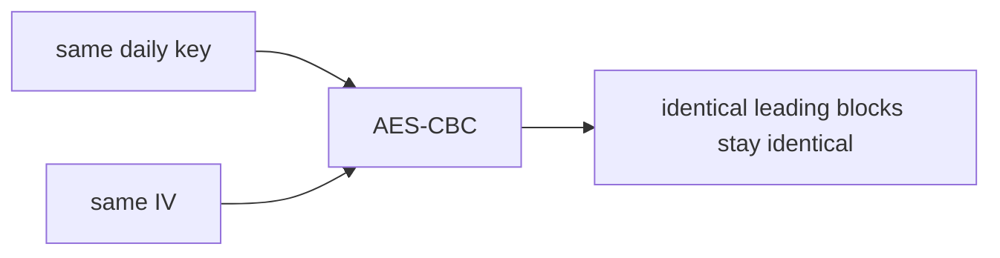
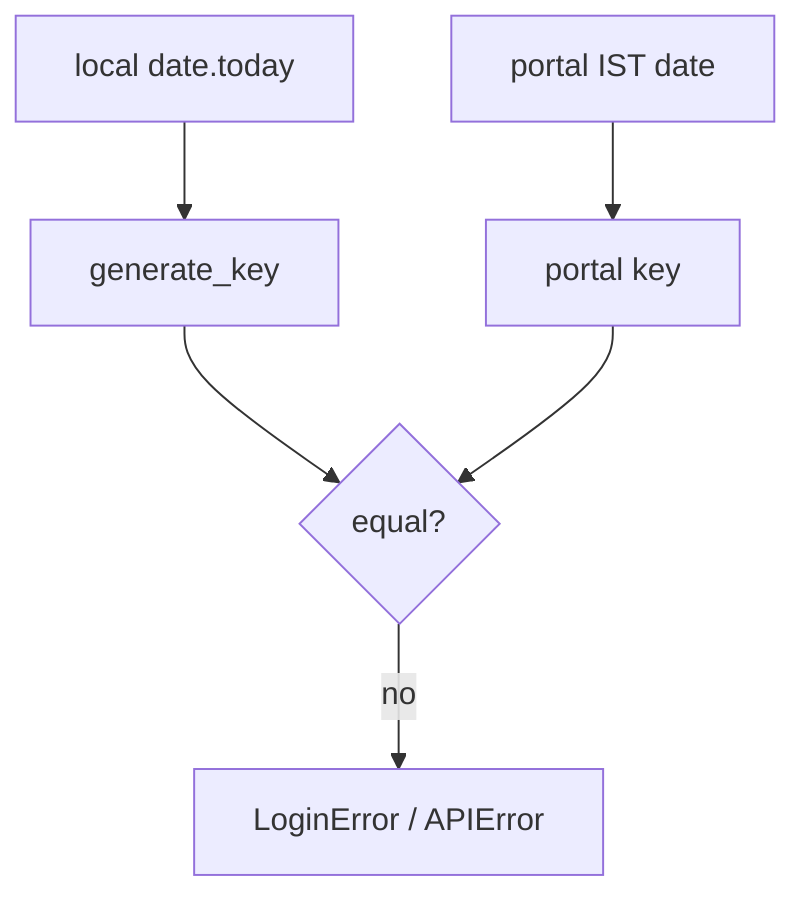
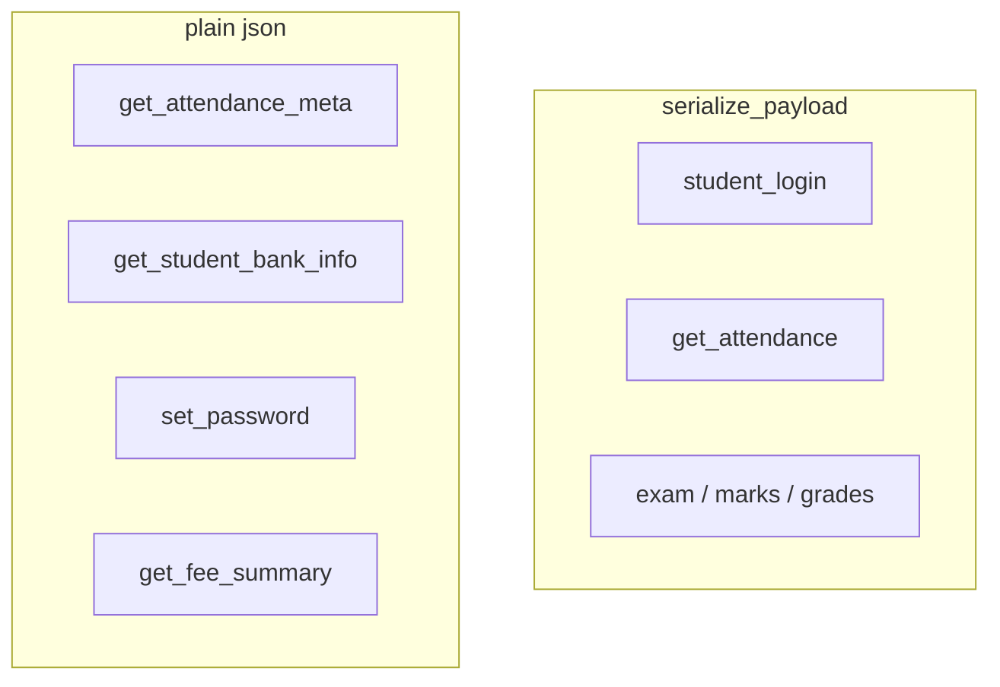

# Security considerations

pyjiit clones the portal's own crypto. That is enough to speak the protocol. It is not a design you would pick for a new API.

## Fixed IV

`IV = b"dcek9wb8frty1pnm"` never changes. CBC with a static IV repeats the first-block pattern for identical first blocks. The daily key and compact JSON reduce how often that happens. It is still a static IV.

## Date-derived key

Anyone who knows the format can compute today's key. The portal's frontend does the same. The key is obfuscation against casual inspection of HTTP bodies, not a secret shared with the student.

If the machine clock is not IST, `date.today()` can disagree with the portal at midnight. Login then fails until the date matches.

## Captcha default

`pyjiit.default.CAPTCHA` is a solved challenge checked into the repo. The usage docs treat that as the normal login path. If the portal ever binds captcha to a session, that shortcut breaks. Until then, bots and this library look the same.

## JWT expiry ignored

`WebportalSession.expiry` is parsed and then unused. A stolen token works until the portal returns 401. Store tokens like passwords.

## Plain JSON endpoints

After login, several POSTs send `instituteid` and ids in clear JSON. TLS still covers the wire. Anyone who can read the process memory or a debug proxy sees student ids immediately.

`set_password` sends old and new password in that plain JSON body. Use HTTPS, and do not log `__hit` kwargs.

## Credentials in tests

`test_signin.py` reads `UID` and `PASS` from the environment. The print says "export USERNAME and PASSWORD", which is wrong. Do not hardcode enrollment numbers. Do not commit `.env` files.

## Dependencies

`pycryptodome` is pinned to `>=3.22.0,<4`. Do not swap in `pycrypto`. `requests` is the HTTP stack. There is no certificate pin and no retry/backoff beyond what you add.

## What this library will not do

- It will not hide you from the institute. Requests still come from your account.
- It will not keep a session secret on disk.
- It will not sanitize portal HTML/PDF (`download_marks` returns raw bytes).
- It is MIT-licensed research code at `0.1.0a8`. Treat it that way.
