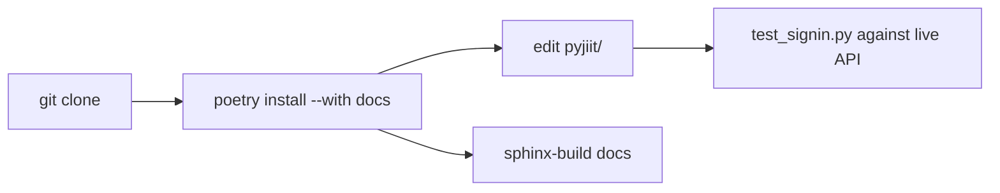

# Development guide

Layout of the clone, Poetry, and how people actually poke the portal. Disk map: [Project structure](5.1-project-structure). Lockfile: [Build system and dependencies](5.2-build-system-and-dependencies). Manual tests: [Testing and development workflow](5.3-testing-and-development-workflow).

## Clone

```bash
git clone https://github.com/tashifkhan/pyjiit.git
cd pyjiit
pip install poetry
poetry install --with docs
```

Upstream remote is `https://github.com/codelif/pyjiit`.



## What you will touch

| Path | Why |
| --- | --- |
| `pyjiit/wrapper.py` | new endpoints, `__hit` kwargs |
| `pyjiit/encryption.py` | payload format |
| `pyjiit/attendance.py`, `exam.py`, `registration.py`, `tokens.py` | models |
| `pyjiit/exceptions.py` | new error types |
| `docs/*.rst` | Sphinx pages |
| `test_signin.py` | live login smoke test |

There is no pytest tree in the repo.

## Local checks

```bash
poetry run python -c "from pyjiit import Webportal; print(Webportal())"
poetry run sphinx-build -b html docs docs/_build/html
```

Live login (env vars `UID` and `PASS`):

```bash
export UID="enrollment"
export PASS="password"
poetry run python test_signin.py
```

## Style that already exists

- Dataclasses with `from_json`.
- Portal typos kept on the wire (`registationid`).
- `@authenticated` on anything that needs `self.session`.
- Encrypt with `serialize_payload` when the portal's JS does.
- Version in both `pyproject.toml` and `pyjiit/init.py`.
