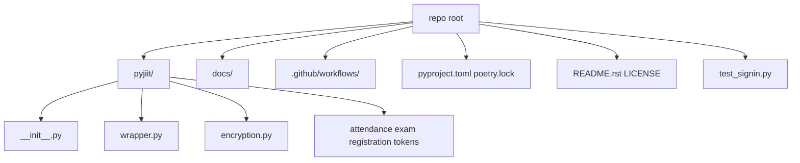
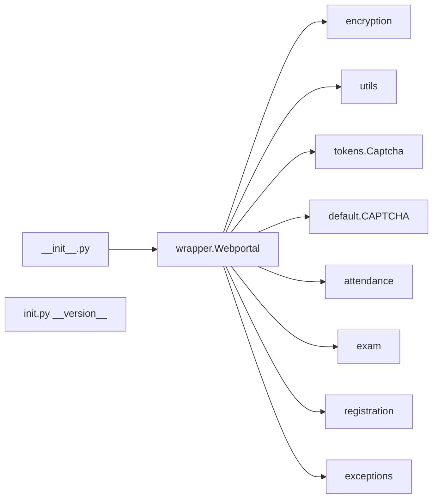
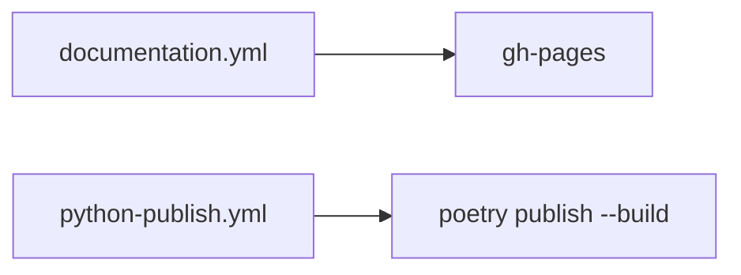

# Project structure

Flat Python package. Poetry at the root. Sphinx under `docs/`. Two GitHub Actions workflows.



| Path | Purpose |
| --- | --- |
| `pyjiit/` | installable package |
| `docs/` | Sphinx RST, `conf.py`, Makefile |
| `.github/workflows/` | `documentation.yml`, `python-publish.yml` |
| `pyproject.toml` | name, 0.1.0a8, deps, Poetry docs group |
| `poetry.lock` | pinned graph |
| `README.rst` | PyPI readme |
| `LICENSE` | MIT, Copyright 2024 Harsh Sharma |
| `test_signin.py` | live pretoken + generate-token1 |

## pyproject.toml

```toml
[project]
name = "pyjiit"
version = "0.1.0a8"
description = "Python wrapper for JIIT webportal"
authors = [{name="Harsh Sharma", email="harsh@codelif.in"}]
license = "MIT License"
readme = "README.rst"
requires-python = ">=3.9"
dependencies = [
  "requests (>=2.32.3,<3.0.0)",
  "pycryptodome (>=3.22.0,<4.0.0)"
]
```

Homepage URL in the file is still `https://github.com/codelif/pyjiit`. Build backend `poetry-core`. Docs group: Sphinx, Furo.

## Package files



| File | Exports |
| --- | --- |
| `__init__.py` | `Webportal` |
| `init.py` | `__version__ = "0.1.0a8"` |
| `wrapper.py` | `API`, `authenticated`, `WebportalSession`, `Webportal` |
| `encryption.py` | key, LocalName, serialize/deserialize |
| `utils.py` | `generate_date_seq`, `get_random_char_seq` |
| `default.py` | `CAPTCHA` |
| `tokens.py` | `Captcha` |
| `attendance.py` | `AttendanceHeader`, `Semester`, `AttendanceMeta` |
| `exam.py` | `ExamEvent` |
| `registration.py` | `RegisteredSubject`, `Registrations` |
| `exceptions.py` | six exception classes |

No nested packages.

## docs/

| File | Role |
| --- | --- |
| `index.rst` | toctree: introduction, design, usage, apiref |
| `introduction.rst` | README-like feature list |
| `design.rst` | stub ("work in progress") |
| `usage.rst` | pip, login, attendance, subjects, exceptions |
| `apiref.rst` | autodoc of wrapper, tokens, attendance, exam, registration, exceptions |
| `conf.py` | project `pyjiit`, release `0.1.0a8`, Furo, githubpages |
| `Makefile` / `make.bat` | `sphinx-build` |
| `requirements.txt` | `furo==2024.8.6` |

CI writes `docs/_build/html/CNAME` as `pyjiit.codelif.in`.

## Workflows


