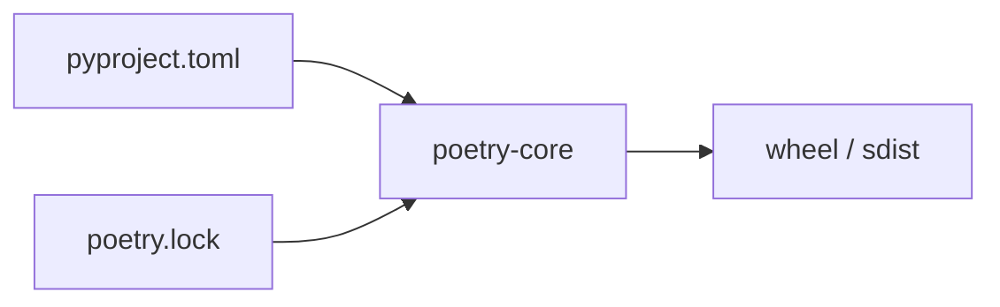
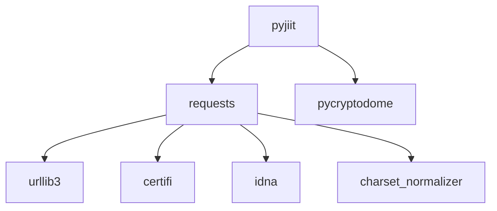
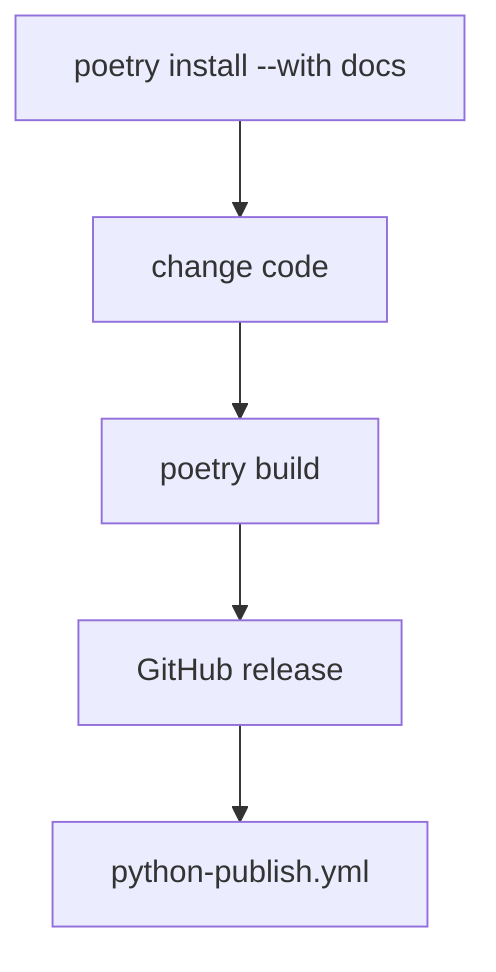

# Build system and dependencies

Poetry owns the lockfile and the publish command. Users still `pip install pyjiit`.



## Metadata

| Field | Value |
| --- | --- |
| name | `pyjiit` |
| version | `0.1.0a8` |
| author | Harsh Sharma `<harsh@codelif.in>` |
| license | MIT License |
| readme | `README.rst` |
| requires-python | `>=3.9` |
| homepage | `https://github.com/codelif/pyjiit` |

## Runtime

| Dist | Constraint |
| --- | --- |
| `requests` | `>=2.32.3,<3.0.0` |
| `pycryptodome` | `>=3.22.0,<4.0.0` |

That is the whole production graph besides their own deps (urllib3, certifi, charset-normalizer, idna, and Crypto).



## Docs extra

```toml
[tool.poetry.group.docs.dependencies]
sphinx = ">=7.4.7"
furo = "^2024.8.6"
```

```bash
poetry install --with docs
```

`docs/requirements.txt` only pins Furo. GitHub Actions uses the Poetry group.

## Commands

| Command | Does |
| --- | --- |
| `poetry install` | runtime env from lock |
| `poetry install --with docs` | plus Sphinx/Furo |
| `poetry add pkg` | new runtime dep |
| `poetry add -G docs pkg` | docs extra |
| `poetry lock` | refresh lock |
| `poetry build` | sdist + wheel |
| `poetry publish --build` | PyPI, needs `pypi-token.pypi` |

CI publish:

```
poetry config pypi-token.pypi ${{ secrets.PYPI_API_KEY }}
poetry publish --build
```



## Version dual write

Bump both:

- `pyproject.toml` `version`
- `pyjiit/init.py` `__version__`

`docs/conf.py` `release` is also `0.1.0a8`.
