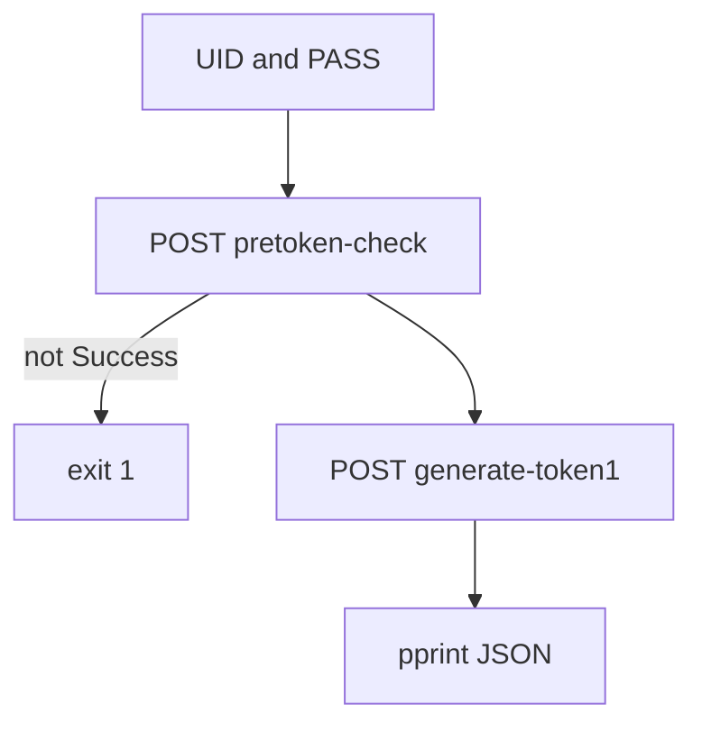
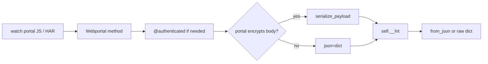
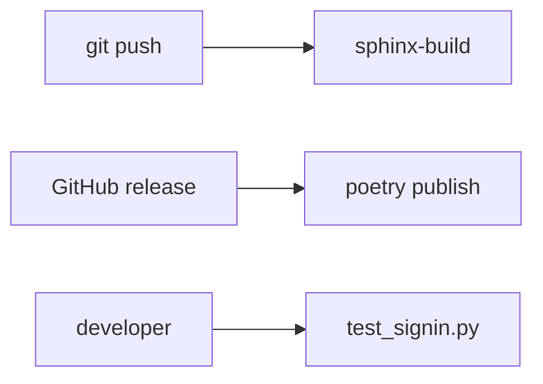

# Testing and development workflow

There is no pytest suite. The repo's smoke test is `test_signin.py` against the live StudentPortalAPI.

## test_signin.py

It does **not** import `Webportal`. It copies the two login POSTs:

1. Read `UID` and `PASS` from the environment. Exit if missing. The error text says "export USERNAME and PASSWORD", which does not match the `os.getenv` keys.
2. Build `{username, usertype: "S", captcha: {captcha, hidden}}` with a hardcoded captcha pair, `serialize_payload`, POST `/token/pretoken-check` with `LocalName`.
3. On Success, pop `rejectedData`, set `Modulename` and `passwordotpvalue`, encrypt, POST `/token/generate-token1`.
4. `pprint` the JSON.



```bash
export UID="enrollment"
export PASS="password"
python test_signin.py
```

That hits production. Treat it as a credentialed integration check, not CI.

## Adding an endpoint



Keep portal typos in request keys. Map them to underscored attributes only inside models.

## Local loop

```bash
poetry install --with docs
poetry run python -c "from pyjiit.encryption import generate_local_name; print(generate_local_name())"
poetry run sphinx-build -b html docs docs/_build/html
```

Debug a payload:

```bash
poetry run python -m pyjiit.encryption '<base64 ciphertext>'
```

That path runs `deserialize_payload` in `encryption.py`'s `__main__`.

## What CI does not run

`documentation.yml` builds Sphinx. `python-publish.yml` publishes. Neither runs `test_signin.py`. A broken login still deploys docs.


