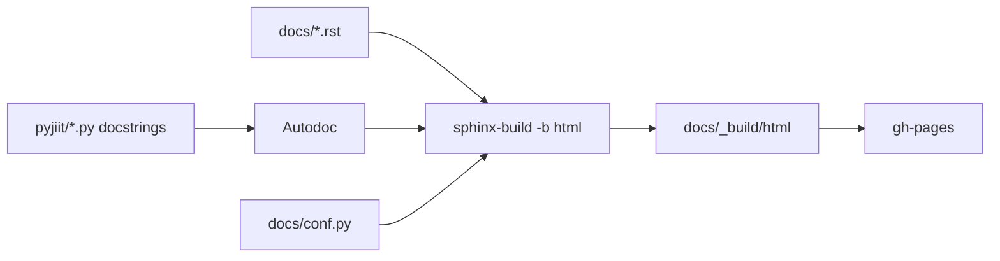
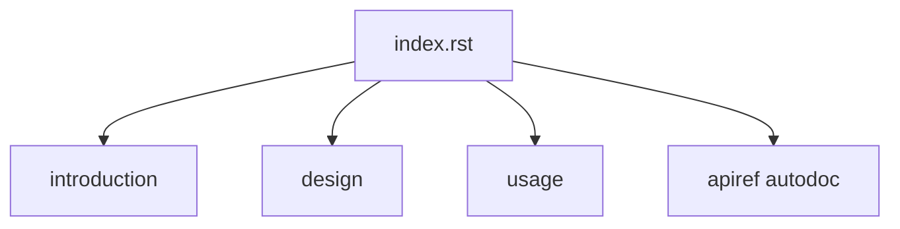

# Documentation system

Sphinx + Furo. RST sources in `docs/`. Autodoc reads the package. GitHub Pages host is `pyjiit.codelif.in` (CNAME written in CI). README.rst points there.

Build steps: [Building documentation](6.1-building-documentation). Deploy: [Documentation deployment](6.2-documentation-deployment). RST habits: [Contributing to documentation](6.3-contributing-to-documentation).

## Pages

| RST | Content |
| --- | --- |
| `index.rst` | toctree |
| `introduction.rst` | features, roadmap, deps (including the joke ones) |
| `design.rst` | placeholder |
| `usage.rst` | pip, `Webportal`, `CAPTCHA`, attendance, subjects |
| `apiref.rst` | autodoc |

`design.rst` is one sentence: still work in progress.

## conf.py

- `project = "pyjiit"`
- `copyright = "2025, Harsh Sharma"`
- `release = "0.1.0a8"`
- `sys.path` inserts the repo root so autodoc imports `pyjiit`
- extensions: `sphinx.ext.autodoc`, `sphinx.ext.githubpages`
- `html_theme = "furo"`
- footer GitHub icon URL: `https://github.com/codelif/pyjiit`

