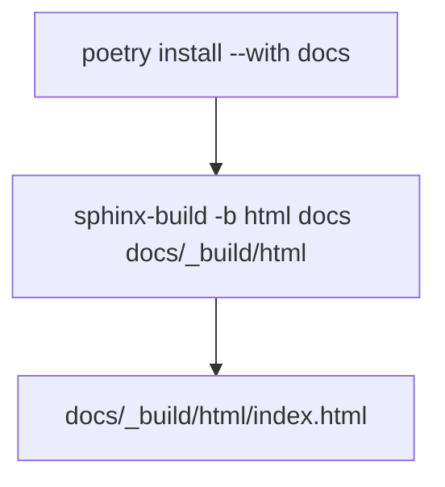

# Building documentation

HTML from RST on your machine.

```bash
pip install poetry
poetry install --with docs
poetry run sphinx-build -b html docs docs/_build/html
```

Or:

```bash
cd docs
poetry run make html
```

Makefile sets `SOURCEDIR = .` and `BUILDDIR = _build`.



Open `docs/_build/html/index.html`. `_build/` is gitignored.

## What autodoc needs

`conf.py` puts the repo root on `sys.path`. Import errors during the build usually mean Poetry's env is missing runtime deps (`requests`, `pycryptodome`). Install the default group, not docs-only.

`apiref.rst` pulls:

- `pyjiit.wrapper.Webportal` (members)
- `pyjiit.wrapper.WebportalSession` (members)
- modules `tokens`, `attendance`, `exam`, `registration`, `exceptions`

Docstrings on those classes are what the API page shows.

## Furo

Theme `furo`, extra from Poetry. `docs/requirements.txt` pins `furo==2024.8.6` if you skip Poetry:

```bash
pip install sphinx furo==2024.8.6
pip install -e .
sphinx-build -b html docs docs/_build/html
```

CI does not use `docs/requirements.txt`. It uses `poetry install --with docs`.
