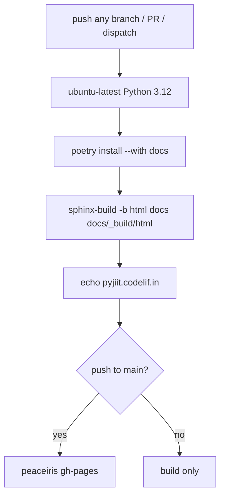
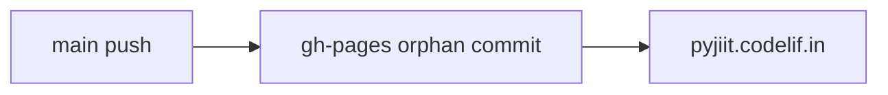

# Documentation deployment

`.github/workflows/documentation.yml`, workflow name `Sphinx: build && deploy docs`.

## Triggers

- push to any branch (`**`)
- pull_request
- workflow_dispatch

Concurrency group `docs-${{ github.ref }}`, `cancel-in-progress: true`.

## Steps

1. `actions/checkout@v4`
2. `actions/setup-python@v5` Python 3.12, pip cache
3. `actions/cache@v3` on `~/.cache/pypoetry` and `~/.cache/pip`, key hashed from `poetry.lock` and `pyproject.toml`
4. `pip install poetry`
5. `poetry install --no-interaction --no-ansi --with docs`
6. `poetry run sphinx-build -b html docs docs/_build/html`
7. `echo "pyjiit.codelif.in" > docs/_build/html/CNAME`
8. `peaceiris/actions-gh-pages@v3` only if `github.event_name == 'push' && github.ref == 'refs/heads/main'`

Deploy uses `GITHUB_TOKEN`, `publish_branch: gh-pages`, `publish_dir: docs/_build/html`, `force_orphan: true`.

Permissions: `contents: write`.

## Live URL

README.rst: [https://pyjiit.codelif.in](https://pyjiit.codelif.in). That matches the CNAME the workflow writes. The fork at tashifkhan/pyjiit keeps the same workflow file, so a Pages deploy from the fork would still stamp that hostname unless you change it.

