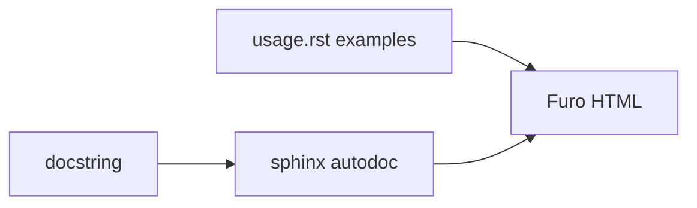

# Contributing to documentation

Edit RST under `docs/`. Keep Python docstrings in sync because `apiref.rst` uses autodoc.

## RST map

```
docs/
  index.rst
  introduction.rst
  design.rst
  usage.rst
  apiref.rst
  conf.py
```

Add a new page by creating `docs/foo.rst` and listing it in the `index.rst` toctree.

## Tone already in usage.rst

Short, a bit dry, jokes in the README/introduction (NESCAFE, Dopamine Dose, sleep). Code samples use `from pyjiit import Webportal` and `from pyjiit.default import CAPTCHA`. Match that.

## Autodoc

```rst
.. autoclass:: pyjiit.wrapper.Webportal
   :members:
```

Docstring shape in `wrapper.py` is Sphinx-ish `:param:` / `:returns:` / `:raises:`.

```python
def get_captcha(self) -> Captcha:
    """
    :returns: Captcha object with empty answer field
    :raises APIError: Raised for generic API error
    """
```



## Local preview

```bash
poetry install --with docs
poetry run sphinx-build -b html docs docs/_build/html
```

Fix WARNINGs before you open a PR. `documentation.yml` builds on every branch.

## Code samples

Use `Webportal`, not `WebPortal`. Pass a `Captcha`. Prefer `CAPTCHA` from `pyjiit.default` unless you are documenting `get_captcha`. HTTP is `requests`.

```python
from pyjiit import Webportal
from pyjiit.default import CAPTCHA

w = Webportal()
w.student_login("username", "password", CAPTCHA)
```

## After merge to main

The docs workflow deploys `docs/_build/html` to `gh-pages` and writes CNAME `pyjiit.codelif.in`.
