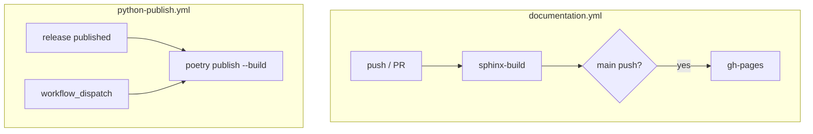
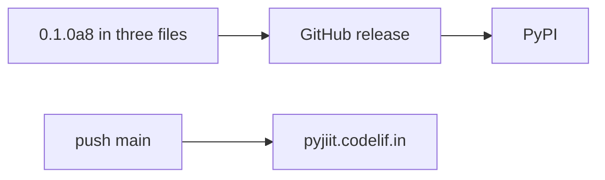

# Deployment and CI/CD

Two workflows. Docs on every push, Pages on `main`. PyPI on a published GitHub release (or manual dispatch).

Detail: [Publishing to PyPI](7.1-publishing-to-pypi), [GitHub Actions workflows](7.2-github-actions-workflows).

## Secrets

| Secret | Workflow | Use |
| --- | --- | --- |
| `GITHUB_TOKEN` | documentation | `peaceiris/actions-gh-pages` |
| `PYPI_API_KEY` | python-publish | `poetry config pypi-token.pypi` |

No test job. No lint job.

## Python on runners

Both workflows pin Python **3.12**. The package still claims `requires-python = ">=3.9"`.

## Version bump before a release

1. `pyproject.toml` version
2. `pyjiit/init.py` `__version__`
3. `docs/conf.py` `release`
4. Tag / GitHub release

