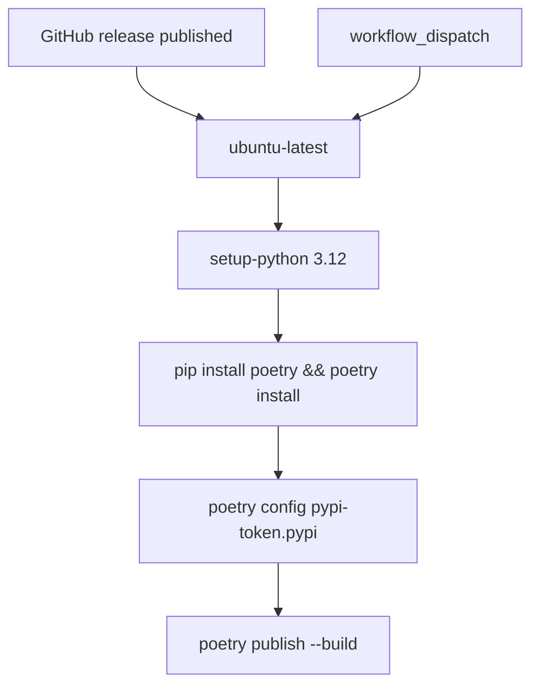
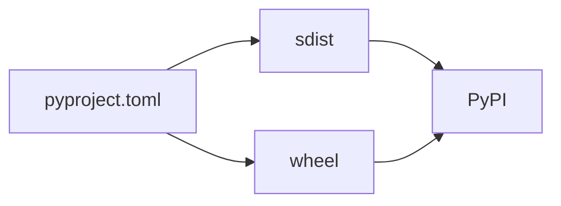

# Publishing to PyPI

`.github/workflows/python-publish.yml`, name `Build and publish python package`.

```yaml
on:
  release:
    types: [ published ]
  workflow_dispatch:
```



## Job

- `actions/checkout@v4`
- `actions/setup-python@v5` with `python-version: '3.12'`
- `pip install poetry` then `poetry install`
- `poetry config pypi-token.pypi ${{ secrets.PYPI_API_KEY }}`
- `poetry publish --build`

Permissions: `contents: write`. The publish job does not run tests.

## Local publish

```bash
poetry build
poetry config pypi-token.pypi <token>
poetry publish
```

Package name on PyPI is `pyjiit`. Users: `pip install pyjiit`.

## Checklist

- Version is `0.1.0a8` (or the next one) in `pyproject.toml`, `pyjiit/init.py`, `docs/conf.py`.
- `README.rst` is the long description.
- Runtime deps still `requests` and `pycryptodome` only.
- You meant to ship an alpha (`a8`).


