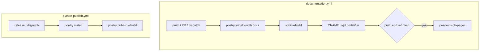
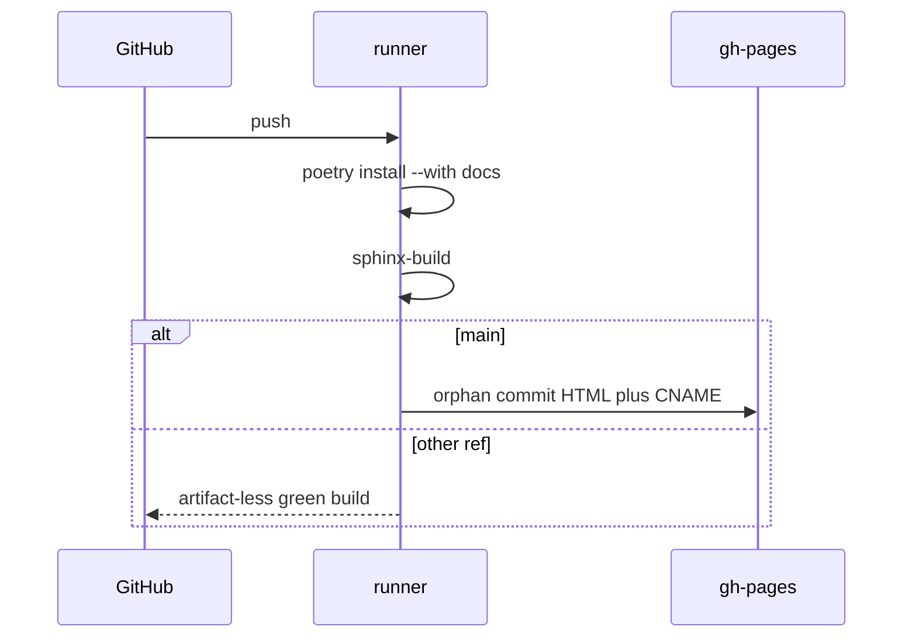

# GitHub Actions workflows

Two YAML files under `.github/workflows/`.

| File | Name | Trigger | Effect |
| --- | --- | --- | --- |
| `documentation.yml` | Sphinx: build && deploy docs | push `**`, pull_request, workflow_dispatch | Sphinx HTML; Pages on `main` |
| `python-publish.yml` | Build and publish python package | release published, workflow_dispatch | `poetry publish --build` |



## documentation.yml

Concurrency: `docs-${{ github.ref }}`, cancel in progress.

Python 3.12, pip cache, extra cache on Poetry and pip directories keyed by `poetry.lock` + `pyproject.toml`.

Install:

```
poetry config virtualenvs.create true
poetry config virtualenvs.in-project false
poetry install --no-interaction --no-ansi --with docs
```

Build:

```
poetry run sphinx-build -b html docs docs/_build/html
echo "pyjiit.codelif.in" > docs/_build/html/CNAME
```

Deploy step `if: ${{ github.event_name == 'push' && github.ref == 'refs/heads/main' }}` with `force_orphan: true` on `gh-pages`.

PRs and non-main branches only prove that Sphinx still builds.



## python-publish.yml

No docs extra. `poetry install` then token then `poetry publish --build`. Secret name is `PYPI_API_KEY`.


## Gaps

- No workflow runs `test_signin.py` (good: it needs live credentials).
- No matrix for Python 3.9 through 3.12 even though the package claims 3.9+.
- Docs CNAME is hardcoded to the upstream domain.

Fork: [https://github.com/tashifkhan/pyjiit](https://github.com/tashifkhan/pyjiit). Upstream URLs in `pyproject.toml` and Sphinx footer stay `codelif/pyjiit`.
