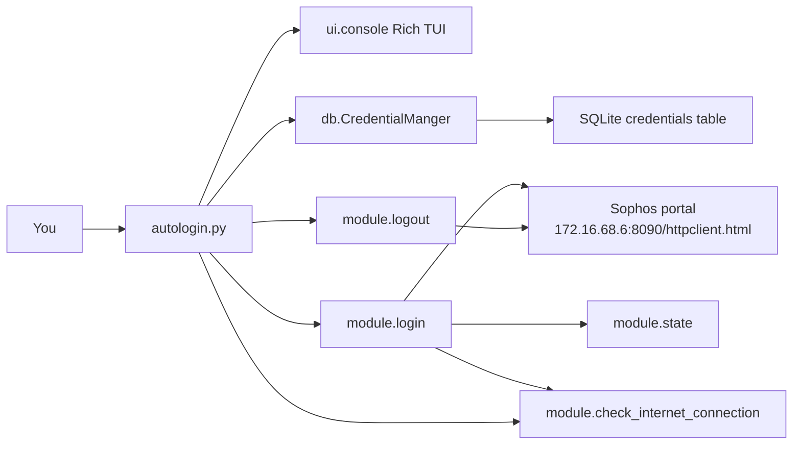
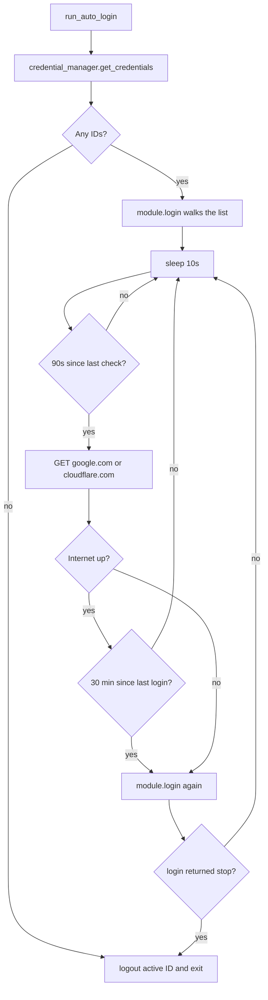

# Overview

A Python CLI that logs you into the Sophos web auth portal used at JIIT hostel and LRC, then keeps the session alive. Credentials sit in SQLite. If one ID hits a data cap or fails, the script tries the next one.

[Download latest release](https://github.com/tashifkhan/sophos-auto-login/releases) · [Source](https://github.com/tashifkhan/sophos-auto-login)

Older docs lived at [sophos-autologin.tashif.codes](https://sophos-autologin.tashif.codes).

## Docs map

- [Overview](1-overview)
- [Quick start](2-quick-start)
- [Command-line usage](3-cli-usage)
- [Interactive menu](4-interactive-menu)
- [Daemon mode](5-daemon-mode)
- [Advanced features](6-advanced-features)
- [Setup guide](7-setup-guide)
- [Screenshots](8-screenshots)

## What it actually does

`autologin.py` is the entry point. It talks to `http://172.16.68.6:8090/httpclient.html` with form fields the portal already understands:

- Login uses `mode=191` plus username and password.
- Logout uses `mode=193` on the same URL.

The portal answers with XML. `module.login` reads the `<message>` text. A successful sign-in looks like `You are signed in as {username}`. Two failures make it skip to the next stored ID:

- `Login failed. You have reached the maximum login limit.`
- `Your data transfer has been exceeded, Please contact the administrator`

After a successful login, `login()` sleeps two minutes, then optionally runs a speed test. The outer loop in `run_auto_login()` is what keeps you online after that. It checks connectivity every 90 seconds (`CONNECTION_CHECK_INTERVAL`). If you are offline, it logs in again. Even if you look online, it forces a re-login every 30 minutes (`FORCED_RELOGIN_INTERVAL`) so the portal does not expire the session.

The README's "every 2 minutes" line is that sleep inside `login()`, not the keep-alive loop.

## Architecture

CLI and menu both go through `CredentialManger` for storage and through `module.login` / `module.logout` for the portal. Active ID lives in `module.state`.



## Login and re-login loop



## Layout

| Path | Role |
| --- | --- |
| `autologin.py` | argparse, interactive menu, `daemonize()`, `run_auto_login()` |
| `db/CredentialManager.py` | SQLite CRUD, CSV import/export. Class is named `CredentialManger` |
| `module/login.py` | POST login, XML parse, failover |
| `module/logout.py` | POST logout |
| `module/check_internet.py` | HTTP (and unused socket) connectivity check |
| `module/status.py` | `get_daemon_status()` from the daemon log |
| `module/deamon_exit_handeler.py` | Kill PID file plus leftover `autologin` processes |
| `module/exit_handeler.py` | Logout on SIGINT/SIGTERM |
| `module/internet_speedtest.py` | `speedtest` wrapper |
| `module/notification_handler.py` | macOS `osascript`, Linux `notify-send`, Windows `win10toast` |
| `module/state.py` | Active credential index |
| `ui/console.py` | Rich theme, header, credential table |
| `requirements.txt` | `requests`, `rich`, `speedtest-cli`, platform notify libs, PyInstaller |

## Credentials table

Created on first run:

```sql
CREATE TABLE IF NOT EXISTS credentials (
  id INTEGER PRIMARY KEY AUTOINCREMENT,
  username TEXT UNIQUE NOT NULL,
  password TEXT NOT NULL
);
```

On Unix the live file is `~/.autologin_script/credentials.db`. On Windows it is `%APPDATA%\autologin_script\credentials.db`. If that file is missing and a bundled `credentials.db` sits next to the script or frozen binary, the manager copies it over.

Daemon logs are a different directory: `~/.sophos-autologin/`.

## Features that are in the code

- SQLite storage with unique usernames.
- Walk the credential list when one ID is at its login or data limit.
- Flags for start, add, edit, delete, import, export, show, daemon, exit, logout, speedtest, status.
- Interactive menu when you pass no flags.
- CSV in and out, including old `UserID (Enrolment Number)` headers.
- Unix daemon via double fork. Needs `--start`.
- Connection check every 90 seconds.
- Forced re-login every 30 minutes.
- Desktop notifications on login, logout, and daemon events.
- Speed test after a successful login, and on demand from the menu or `--speedtest`.
