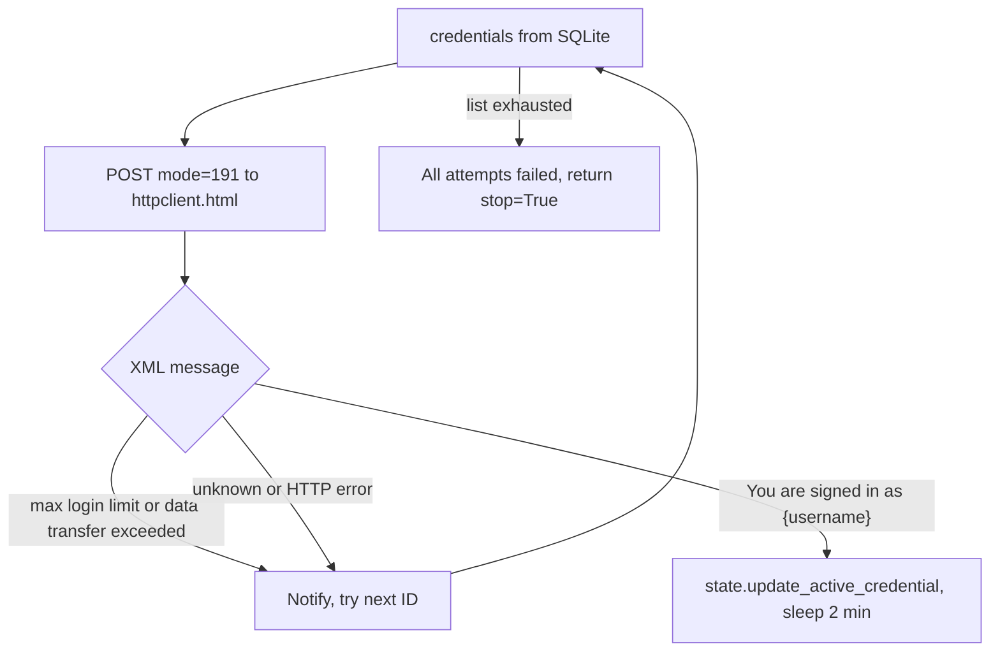

# Command-line usage

`parse_arguments()` in `autologin.py` is argparse. Pass a flag and the process does that job, then returns. Pass nothing and you get the [interactive menu](4-interactive-menu).

`--daemon` is the exception. It only works with `--start`. Alone, the script prints `--daemon must be used with --start` and exits 1.

## Flags

| Flag | What it does |
| --- | --- |
| `--start` / `-s` | `run_auto_login()`. Foreground loop, Ctrl+C to stop. |
| `--add` / `-a` | Prompt for username and password, insert into SQLite. Duplicate username raises `IntegrityError`. |
| `--edit` / `-e` | Pick a row, optionally change username or password. |
| `--delete` / `-del` | Pick a row, confirm, delete. |
| `--export [path]` / `-x [path]` | Write CSV. No path means `credentials.csv` next to the database file. |
| `--import path` / `-i path` | Read CSV. File must exist. |
| `--show` / `-l` | Rich table of stored usernames. |
| `--daemon` / `-d` | Double-fork into the background. Unix only. Requires `--start`. |
| `--exit` / `-q` | Logout the active credential, then `module.deamon_exit()` on non-Windows. |
| `--logout` / `-lo` | Logout every stored credential. Does not stop a daemon. |
| `--speedtest` / `-t` | `module.speed_test()`, then `speedtest_results()`. |
| `--status` / `-st` | `module.get_daemon_status()` from `~/.sophos-autologin/sophos-autologin.log`. |

`--import` is stored as `args.import_csv` because `import` is a Python keyword.

## Examples

```bash
python autologin.py --start
python autologin.py --start --daemon
python autologin.py --exit
python autologin.py --add
python autologin.py --show
python autologin.py --import credentials.csv
python autologin.py --export
python autologin.py --export /tmp/creds.csv
python autologin.py --logout
python autologin.py --status
python autologin.py --speedtest
```

## `--exit` vs `--logout`

`--logout` walks every row in SQLite and POSTs `mode=193` for each. The daemon, if any, keeps running.

`--exit` logs out the credential in `module.state` (the one currently signed in), then on Unix runs `deamon_exit()`, which kills the PID in `~/.sophos-autologin/sophos-autologin.pid` and any `ps aux` lines matching `autologin`, `sal`, or `sla`.

## Failover while `--start` is running

`module.login` tries credentials in database order. See [Advanced features](6-advanced-features) for the XML messages that skip an ID.


