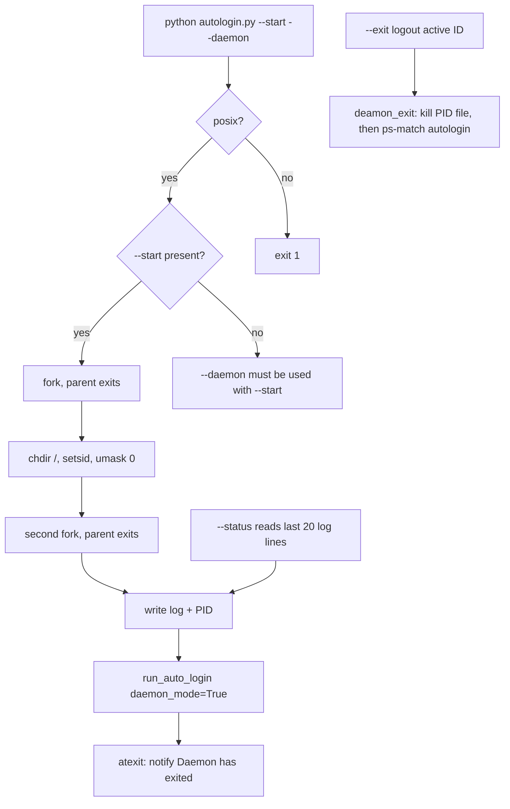

# Daemon mode

Unix only (`os.name == "posix"`). Windows prints `Daemon mode is only supported on Unix-like systems.` and exits 1.

`--daemon` without `--start` is also a hard fail. The process is not a service manager. It double-forks, then runs the same `run_auto_login(..., daemon_mode=True)` loop as the foreground.

## Files

`daemonize()` creates `~/.sophos-autologin/` if needed.

| File | Purpose |
| --- | --- |
| `~/.sophos-autologin/sophos-autologin.log` | INFO logs. Format `%(asctime)s │ %(levelname)-8s │ %(message)s` |
| `~/.sophos-autologin/sophos-autologin.pid` | Child PID after the second fork |

stdin/stdout/stderr go to `/dev/null`. Watch the log, not the terminal.

After fork the working directory is `/`. Relative paths in your own wrappers will not resolve against the repo.

## Lifecycle



## Start, status, stop

```bash
python autologin.py --start --daemon
python autologin.py --status
python autologin.py --exit
```

`--status` does not talk to the process. `get_daemon_status()` reads the log. It treats the daemon as running if recent lines mention connection checks, login attempts, or `daemon started`. No log file means not running. Last timestamp older than 30 minutes sets `running` false and an error that the daemon may be stuck.

You can also kill the PID yourself:

```bash
kill $(cat ~/.sophos-autologin/sophos-autologin.pid)
```

`--exit` is cleaner. It logs out the active credential first, then `module.deamon_exit()` (`deamon_exit_handeler.main`). That function kills the PID file process, then any `ps aux` line containing `autologin`, `sal`, or `sla`. That last sweep can catch a foreground `autologin.py` too. Do not run `--exit` if you meant to leave a non-daemon session alone.


## What the log looks like

On start:

```
Daemon started
Daemon process started with PID …
Starting auto-login process in daemon mode
Logged in with credential ID #N (username)
```

Every 90 seconds:

```
CONNECTION CHECK | Status: ✓ Connected | Runtime: …
Active credential: ID #N (username)
➤ Internet is connected. No login needed.
```

Scheduled re-login uses `⟳ Performing scheduled re-login` then `LOGIN ATTEMPT #…`. Desktop notification `Sophos Auto Login` / `Daemon started` fires when the loop begins.
