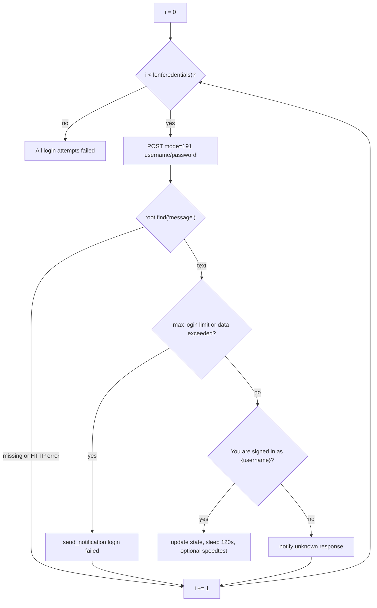

# Advanced features

## Automatic ID switching

`module.login(credentials)` walks the list from `get_credentials()`. Each ID POSTs `mode=191` to `http://172.16.68.6:8090/httpclient.html` with a 45 second timeout.

The portal returns XML. These `<message>` values skip the current ID and continue:

- `Login failed. You have reached the maximum login limit.`
- `Your data transfer has been exceeded, Please contact the administrator`

Success is `You are signed in as {username}`. That sets `state.active_credential_index`, sleeps two minutes, then tries `check_internet_connection()` and a speed test.

Anything else (unknown text, missing `<message>`, non-200) notifies and tries the next row. If the list ends with no success, login returns `(True, cred_index)` and the auto-login loop stops.

Order is SQLite `SELECT username, password FROM credentials` order, which follows `id`. Put the ID you want first at the top of the table.



## Connection check

`CONNECTION_CHECK_INTERVAL = 90` in `run_auto_login()`. `check_internet_connection()` defaults to HTTP against `https://www.google.com` then `https://www.cloudflare.com`, 3 second timeout. First success returns True.

If that check fails, the loop calls `module.login` again. If it succeeds and fewer than 30 minutes have passed since `last_login_time`, it prints `Internet is connected. No login needed.` and sleeps 10 seconds.

There is a socket fallback in `check_internet.py` (8.8.8.8, 1.1.1.1, OpenDNS on port 53). The auto-login loop never passes `method="socket"`. Only the module's `__main__` demo does.

## Scheduled re-login

`FORCED_RELOGIN_INTERVAL = 30 * 60`. The 30 minute timer is checked on the same 90 second tick as the HTTP probe. Connected plus stale session still triggers `module.login`. That is the keep-alive, not the two-minute sleep inside a successful login.

## CSV import and export

`export_to_csv` writes `username,password` with a header. Default path is `credentials.csv` in the database directory (`~/.autologin_script/` on Unix).

`import_from_csv` maps columns case-insensitively. Accepted username headers:

- `username`
- `userid (enrolment number)` (the old CSV-based script)

Password column must be `password`. Duplicate usernames increment the skipped count and do not fail the whole import.

```bash
python autologin.py --import credentials.csv
```

## Notifications

`send_notification(title, message)`:

- macOS: `osascript` `display notification`
- Linux: `notify-send`
- Windows: `win10toast.ToastNotifier`

Login, logout, daemon start/stop, and failures all go through this.

## Speed test

`module.internet_speedtest.run_speed_test` uses the `speedtest` package. `--speedtest` / menu 8 print download Mbps, upload Mbps, ping, and server. A successful portal login also runs a test after the two-minute wait, then folds those numbers into the "Connected" notification.

## Building an executable

```bash
git clone https://github.com/tashifkhan/sophos-auto-login.git
cd sophos-auto-login
pip install -r requirements.txt
pip install pyinstaller
```

```bash
# macOS / Linux
pyinstaller --onefile --add-data "db/credentials.db:." autologin.py

# Windows
pyinstaller --onefile --add-data "db/credentials.db;." autologin.py
```

Output is `dist/autologin` (or `autologin.exe`). `--add-data` ships a seed DB. `CredentialManger.get_db_path()` copies it into the persistent path on first run of a frozen binary (`sys.frozen`).
