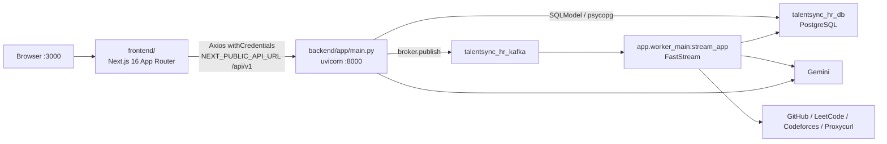
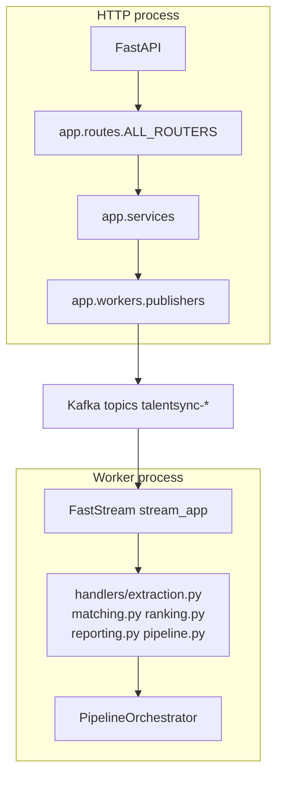
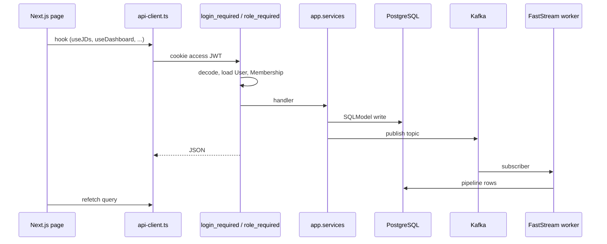

# Architecture overview

The browser talks to Next.js. Next.js calls FastAPI with credentialed Axios. FastAPI writes Postgres and publishes Kafka messages. The FastStream worker consumes those messages and runs Gemini plus profile adapters.



## Process layout

`app.main:app` and `app.worker_main:stream_app` share `app.broker.broker`. Lifespan in `main.py` starts the broker and APScheduler, then imports `app.workers.handlers` so `@broker.subscriber` decorations register. The worker process does the same import. Do not run two copies of the same consumer group on one machine unless you intend to share partitions.



## Backend packages

| Path | Role |
|---|---|
| `app/api/v1/` | Thin routers |
| `app/api/v1/schemas/` | Pydantic contracts |
| `app/core/` | Settings, JWT, `@login_required`, `@role_required`, `@app_admin_required`, org access, Gemini client |
| `app/db/models/` | SQLModel tables |
| `app/services/` | Extraction, matching, ranking, validation, reporting, auth, email |
| `app/workers/` | Topics, message models, publishers, subscribers |
| `app/agents/` | `github_agent`, `websearch_agent`, `web_content_agent` |
| `app/data/prompt/` | Prompt modules for JD/resume extract, match, gap, report |

Routers are listed in `app/routes/__init__.py` and included with `prefix=settings.api_v1_prefix`.

## Kafka topics

Constants live in `app/workers/messages/topics.py`:

| Topic | Publisher | Subscriber |
|---|---|---|
| `talentsync-jd-created` | `jds.py` via `publish_jd_created` | `handlers/extraction.py` `on_jd_created` |
| `talentsync-resume-extracted` | `resumes.py` | `on_resume_extracted` |
| `talentsync-resume-processed` | `resumes.py`, public apply in `jds.py` | `handlers/pipeline.py` `on_resume_processed` |
| `talentsync-matching-completed` | `matches.py` | `handlers/matching.py` |
| `talentsync-ranking-completed` | `rankings.py` | `handlers/ranking.py` |
| `talentsync-report-generated` | `reports.py`, orchestrator | `handlers/reporting.py` |

Extraction and JD-created handlers currently log (enrichment hooks are commented). The pipeline subscriber is the one that fills match, validation, ranking, and report tables.

## Frontend layout

```
frontend/
  app/                 routes
  components/          AuthProvider, QueryProvider, dashboard-sidebar, ui/
  hooks/               TanStack Query wrappers
  services/            Axios modules
  lib/api-client.ts    baseURL, cookie refresh interceptor
  lib/rbac.ts          org/team capabilities
```

`api-client.ts` retries once on 401 by `POST /auth/refresh`, then replays the request. Auth cookies are `talentsync_access_token` and `talentsync_refresh_token`. CORS in `main.py` allows `FRONTEND_BASE_URL` plus localhost 3000/3001 with credentials.

## Request path



Org context: `x-org-id` header, `org_id` query, or JWT `org_id`. Multiple memberships without an org id return 400 on `@role_required` routes.
