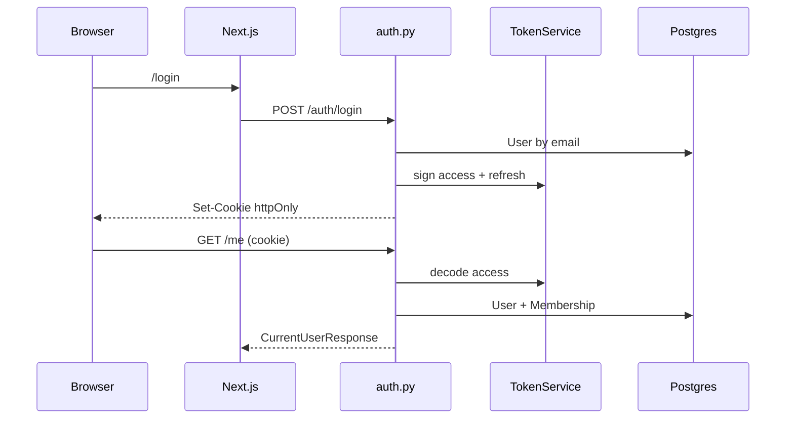

# Authentication and authorization

Guards live in `app/core/auth_decorators.py`. JWT helpers in `app/core/security.py`. Org resolution in `app/core/org_access.py`. Settings in `app/core/settings.py`.

## Tokens and cookies

| Setting | Default |
|---|---|
| `JWT_ALGORITHM` | HS256 |
| `ACCESS_TOKEN_EXPIRE_MINUTES` | 480 |
| `REFRESH_TOKEN_EXPIRE_DAYS` | 14 |
| `ACCESS_COOKIE_NAME` | `talentsync_access_token` |
| `REFRESH_COOKIE_NAME` | `talentsync_refresh_token` |
| `AUTH_COOKIE_SAMESITE` | lax |
| `AUTH_COOKIE_SECURE` | false (set true in prod compose) |

Access JWT `type` must be `access`. Payload `sub` is user UUID. Optional `org_id` is the active organization. Bearer `Authorization` is accepted; if missing, the access cookie is used.

Passwords are bcrypt plus optional `PASSWORD_PEPPER`.

## Login methods

- **Email/password:** `POST /auth/login`.
- **Signup + magic link:** `POST /auth/signup` stores `MagicLink` (`MAGIC_LINK_TTL_MINUTES` default 20) and emails `FRONTEND_BASE_URL`. `GET /auth/email/verify?token=` consumes it. `POST /auth/email/request-link` is 410.
- **Google OAuth2:** `GET /auth/google/login` → Google → `GET /auth/google/callback`. Signed state. Upserts `AuthAccount` with `AuthProvider.GOOGLE`. Connect flow: `/auth/google/connect` and `/auth/google/connect/callback`.

`POST /auth/switch-org` reissues cookies with a new `org_id` after membership check.

## Guards

`@login_required` loads the user, lists memberships, and sets `request.state.active_organization_id` from `x-org-id`, `org_id` query, or JWT `org_id`. Inactive users get 403.

`@role_required(OrganizationRole.RECRUITER)` (or `ADMIN` / `VIEWER`) requires an active membership in an `ACTIVE` org. Role rank: viewer 1, recruiter 2, admin 3. Missing org with multiple memberships is 400.

`@app_admin_required` requires `PlatformRoleAssignment` with `app_admin`. Used by `/admin/organizations`. `POST /orgs` is 410 even for app admins.

Handlers must take `request`, `session`, and `token_service` kwargs or the decorator returns 500.

## Frontend

`AuthProvider` (`components/auth-provider.tsx`) uses `useUser` (`GET /me`) and `useAuthMutations`. Public routes listed in that file. `lib/rbac.ts` duplicates org/team capability checks for buttons and nav. Axios refreshes on 401 via `POST /auth/refresh`.

Production compose sets `AUTH_COOKIE_SECURE=true`, `FRONTEND_BASE_URL=https://hr.talentsync.tashif.codes`, and `GOOGLE_REDIRECT_URI` to that host's `/api/v1/auth/google/callback`.
