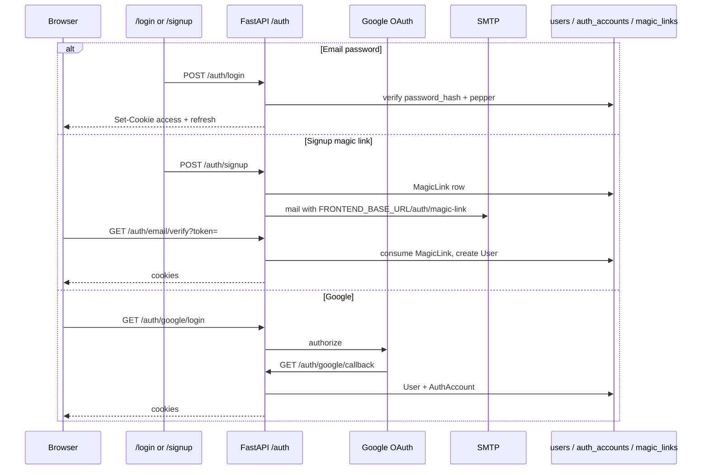

# Auth

Router: `app/api/v1/auth.py`, prefix `/auth`. Tokens are JWTs (`type=access` or `refresh`) set as httpOnly cookies `talentsync_access_token` and `talentsync_refresh_token`. Cookie flags come from `AUTH_COOKIE_SECURE`, `AUTH_COOKIE_DOMAIN`, `AUTH_COOKIE_SAMESITE`.

## Endpoints

| Method | Path | Status notes |
|---|---|---|
| POST | `/auth/email/request-link` | **410 Gone.** Passwordless login is disabled. |
| POST | `/auth/signup` | 202. Creates a magic-link record and emails it. Body: email, password, optional `full_name`, `invitation_token`. |
| POST | `/auth/login` | Email + password. Sets cookies, returns `AuthTokensResponse`. |
| GET | `/auth/email/verify` | Query `token`. Consumes magic link, sets cookies. |
| GET | `/auth/google/login` | Redirect to Google. Signed state for CSRF. |
| GET | `/auth/google/callback` | Code exchange, upsert `AuthAccount` (`provider=google`), set cookies. |
| POST | `/auth/refresh` | Cookie refresh JWT in, new access (+ refresh) out. |
| POST | `/auth/switch-org` | Body `organization_id`. Reissues JWT with that `org_id`. |
| GET | `/auth/session` | Current tokens / memberships from cookies. |
| POST | `/auth/logout` | Clears cookies. |
| GET | `/auth/google/connect` | Link Google to an existing logged-in user. |
| GET | `/auth/google/connect/callback` | Connect callback. |

Signup still uses `MagicLinkService`. `POST /auth/email/request-link` is explicitly gone.

Frontend: `frontend/services/auth.service.ts`, callback pages `/auth/google/callback` and `/auth/magic-link`. Axios interceptor calls `POST /auth/refresh` on 401 except for `/auth/` URLs.
