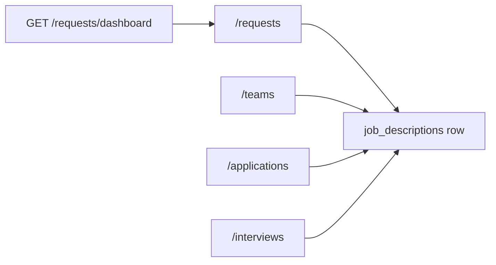

# Backend API reference

Base URL locally: `http://localhost:8000/api/v1` (`Settings.api_v1_prefix`). Interactive docs: `http://localhost:8000/docs`.

Routers are registered in `backend/app/routes/__init__.py` and mounted in `app.main`. Guards: `@login_required`, `@role_required(OrganizationRole.*)`, `@app_admin_required`. Public JD apply and most `/auth/*` routes skip org role checks.

Split pages:

- [Auth](./Auth.md)
- [JDs and resumes](./JDs%20and%20resumes.md)
- [Matching and ranking](./Matching%20and%20ranking.md)
- [Reports and validation](./Reports%20and%20validation.md)
- [Orgs and campaigns](./Orgs%20and%20campaigns.md)

## Router map

| Module | Prefix | Guard pattern |
|---|---|---|
| `health.py` | `/health` | none |
| `auth.py` | `/auth` | mixed |
| `users.py` | `/me` | login |
| `orgs.py` | `/orgs` | login / admin |
| `invitations.py` | `/invitations` | login for accept |
| `platform_admin.py` | `/admin` | app admin |
| `campaigns.py` | `/campaigns` | recruiter |
| `jds.py` | `/jds` | recruiter, public GETs unauthenticated |
| `resumes.py` | `/resumes` | recruiter |
| `matches.py` | `/matches` | recruiter |
| `match_evaluation.py` | `/match-evaluation` | recruiter |
| `rankings.py` | `/rankings` | recruiter |
| `reports.py` | `/reports` | recruiter |
| `validation.py` | `/validation` | recruiter |
| `gap_alignment.py` | `/gap-alignment` | recruiter |
| `requests.py` | `/requests` | viewer read, recruiter write |
| `teams.py` | `/teams` | org roles |
| `applications.py` | mixed paths | viewer / recruiter |
| `interviews.py` | mixed paths | viewer / recruiter |
| `analytics.py` | `/analytics` | viewer |

## Health and session user

| Method | Path | Notes |
|---|---|---|
| GET | `/health` | `{ status, app, env }` |
| GET | `/me` | Current user, orgs, `is_app_admin`, team memberships |

## Hiring command center

`requests.py` treats a hiring request as a `JobDescription` with command-center fields (`team_id`, `priority`, `request_status`, `headcount`, …).

| Method | Path | Role |
|---|---|---|
| POST | `/requests` | recruiter |
| GET | `/requests` | viewer |
| GET | `/requests/dashboard` | viewer |
| GET | `/requests/{request_id}` | viewer |
| PATCH | `/requests/{request_id}` | recruiter |
| DELETE | `/requests/{request_id}` | recruiter |
| GET | `/teams` | viewer |
| POST | `/teams` | admin |
| PATCH | `/teams/{team_id}` | admin |
| DELETE | `/teams/{team_id}` | admin |
| GET | `/teams/{team_id}/requests` | viewer |
| GET | `/teams/{team_id}/members` | viewer |
| POST | `/teams/{team_id}/members` | admin |
| PATCH | `/teams/{team_id}/members/{team_membership_id}` | admin |
| GET | `/candidates` | viewer (applications router) |
| GET | `/requests/{request_id}/applications` | viewer |
| POST | `/requests/{request_id}/applications` | recruiter |
| PATCH | `/applications/{application_id}` | recruiter |
| DELETE | `/applications/{application_id}` | recruiter |
| GET | `/requests/{request_id}/interviews` | viewer |
| POST | `/requests/{request_id}/interviews` | recruiter |
| PATCH | `/interviews/{interview_id}` | recruiter |
| DELETE | `/interviews/{interview_id}` | recruiter |
| GET | `/analytics` | viewer |

Interview list/create is scoped by `Interview.job_description_id == request_id`.

## Adding an endpoint

1. Schema in `app/api/v1/schemas/`.
2. Logic in `app/services/`.
3. Router in `app/api/v1/`, decorate with login/role.
4. Import the router in `app/routes/__init__.py` and append `ALL_ROUTERS`.
