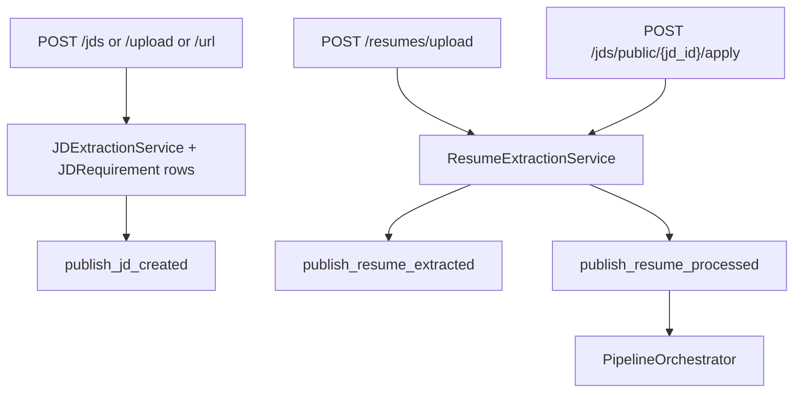

# JDs and resumes

Routers: `jds.py` (`prefix=/jds`), `resumes.py` (`prefix=/resumes`). Recruiter-only except the public JD list, detail, and apply.

## Job descriptions

| Method | Path | Role |
|---|---|---|
| POST | `/jds` | recruiter. Raw text body. Extracts requirements, publishes `talentsync-jd-created`. |
| POST | `/jds/upload` | recruiter. File upload via `FileProcessingService`. |
| POST | `/jds/url` | recruiter. Fetch page then extract. |
| GET | `/jds` | recruiter. Org list. |
| GET | `/jds/{jd_id}/requirements` | recruiter. `JDRequirement` rows. |
| DELETE | `/jds/{jd_id}` | recruiter. |
| GET | `/jds/{jd_id}/candidates` | recruiter. Candidates linked to the JD. |
| GET | `/jds/public` | none. Active public JDs. |
| GET | `/jds/public/{jd_id}` | none. |
| POST | `/jds/public/{jd_id}/apply` | none. Multipart: `file`, `full_name`, `email`, optional `phone`, `linkedin_url`. |

Public apply requires `JobDescription.status == active`. It creates `Candidate`, `Resume`, analysis rows, then `publish_resume_processed`.

## Resumes

| Method | Path | Role |
|---|---|---|
| POST | `/resumes/upload` | recruiter. Parses file, writes candidate/resume, `publish_resume_extracted`, and `publish_resume_processed` when a JD is attached. |
| GET | `/resumes/{resume_id}/analysis` | recruiter. |
| GET | `/resumes` | recruiter. |
| GET | `/resumes/candidates` | recruiter. Candidate profiles in the org. |

Frontend: `jd.service.ts`, `resume.service.ts`, pages `/jobs`, `/jobs/create-jd`, `/apply/[jobId]`.
