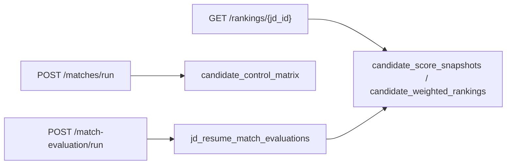

# Matching and ranking

Routers: `matches.py`, `match_evaluation.py`, `rankings.py`.

## Matches

| Method | Path | Role |
|---|---|---|
| POST | `/matches/run` | recruiter. Builds control matrix for a candidate-JD pair, publishes `talentsync-matching-completed`. |
| GET | `/matches/{jd_id}/{candidate_id}` | recruiter. `CandidateControlMatrix` rows. |

Each matrix row is one `JDRequirement`. `match_status` is `matched`, `partial`, or `unmatched`. Confidence is `low` / `medium` / `high`.

## Match evaluation

| Method | Path | Role |
|---|---|---|
| POST | `/match-evaluation/run` | recruiter. Holistic Gemini evaluation stored as `JDResumeMatchEvaluation`. |

Dimensions on that row: education, work_experience, skills, projects, certifications, achievements, gap_summary (0–100 plus justifications), `overall_score`, `llm_status`, `llm_summary`.

## Rankings

| Method | Path | Role |
|---|---|---|
| GET | `/rankings/{jd_id}` | recruiter. Ordered candidates, publishes `talentsync-ranking-completed`. |

`RankingService` weights (must sum to 1.0, default):

| Dimension | Default |
|---|---|
| skills | 0.30 |
| work_experience | 0.25 |
| projects | 0.15 |
| education | 0.10 |
| gap_summary | 0.10 |
| certifications | 0.05 |
| achievements | 0.05 |

The worker pipeline also writes `CandidateScoreSnapshot` with a separate blend: jd_match 0.50, projects 0.20, coding_profiles 0.15, education 0.10, experience 0.05.

