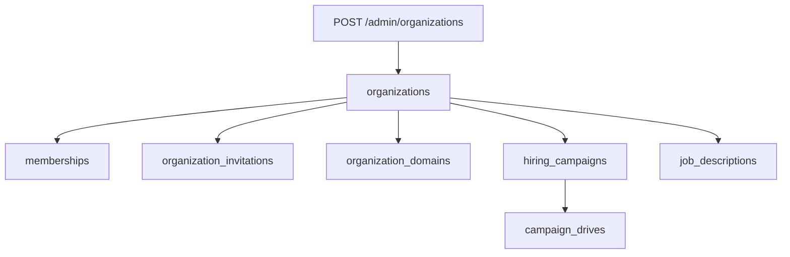

# Orgs and campaigns

Routers: `orgs.py`, `invitations.py`, `platform_admin.py`, `campaigns.py`.

## Organizations

| Method | Path | Guard |
|---|---|---|
| GET | `/orgs` | login. Memberships for the current user. |
| POST | `/orgs` | app admin, **410 Gone**. Use `/admin/organizations`. |
| GET | `/orgs/{org_id}/members` | login / membership |
| PATCH | `/orgs/{org_id}/members/{membership_id}` | admin |
| POST | `/orgs/{org_id}/members` | admin. Direct add. |
| GET | `/orgs/{org_id}/invitations` | admin |
| POST | `/orgs/{org_id}/invitations` | admin |
| DELETE | `/orgs/{org_id}/invitations/{invitation_id}` | admin |
| GET | `/orgs/{org_id}/domains` | admin |
| POST | `/orgs/{org_id}/domains` | admin |
| POST | `/orgs/{org_id}/domains/{domain_id}/verify` | admin |

## Invitations (token)

| Method | Path |
|---|---|
| GET | `/invitations/preview` |
| POST | `/invitations/accept` |

Frontend: `/invite/accept`.

## Platform admin

| Method | Path | Guard |
|---|---|---|
| GET | `/admin/organizations` | `@app_admin_required` |
| POST | `/admin/organizations` | `@app_admin_required` |

`PlatformRoleAssignment.role == app_admin`. Frontend: `/admin/organizations`.

## Campaigns

| Method | Path | Role |
|---|---|---|
| POST | `/campaigns` | recruiter |
| GET | `/campaigns` | recruiter |
| POST | `/campaigns/{campaign_id}/drives` | recruiter |
| GET | `/campaigns/{campaign_id}/drives` | recruiter |

`HiringCampaign` groups JDs. `CampaignDrive` is an event inside a campaign (campus round, etc.).

