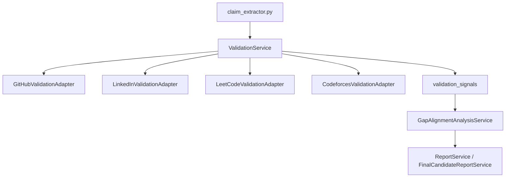

# Reports and validation

Routers: `reports.py`, `validation.py`, `gap_alignment.py`.

## Reports

| Method | Path | Role |
|---|---|---|
| GET | `/reports/{jd_id}/{candidate_id}` | recruiter. Stored `RecruiterReport`. |
| POST | `/reports/jd-report/{jd_id}` | recruiter. JD-level rollup. |
| POST | `/reports/candidate/{candidate_id}/{jd_id}` | recruiter. Per-candidate structured report. |
| POST | `/reports/candidate/{candidate_id}/{jd_id}/final` | recruiter. Markdown dossier via `FinalCandidateReportService`. |

`RecruiterReport` fields: `executive_summary`, `strengths`, `risks`, `interview_focus`, `recommendation`, `report_payload`. Final report text is `FinalCandidateReport.llm_response`.

## Validation

| Method | Path | Role |
|---|---|---|
| POST | `/validation/candidates/{candidate_id}` | recruiter. Run adapters for one candidate. |
| POST | `/validation/run` | recruiter. Pipeline-style run. |
| GET | `/validation/candidates/{candidate_id}` | recruiter. Stored `ValidationSignal` rows. |

Adapters in `app/services/validation/`:

- `github_adapter.py` plus optional `GITHUB_TOKEN` (60 vs 5000 req/hr)
- `linkedin_adapter.py` via Proxycurl (`PROXYCURL_API_KEY`)
- `leetcode_adapter.py` (`LEETCODE_STATS_API_BASE_URL`, default `https://leetcode-stats.tashif.codes`)
- `codeforces_adapter.py` (`CODEFORCES_STATS_API_BASE_URL`)

Timeout: `VALIDATION_HTTP_TIMEOUT_SECONDS` (8). LinkedIn can fall back to a lightweight endpoint when `VALIDATION_LINKEDIN_LIGHTWEIGHT_FALLBACK` is true.

## Gap alignment

| Method | Path | Role |
|---|---|---|
| POST | `/gap-alignment/run` | recruiter. Writes `GapAlignmentAnalysis` (`gap_analysis`, `alignment_analysis`, `final_synthesized_verdict`). |

