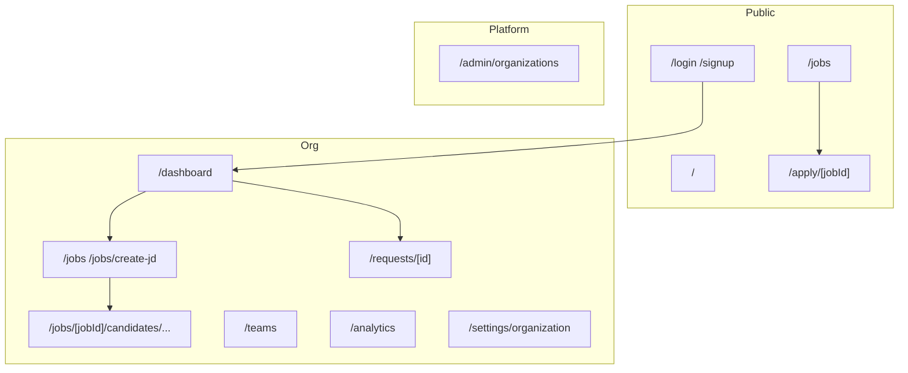

# Frontend application

The in-repo UI is `TalentSync-HR/frontend`: Next.js 16 App Router, React 19, TypeScript, Tailwind 4, bun. Server state is TanStack Query v5. HTTP is Axios with cookies (`lib/api-client.ts`). Forms use React Hook Form + Zod.

This is the recruiter console, plus public job list and apply. It does not build or optimize a job-seeker resume.

## App Router routes

Prefer these paths from `frontend/app`:

| Path | Page |
|---|---|
| `/` | Landing |
| `/login`, `/signup` | Email/password and Google |
| `/auth/google/callback` | OAuth return |
| `/auth/magic-link` | Magic-link consume |
| `/invite/accept` | Org invitation |
| `/dashboard` | Command center (`useDashboard`, `useRequests`, `useTeams`) |
| `/jobs` | JD list (auth or public) |
| `/jobs/create-jd` | Create JD |
| `/jobs/[jobId]` | JD detail |
| `/jobs/[jobId]/candidates` | Shortlist |
| `/jobs/[jobId]/candidates/[candidateId]` | Candidate vs JD |
| `/jobs/[jobId]/candidates/[candidateId]/report` | Recruiter report |
| `/candidates` | Org candidates |
| `/apply/[jobId]` | Public apply (no account) |
| `/requests/[id]` | Requisition detail, applications, interviews |
| `/teams` | Teams |
| `/analytics` | `GET /analytics` |
| `/settings/organization` | Org settings |
| `/admin/organizations` | Platform admin |

`AuthProvider` public exact paths: `/`, `/login`, `/signup`, `/auth/magic-link`, `/auth/google/callback`, `/jobs`, `/invite/accept`. `/apply/...` is public via prefix. Logged-in users without an org are pushed toward invite/admin flows.

`dashboard-sidebar.tsx` still points at `/dashboard/jobs` and `/dashboard/candidates`. Those nested paths are not in `app/`. Use `/jobs` and `/candidates`.

## Data layer

| File | Calls |
|---|---|
| `services/auth.service.ts` | `/auth/login`, signup, verify, refresh, session, logout, switch-org |
| `services/user.service.ts` | `GET /me` |
| `services/jd.service.ts` | `/jds`, public apply |
| `services/resume.service.ts` | `/resumes` |
| `services/request.service.ts` | `/requests` |
| `services/team.service.ts` | `/teams` |
| `services/application.service.ts` | applications |
| `services/interview.service.ts` | interviews |
| `services/governance.service.ts` | `/admin/organizations`, org members/invites |
| `services/validation.service.ts` | `/validation` |
| `services/match-evaluation.service.ts` | `/match-evaluation/run` |
| `services/gap-alignment.service.ts` | `/gap-alignment/run` |
| `services/report.service.ts` | `/reports` |
| `services/analytics.service.ts` | `/analytics` |

Hooks in `frontend/hooks/` wrap those services (`use-jd.hook.ts`, `use-command-center.hook.ts`, …). `QueryProvider` wraps the tree in `app/layout.tsx`.

Axios `baseURL` is `NEXT_PUBLIC_API_URL` or `http://localhost:8000/api/v1`. `withCredentials: true`. On 401 it posts `/auth/refresh` once and retries.

## RBAC in the UI

`lib/rbac.ts` mirrors backend org priority (`viewer` < `recruiter` < `admin`) and team capabilities. `AuthProvider` exposes `canWrite`, `isOrgAdmin`, `isAppAdmin`, `hasOrgPermission`, `hasTeamPermission`.

## Older dashboard repo

[TalentSync-HR-Dashboard](https://github.com/tashifkhan/TalentSync-HR-Dashboard) routes, if you are mapping screens that are not in the in-repo app yet:

- `(auth)`: login, signup, otp, forgot-password, role-selection
- `dashboard/admin`, `dashboard/hm`, `dashboard/hr`
- `(job-pages)/jobs`, `candidates-jobs`, `candidate/[id]`
- `(interview pipeline)`: scheduling, toolkit, live monitoring, post-review
- `form-builder`
- `(client-pages)`: job-application, application-status, schedule-interview
- `(comm-pages)`: campaign-manager, compose-message, template-library, communication-log

Those pages are UI sketches. Do not document their paths as TalentSync-HR API routes.
