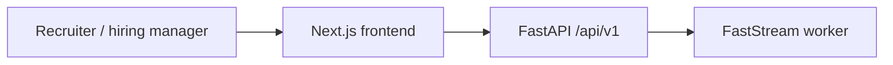

# Project overview

TalentSync HR is a multi-tenant recruiter platform. An organization owns jobs, candidates, teams, interviews, and reports. Recruiters extract structured requirements from JDs, parse resumes, match evidence to each requirement, check claims on public profiles, then rank and report.

This tree documents the recruiter product. TalentSync Normies (resume builder, ATS optimizer for job seekers) lives under `talentsync/`.

## What it does

1. Ingest a JD from text, PDF/DOCX upload, or URL (`POST /api/v1/jds`, `/jds/upload`, `/jds/url`). Gemini writes `JDExtraction` plus `JDRequirement` rows.
2. Ingest a resume (`POST /api/v1/resumes/upload` or public `POST /api/v1/jds/public/{jd_id}/apply`). Gemini writes `ResumeAIAnalysis` / `ResumeAnalysis`.
3. Run matching: holistic `JDResumeMatchEvaluation` and per-requirement `CandidateControlMatrix`.
4. Validate GitHub, LinkedIn (Proxycurl), LeetCode, and Codeforces claims into `ValidationSignal` rows.
5. Rank with `RankingService` into `CandidateScoreSnapshot` / `CandidateWeightedRanking`.
6. Write `GapAlignmentAnalysis`, `RecruiterReport`, and markdown `FinalCandidateReport`.

Long LLM work is published to Kafka. `app.worker_main:stream_app` consumes it so `uvicorn` is not blocked.

## Stack

| Layer | Choice |
|---|---|
| API | FastAPI, Python 3.12+, `uv` |
| ORM | SQLModel, PostgreSQL 15 (prod compose uses 16) |
| Migrations | Alembic (`0001_initial`, `0002_hiring_command_center_teams_`, `0003_organization_governance`) |
| Jobs | FastStream + Kafka |
| LLM | Google Gemini via `app.core.llm` |
| Auth | JWT httpOnly cookies, Google OAuth2, magic-link verify (passwordless request-link is 410) |
| Frontend | Next.js 16, React 19, TanStack Query v5, Axios, Tailwind 4, bun |
| UI | shadcn/ui, Framer Motion |

## Tenancy and roles

Every recruitment row carries `organization_id`. Active org comes from the JWT `org_id` claim, `x-org-id`, or `org_id` query. Org roles: `admin`, `recruiter`, `viewer` (`OrganizationRole`). Team roles: `team_admin`, `team_recruiter`, `interviewer`, `team_viewer`. Platform admins (`PlatformRole.APP_ADMIN`) provision orgs through `/api/v1/admin/organizations`.

## Command center vs screening

Two overlapping UIs share the same `JobDescription` table:

- Screening: `/jobs`, `/jobs/create-jd`, `/jobs/{jobId}/candidates/...`, `/candidates`
- Command center: `/dashboard` and `/requests/{id}` (requisition status, applications, interviews, teams)

`JobDescriptionStatus` (`draft` / `active` / `closed`) controls public posting. `RequestStatus` (`open`, `in_review`, `interviewing`, …) is the operational pipeline.

## Related dashboard repo

[TalentSync-HR-Dashboard](https://github.com/tashifkhan/TalentSync-HR-Dashboard) is an older App Router sketch: `(auth)`, `dashboard/{admin,hm,hr}`, `(job-pages)`, `(interview pipeline)`, `form-builder`, `(client-pages)`, `(comm-pages)`. Prefer `TalentSync-HR/frontend/app` for routes that exist today. Treat Dashboard paths as planned screens, not live API contracts.

## Repos and live stack

- https://github.com/tashifkhan/TalentSync-HR
- https://github.com/tashifkhan/TalentSync-HR-Dashboard
- Production compose targets `https://hr.talentsync.tashif.codes` and shares Kafka with the TalentSync stack (`talentsync_kafka`).
