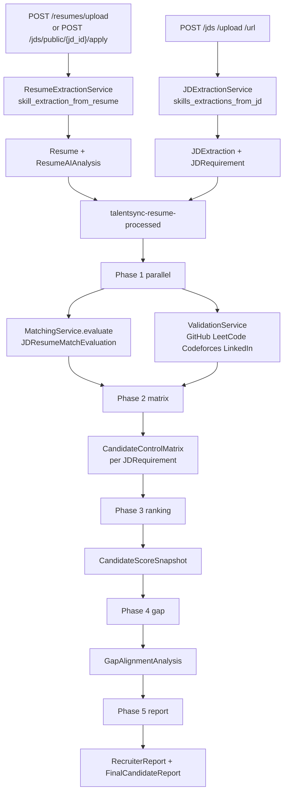
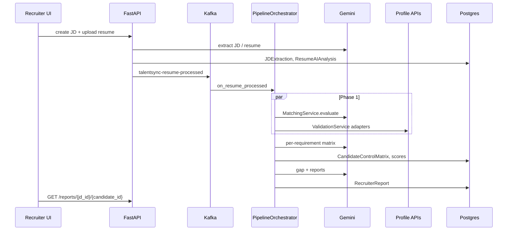

# Screening and matching

End-to-end path for one candidate against one JD. HTTP creates the records and publishes Kafka. `PipelineOrchestrator.run_post_parse_pipeline` (from `on_resume_processed`) does the slow work.

## JD extract

`jd_extraction_service.py` plus prompt `app/data/prompt/skills_extractions_from_jd.py`. Writes `jd_extractions`: title, type, department, skill lists, experience bounds, `raw_llm_response`. Also inserts `jd_requirements` with `control_id`, `must_have`, `priority_weight`. Then `publish_jd_created` (`talentsync-jd-created`). The extraction handler currently logs only.

## Resume extract

`resume_extraction_service.py` plus `skill_extraction_from_resume.py`. Writes contact fields, `predicted_field`, `recommended_roles`, JSONB sections (skills, education, work, projects, publications, PoR, certs, achievements). `publish_resume_extracted`. If the resume is tied to a JD, `publish_resume_processed`.

## Match

`MatchingService.evaluate` runs the holistic prompt `matching_of_jd_and_resume.py` (education, experience, skills, projects, certs, achievements, gap). `match_requirement` fills one matrix row: `matched` / `partial` / `unmatched`, evidence JSON, scores. Worker blends LLM confidence 0.7 with validation score 0.3.

You can also trigger HTTP `POST /matches/run` and `POST /match-evaluation/run` without waiting for Kafka.

## External validation

`claim_extractor.py` pulls project and work claims from resume JSON. Adapters:

| Source | Adapter | Config |
|---|---|---|
| GitHub | `github_adapter.py` | optional `GITHUB_TOKEN`, `GITHUB_STATS_API_BASE_URL` |
| LinkedIn | `linkedin_adapter.py` | Proxycurl `PROXYCURL_API_KEY` |
| LeetCode | `leetcode_adapter.py` | `LEETCODE_STATS_API_BASE_URL` |
| Codeforces | `codeforces_adapter.py` | `CODEFORCES_STATS_API_BASE_URL` |

Each observation becomes a `ValidationSignal` (`source`, `claim`, `evidence_url`, `matched`, `confidence_delta`). Missing URLs skip that adapter. Timeout 8s.

## Ranking

Pipeline snapshot weights: jd_match 0.50, projects 0.20, coding_profiles 0.15, education 0.10, experience 0.05. Coding profile is a coarse bump if `candidate.github_url` is set (70 vs 40).

`GET /rankings/{jd_id}` uses `RankingService` on the seven holistic dimensions (weights must sum to 1.0) and stores `CandidateWeightedRanking`.

## Report

`GapAlignmentAnalysisService` then `ReportService` (summary, strengths, risks, interview focus, recommendation) then `FinalCandidateReportService` (markdown dossier). Orchestrator publishes `talentsync-report-generated`.

Frontend: `/jobs/{jobId}/candidates/{candidateId}/report` and hooks `use-report`, `use-validation`, `use-match-evaluation`, `use-gap-alignment`.
