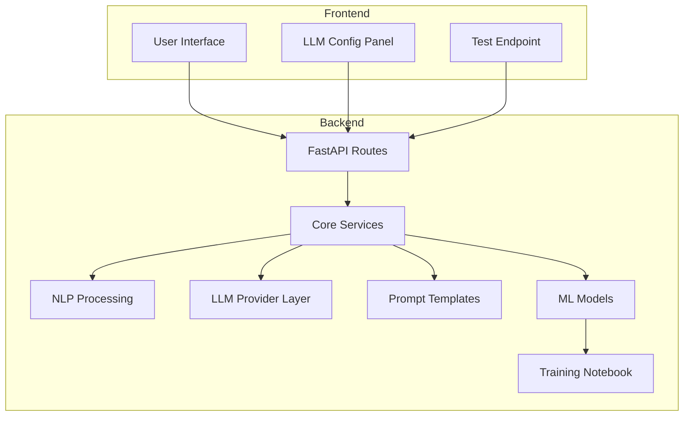
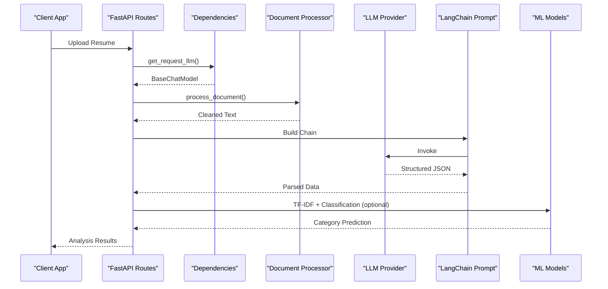
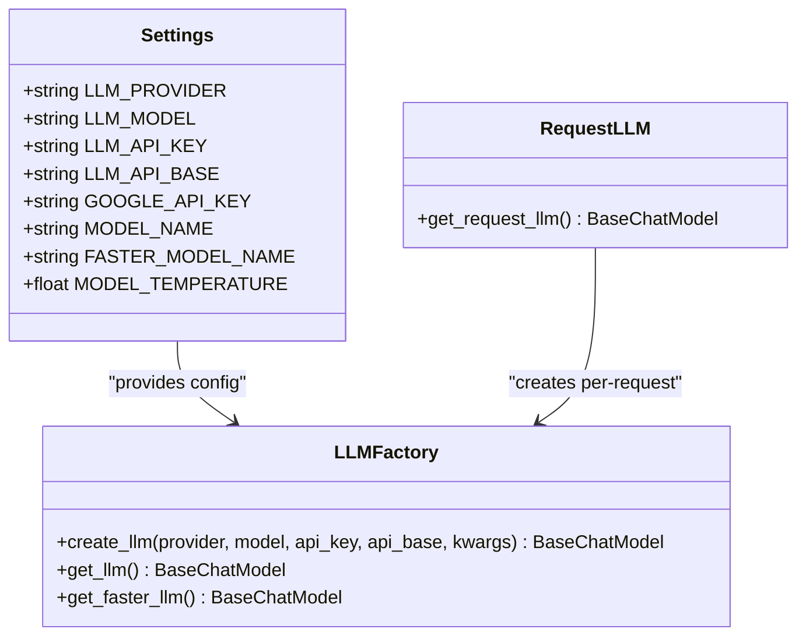
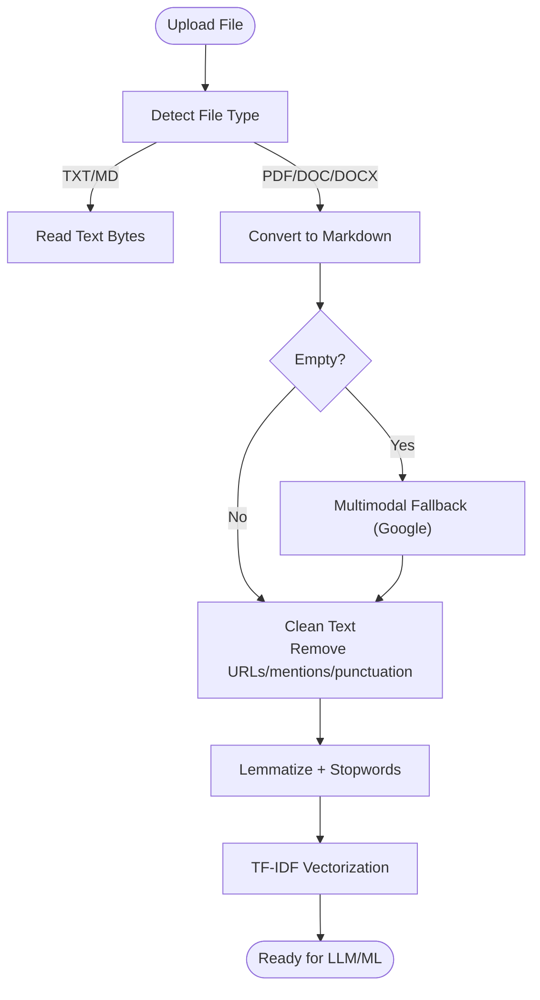
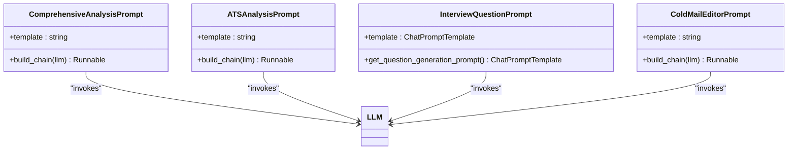
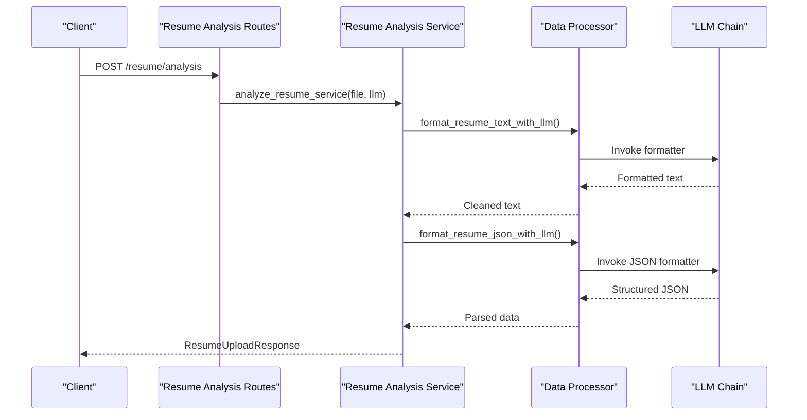
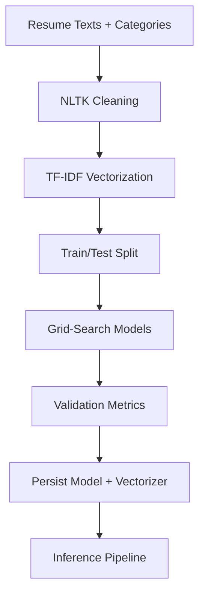
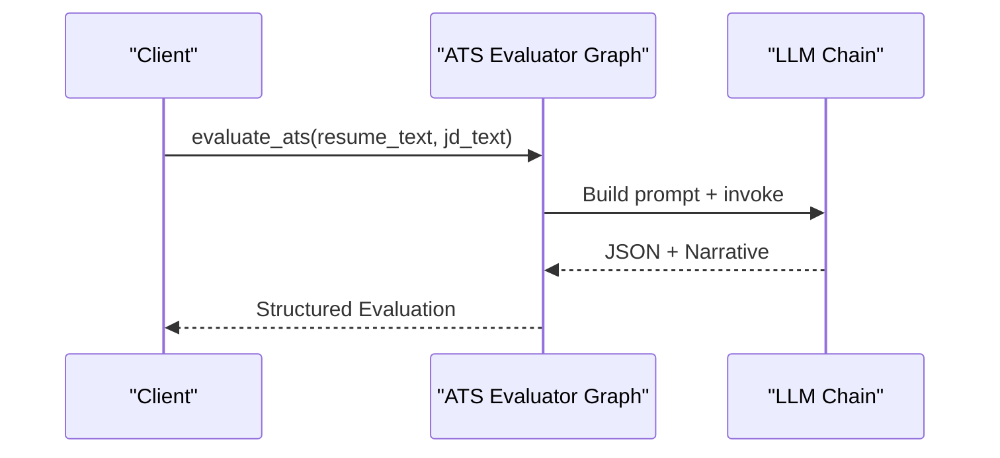
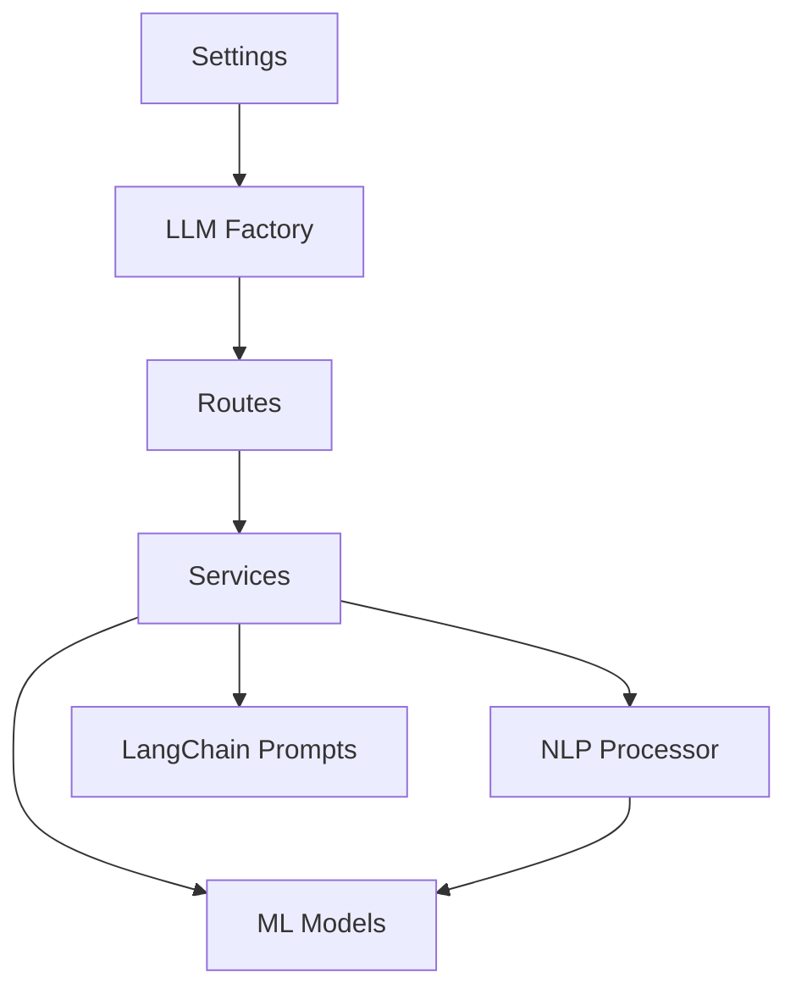

# AI/ML Integration

<cite>
**Referenced Files in This Document**
- [server.py](file://backend/server.py)
- [process_resume.py](file://backend/app/services/process_resume.py)
- [resume_analysis.py](file://backend/app/services/resume_analysis.py)
- [data_processor.py](file://backend/app/services/data_processor.py)
- [resume_analysis_routes.py](file://backend/app/routes/resume_analysis.py)
- [schemas.py](file://backend/app/models/schemas.py)
- [llm.py](file://backend/app/core/llm.py)
- [deps.py](file://backend/app/core/deps.py)
- [settings.py](file://backend/app/core/settings.py)
- [llm_routes.py](file://backend/app/routes/llm.py)
- [ats_analysis.py](file://backend/app/data/prompt/ats_analysis.py)
- [comprehensive_analysis.py](file://backend/app/data/prompt/comprehensive_analysis.py)
- [interview_question.py](file://backend/app/data/prompt/interview_question.py)
- [cold_mail_editor.py](file://backend/app/data/prompt/cold_mail_editor.py)
- [ats_evaluator_graph.py](file://backend/app/services/ats_evaluator/graph.py)
- [ats.py](file://backend/app/services/ats.py)
- [resume_generator_graph.py](file://backend/app/services/resume_generator/graph.py)
- [interview_templates.py](file://backend/app/models/interview/templates.py)
- [Resume Analyser.ipynb](file://analysis/Resume%20Analyser.ipynb)
- [test.py](file://backend/test.py)
</cite>

## Table of Contents
1. [Introduction](#introduction)
2. [Project Structure](#project-structure)
3. [Core Components](#core-components)
4. [Architecture Overview](#architecture-overview)
5. [Detailed Component Analysis](#detailed-component-analysis)
6. [Dependency Analysis](#dependency-analysis)
7. [Performance Considerations](#performance-considerations)
8. [Troubleshooting Guide](#troubleshooting-guide)
9. [Conclusion](#conclusion)
10. [Appendices](#appendices)

## Introduction
This document describes the AI/ML integration for the TalentSync-Normies platform. It covers the microservice architecture, LangChain orchestration for AI pipelines, NLP processing for resume text extraction and structured analysis, machine learning models for resume classification, and the prompt engineering system supporting ATS scoring, comprehensive analysis, interview assistance, and communication tools. It also documents LLM provider configuration, dynamic provider switching, cost optimization strategies, model training data and validation metrics, performance monitoring, testing strategies, model versioning, and deployment considerations.

## Project Structure
The AI/ML capabilities are primarily implemented in the backend Python service, with complementary frontend components for configuration and testing. The backend organizes AI/ML logic into:
- Core LLM configuration and provider switching
- Document processing and NLP preprocessing
- LangChain prompt engineering and chains
- Resume analysis services and routes
- ATS evaluation and interview assistance
- Experiment notebooks for ML model training

**Diagram sources**
- [llm_routes.py](file://backend/app/routes/llm.py#L23-L49)
- [llm.py](file://backend/app/core/llm.py#L45-L180)
- [process_resume.py](file://backend/app/services/process_resume.py#L68-L91)
- [data_processor.py](file://backend/app/services/data_processor.py#L1-L409)

**Section sources**
- [llm_routes.py](file://backend/app/routes/llm.py#L1-L50)
- [llm.py](file://backend/app/core/llm.py#L45-L180)
- [process_resume.py](file://backend/app/services/process_resume.py#L1-L117)

## Core Components
- LLM Provider Configuration and Dynamic Switching: Centralized provider selection and instantiation supporting multiple vendors with unified API.
- NLP Pipeline: Document ingestion, text extraction, cleaning, and preprocessing using spaCy and NLTK.
- LangChain Prompt Engineering: Structured prompts for comprehensive resume analysis, ATS scoring, interview question generation, and cold email editing.
- ML Models: Scikit-learn-based resume classification trained on a synthetic dataset; persisted models and vectorizers for inference.
- Service Orchestration: FastAPI routes delegating to specialized services for resume analysis, ATS evaluation, and interview assistance.

**Section sources**
- [settings.py](file://backend/app/core/settings.py#L21-L33)
- [llm.py](file://backend/app/core/llm.py#L45-L180)
- [process_resume.py](file://backend/app/services/process_resume.py#L12-L91)
- [data_processor.py](file://backend/app/services/data_processor.py#L1-L409)
- [Resume Analyser.ipynb](file://analysis/Resume%20Analyser.ipynb#L1-L729)

## Architecture Overview
The AI/ML microservice architecture integrates document processing, LLM orchestration, and ML inference. The system supports dynamic LLM provider switching and includes robust error handling and fallback mechanisms.

**Diagram sources**
- [resume_analysis_routes.py](file://backend/app/routes/resume_analysis.py#L16-L67)
- [deps.py](file://backend/app/core/deps.py#L39-L68)
- [process_resume.py](file://backend/app/services/process_resume.py#L68-L91)
- [data_processor.py](file://backend/app/services/data_processor.py#L186-L268)
- [server.py](file://backend/server.py#L563-L3334)

## Detailed Component Analysis

### LLM Provider Configuration and Dynamic Switching
The system supports multiple LLM providers (Google, OpenAI, Anthropic, Ollama, OpenRouter, DeepSeek) with a unified factory that selects the appropriate client based on configuration. It includes:
- Environment-based settings for provider, model, API key, and base URL
- Singleton instances for default and faster models
- Runtime provider override via request headers
- Connection testing endpoint for validating credentials

**Diagram sources**
- [settings.py](file://backend/app/core/settings.py#L7-L49)
- [llm.py](file://backend/app/core/llm.py#L45-L180)
- [deps.py](file://backend/app/core/deps.py#L39-L68)

**Section sources**
- [settings.py](file://backend/app/core/settings.py#L21-L33)
- [llm.py](file://backend/app/core/llm.py#L45-L180)
- [deps.py](file://backend/app/core/deps.py#L39-L68)
- [llm_routes.py](file://backend/app/routes/llm.py#L23-L49)

### NLP Processing Pipeline
The pipeline extracts and cleans text from documents, applies preprocessing, and prepares data for LLM analysis and ML classification:
- Document ingestion: Supports TXT, MD, PDF, DOC/DOCX with fallback to multimodal conversion when needed.
- Text extraction: Uses PyMuPDF for reliable Markdown rendering.
- Cleaning and preprocessing: Removes URLs, mentions, punctuation, lemmatization, and stopword filtering.
- spaCy integration: Tokenization and lemmatization for structured NLP tasks.
- ML preprocessing: TF-IDF vectorization for classification.

**Diagram sources**
- [process_resume.py](file://backend/app/services/process_resume.py#L68-L91)
- [server.py](file://backend/server.py#L738-L761)
- [Resume Analyser.ipynb](file://analysis/Resume%20Analyser.ipynb#L10-L22)

**Section sources**
- [process_resume.py](file://backend/app/services/process_resume.py#L12-L91)
- [server.py](file://backend/server.py#L738-L761)
- [Resume Analyser.ipynb](file://analysis/Resume%20Analyser.ipynb#L10-L22)

### LangChain Prompt Engineering System
Structured prompts guide the LLM to produce standardized JSON outputs for downstream processing:
- Comprehensive Analysis: Extracts skills, experience, projects, education, and predicted field.
- ATS Analysis: Scores resumes against job descriptions and provides keyword coverage and recommendations.
- Interview Question Generation: Produces role-specific, difficulty-tuned questions with evaluation criteria.
- Cold Mail Editing: Personalizes and refines cold outreach emails with context and edits.

**Diagram sources**
- [comprehensive_analysis.py](file://backend/app/data/prompt/comprehensive_analysis.py#L1-L173)
- [ats_analysis.py](file://backend/app/data/prompt/ats_analysis.py#L1-L68)
- [interview_question.py](file://backend/app/data/prompt/interview_question.py#L1-L60)
- [cold_mail_editor.py](file://backend/app/data/prompt/cold_mail_editor.py#L1-L137)

**Section sources**
- [comprehensive_analysis.py](file://backend/app/data/prompt/comprehensive_analysis.py#L1-L173)
- [ats_analysis.py](file://backend/app/data/prompt/ats_analysis.py#L1-L68)
- [interview_question.py](file://backend/app/data/prompt/interview_question.py#L1-L60)
- [cold_mail_editor.py](file://backend/app/data/prompt/cold_mail_editor.py#L1-L137)

### Resume Analysis Services and Routes
The backend exposes endpoints for resume analysis, formatting, and comprehensive analysis. Services integrate LLM chains and validation schemas:
- File-based analysis: Processes uploaded files and returns structured data.
- Text-based analysis: Accepts formatted text and returns comprehensive analysis.
- Validation and cleanup: Ensures data conforms to Pydantic models and filters invalid entries.

**Diagram sources**
- [resume_analysis_routes.py](file://backend/app/routes/resume_analysis.py#L16-L67)
- [resume_analysis.py](file://backend/app/services/resume_analysis.py#L28-L157)
- [data_processor.py](file://backend/app/services/data_processor.py#L26-L130)

**Section sources**
- [resume_analysis_routes.py](file://backend/app/routes/resume_analysis.py#L1-L68)
- [resume_analysis.py](file://backend/app/services/resume_analysis.py#L1-L364)
- [data_processor.py](file://backend/app/services/data_processor.py#L1-L409)
- [schemas.py](file://backend/app/models/schemas.py#L105-L191)

### Machine Learning Models for Resume Classification
A scikit-learn pipeline classifies resumes into predefined categories:
- Training Data: Synthetic dataset with resume texts and categories.
- Preprocessing: NLTK-based cleaning and TF-IDF vectorization.
- Models: Grid-searched ensemble models (Random Forest, AdaBoost, Gradient Boosting, SVM, KNN, MultinomialNB, Logistic Regression).
- Persistence: Saved model and vectorizer artifacts for inference.

**Diagram sources**
- [Resume Analyser.ipynb](file://analysis/Resume%20Analyser.ipynb#L10-L22)
- [Resume Analyser.ipynb](file://analysis/Resume%20Analyser.ipynb#L16-L22)
- [Resume Analyser.ipynb](file://analysis/Resume%20Analyser.ipynb#L749-L780)

**Section sources**
- [Resume Analyser.ipynb](file://analysis/Resume%20Analyser.ipynb#L1-L729)

### ATS Evaluation and Interview Assistance
- ATS Evaluation: LangChain graph orchestrates keyword matching, scoring, and recommendations against job descriptions.
- Interview Assistance: Templates and question generation with difficulty and topic alignment; streaming code execution for technical interviews.

**Diagram sources**
- [ats_evaluator_graph.py](file://backend/app/services/ats_evaluator/graph.py#L116-L149)
- [ats_analysis.py](file://backend/app/data/prompt/ats_analysis.py#L66-L68)
- [ats.py](file://backend/app/services/ats.py#L106-L127)

**Section sources**
- [ats_evaluator_graph.py](file://backend/app/services/ats_evaluator/graph.py#L97-L149)
- [ats_analysis.py](file://backend/app/data/prompt/ats_analysis.py#L1-L68)
- [ats.py](file://backend/app/services/ats.py#L85-L127)
- [interview_templates.py](file://backend/app/models/interview/templates.py#L372-L410)

### Communication Tools and Tailored Resume Generation
- Cold Email Editing: Personalized email generation and iterative editing guided by candidate data and company insights.
- Tailored Resume Generation: Uses ATS evaluation summaries and company website content to refine and align resumes.

**Section sources**
- [cold_mail_editor.py](file://backend/app/data/prompt/cold_mail_editor.py#L1-L137)
- [resume_generator_graph.py](file://backend/app/services/resume_generator/graph.py#L99-L137)

## Dependency Analysis
The AI/ML subsystem exhibits clear separation of concerns:
- Core LLM layer depends on environment settings and provider libraries.
- Services depend on LangChain prompts and LLM instances.
- NLP preprocessing depends on spaCy and NLTK resources.
- ML models depend on persisted artifacts and vectorizers.

**Diagram sources**
- [settings.py](file://backend/app/core/settings.py#L7-L49)
- [llm.py](file://backend/app/core/llm.py#L45-L180)
- [llm_routes.py](file://backend/app/routes/llm.py#L23-L49)
- [process_resume.py](file://backend/app/services/process_resume.py#L12-L91)
- [data_processor.py](file://backend/app/services/data_processor.py#L1-L409)

**Section sources**
- [settings.py](file://backend/app/core/settings.py#L1-L50)
- [llm.py](file://backend/app/core/llm.py#L45-L180)
- [llm_routes.py](file://backend/app/routes/llm.py#L1-L50)
- [process_resume.py](file://backend/app/services/process_resume.py#L1-L117)
- [data_processor.py](file://backend/app/services/data_processor.py#L1-L409)

## Performance Considerations
- LLM Provider Selection: Choose models aligned with latency and cost targets; use faster models for preliminary formatting and heavier models for complex reasoning.
- Cost Optimization: 
  - Use provider-specific pricing calculators and monitor token usage.
  - Prefer smaller, cheaper models for formatting and fallbacks.
  - Batch requests where feasible and avoid unnecessary retries.
- Caching and Persistence:
  - Persist TF-IDF vectorizer and ML models to avoid retraining.
  - Cache LLM responses for identical inputs where appropriate.
- Resource Management:
  - Monitor memory usage during PDF processing and vectorization.
  - Limit concurrent LLM invocations to prevent rate-limit errors.

## Troubleshooting Guide
Common issues and resolutions:
- Authentication Failures: Verify API keys and provider configuration; use the LLM test endpoint to validate connectivity.
- Rate Limits: Implement retry with exponential backoff and switch to lighter models temporarily.
- Empty or Malformed JSON: Ensure prompts return JSON blocks; use fallback parsing logic to extract JSON substrings.
- Provider Switching Errors: Confirm environment variables and model availability; fallback to default provider if unknown.

**Section sources**
- [llm_routes.py](file://backend/app/routes/llm.py#L23-L49)
- [data_processor.py](file://backend/app/services/data_processor.py#L54-L129)
- [llm.py](file://backend/app/core/llm.py#L99-L107)

## Conclusion
The TalentSync-Normies AI/ML integration leverages a modular backend architecture with LangChain orchestration, robust LLM provider configuration, and a hybrid NLP/ML pipeline. The system supports dynamic provider switching, structured prompt engineering, and scalable inference through persisted models. With clear error handling, testing endpoints, and performance-conscious design, it provides a solid foundation for AI-driven talent acquisition workflows.

## Appendices

### Model Training Data and Validation Metrics
- Dataset: Synthetic resume corpus with labeled categories.
- Preprocessing: NLTK cleaning and TF-IDF vectorization.
- Models Tested: Random Forest, AdaBoost, Gradient Boosting, SVM, KNN, MultinomialNB, Logistic Regression.
- Validation: Cross-validation grid search with hyperparameter tuning; best scores recorded.

**Section sources**
- [Resume Analyser.ipynb](file://analysis/Resume%20Analyser.ipynb#L16-L22)
- [Resume Analyser.ipynb](file://analysis/Resume%20Analyser.ipynb#L749-L780)

### Testing Strategies and Model Versioning
- Unit-level tests: Validate prompt parsing, JSON extraction, and service error handling.
- Integration tests: End-to-end resume analysis and ATS evaluation flows.
- Model versioning: Persist model and vectorizer artifacts; maintain backward-compatible schemas.

**Section sources**
- [test.py](file://backend/test.py#L1-L19)
- [data_processor.py](file://backend/app/services/data_processor.py#L186-L268)

### Deployment Considerations
- Containerization: Package backend with required LLM provider libraries and environment variables.
- Secrets Management: Store API keys securely; use encrypted configuration for user-defined providers.
- Monitoring: Track LLM latency, error rates, and token usage; alert on sustained failures.

**Section sources**
- [settings.py](file://backend/app/core/settings.py#L21-L33)
- [llm_routes.py](file://backend/app/routes/llm.py#L23-L49)