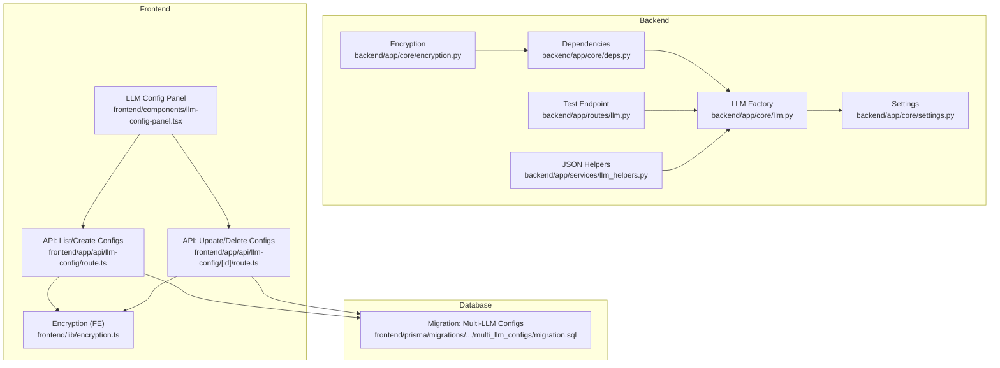
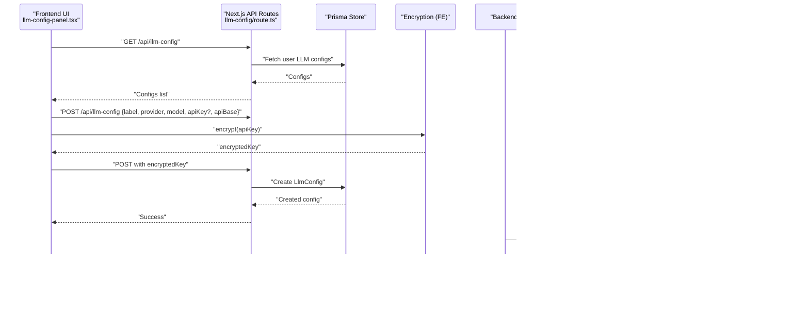
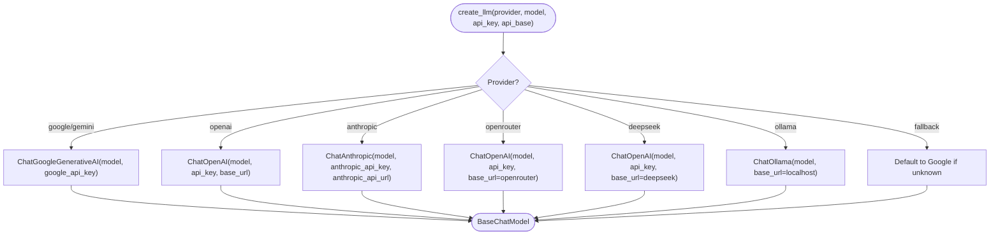
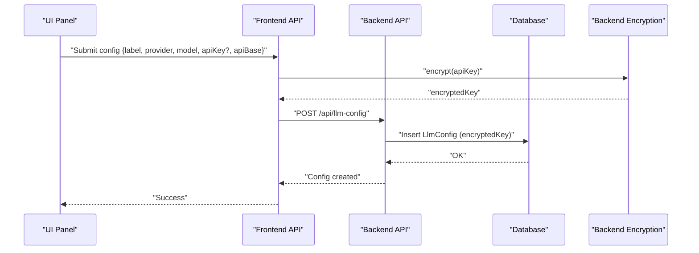
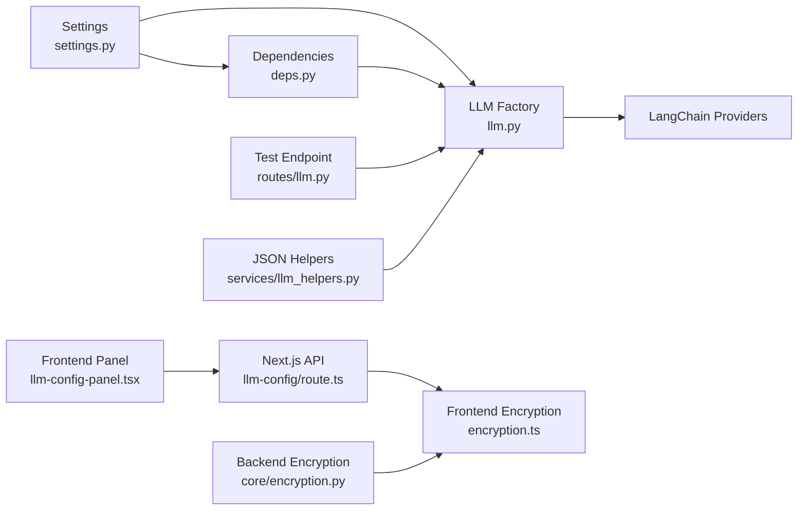

# LLM provider configuration

## Introduction
This page explains how TalentSync manages Large Language Model (LLM) providers and configurations. It covers the dynamic provider switching mechanism supporting OpenAI, Gemini, Anthropic, OpenRouter, DeepSeek, Ollama, and Mistral. It documents the configuration system including API key management, rate limiting considerations, and fallback strategies. It also details cost optimization techniques such as token usage tracking, model selection based on complexity, and response caching. The provider abstraction layer, authentication handling, and error recovery mechanisms are explained, along with deployment configurations, environment variable setup, and monitoring approaches for provider performance metrics.

## Project structure
The LLM configuration spans backend and frontend components:
- Backend provides provider factories, settings, dependencies, encryption utilities, and a test endpoint.
- Frontend exposes a UI panel to manage multiple LLM configurations per user, including encryption and testing.

```mermaid
graph TB
subgraph "Backend"
S["Settings<br/>backend/app/core/settings.py"]
L["LLM Factory<br/>backend/app/core/llm.py"]
D["Dependencies<br/>backend/app/core/deps.py"]
E["Encryption<br/>backend/app/core/encryption.py"]
R["Test Endpoint<br/>backend/app/routes/llm.py"]
H["JSON Helpers<br/>backend/app/services/llm_helpers.py"]
end
subgraph "Frontend"
FC["API: List/Create Configs<br/>frontend/app/api/llm-config/route.ts"]
FD["API: Update/Delete Configs<br/>frontend/app/api/llm-config/[id]/route.ts"]
UI["LLM Config Panel<br/>frontend/components/llm-config-panel.tsx"]
FE["Encryption (FE)<br/>frontend/lib/encryption.ts"]
end
subgraph "Database"
M["Migration: Multi-LLM Configs<br/>frontend/prisma/migrations/.../multi_llm_configs/migration.sql"]
end
UI --> FC
UI --> FD
FC --> M
FD --> M
FC --> FE
FD --> FE
D --> L
L --> S
R --> L
H --> L
E --> D
```

- [frontend/app/api/llm-config/[id]/route.ts](file://frontend/app/api/llm-config/[id]/route.ts#L36-L83)
- `frontend/components/llm-config-panel.tsx`
- `frontend/lib/encryption.ts`
- `frontend/prisma/migrations/20260214000000_multi_llm_configs/migration.sql`

- [frontend/app/api/llm-config/[id]/route.ts](file://frontend/app/api/llm-config/[id]/route.ts#L1-L133)
- `frontend/components/llm-config-panel.tsx`
- `frontend/lib/encryption.ts`
- `frontend/prisma/migrations/20260214000000_multi_llm_configs/migration.sql`

## Core components
- Provider factory and singleton management:
  - Dynamic provider creation supports OpenAI, Gemini, Anthropic, OpenRouter, DeepSeek, Ollama, and Mistral.
  - Temperature support varies by provider/model; factory enforces compatibility.
  - Singleton instances for default and "faster" models reduce initialization overhead.
- Settings and environment:
  - Centralized configuration via Pydantic settings with environment file loading.
  - Supports legacy and multi-provider fields for backward compatibility.
- Dependencies and request-time selection:
  - FastAPI dependency injects a per-request LLM instance using headers from the frontend proxy.
  - Falls back to server defaults when user-specific headers are absent.
- Encryption:
  - Backend encryption utilities for secure storage of API keys.
  - Frontend encryption utilities mirror the backend key derivation strategy.
- JSON helpers:
  - Reliable extraction and JSON parsing for LLM responses.
- Test endpoint:
  - Validates provider connectivity and response content.

## Architecture overview
The system separates concerns across layers:
- Frontend UI manages multiple user LLM configurations, encrypts keys, and tests connections.
- Backend validates and stores encrypted keys, exposes a test endpoint, and creates provider instances.
- Per-request dependency selects either user-specific or server-default LLM based on headers.

```mermaid
sequenceDiagram
participant FE as "Frontend UI<br/>llm-config-panel.tsx"
participant API as "Next.js API Routes<br/>llm-config/route.ts"
participant DB as "Prisma Store"
participant ENC as "Encryption (FE)"
participant BE as "Backend"
participant DEP as "get_request_llm"
participant LLM as "LLM Factory"
FE->>API : "GET /api/llm-config"
API->>DB : "Fetch user LLM configs"
DB-->>API : "Configs"
API-->>FE : "Configs list"
FE->>API : "POST /api/llm-config {label, provider, model, apiKey?, apiBase}"
FE->>ENC : "encrypt(apiKey)"
ENC-->>FE : "encryptedKey"
FE->>API : "POST with encryptedKey"
API->>DB : "Create LlmConfig"
DB-->>API : "Created config"
API-->>FE : "Success"
BE->>DEP : "Inject per-request LLM"
DEP->>LLM : "create_llm(provider, model, api_key, api_base)"
LLM-->>DEP : "BaseChatModel"
DEP-->>BE : "LLM instance"
```

- [frontend/app/api/llm-config/[id]/route.ts](file://frontend/app/api/llm-config/[id]/route.ts#L36-L83)
- `frontend/lib/encryption.ts`
- `backend/app/core/deps.py`
- `backend/app/core/llm.py`

## Detailed component analysis

### Provider abstraction and dynamic switching
The provider abstraction encapsulates LangChain chat model constructors behind a single factory function. Supported providers include OpenAI, Gemini, Anthropic, OpenRouter, DeepSeek, Ollama, and Mistral. The factory:
- Selects the appropriate constructor based on provider string.
- Applies provider-specific base URLs and API key fields.
- Conditionally passes temperature depending on provider/model compatibility.

```mermaid
flowchart TD
Start(["create_llm(provider, model, api_key, api_base)"]) --> CheckProv{"Provider?"}
CheckProv --> |google/gemini| G["ChatGoogleGenerativeAI(model, google_api_key)"]
CheckProv --> |openai| O["ChatOpenAI(model, api_key, base_url)"]
CheckProv --> |anthropic| A["ChatAnthropic(model, anthropic_api_key, anthropic_api_url)"]
CheckProv --> |openrouter| OR["ChatOpenAI(model, api_key, base_url=openrouter)"]
CheckProv --> |deepseek| DS["ChatOpenAI(model, api_key, base_url=deepseek)"]
CheckProv --> |ollama| OL["ChatOllama(model, base_url=localhost)"]
CheckProv --> |fallback| F["Default to Google if unknown"]
G --> End(["BaseChatModel"])
O --> End
A --> End
OR --> End
DS --> End
OL --> End
F --> End
```

### Configuration system and API key management
- Frontend:
  - Users can define multiple configurations with labels, provider, model, optional base URL, and optional API key.
  - API keys are encrypted client-side before being sent to the backend.
  - A dedicated test action validates connectivity against the selected provider/model/base.
- Backend:
  - Stores encrypted keys in the database and exposes endpoints to list, create, update, and delete configurations.
  - Provides a test endpoint that instantiates an LLM and checks response content.
  - Uses a server-side encryption utility to derive a 32-byte key via SHA-256 and AES-256-GCM for secure storage.

```mermaid
sequenceDiagram
participant UI as "UI Panel"
participant FE as "Frontend API"
participant BE as "Backend API"
participant DB as "Database"
participant ENC as "Backend Encryption"
UI->>FE : "Submit config {label, provider, model, apiKey?, apiBase}"
FE->>ENC : "encrypt(apiKey)"
ENC-->>FE : "encryptedKey"
FE->>BE : "POST /api/llm-config"
BE->>DB : "Insert LlmConfig (encryptedKey)"
DB-->>BE : "OK"
BE-->>FE : "Config created"
FE-->>UI : "Success"
```

- [frontend/app/api/llm-config/[id]/route.ts](file://frontend/app/api/llm-config/[id]/route.ts#L36-L83)
- `frontend/lib/encryption.ts`
- `backend/app/core/encryption.py`

### Rate limiting and fallback strategies
- Rate limiting:
  - Implemented at the provider level via upstream API constraints. The system does not enforce application-level rate limits.
- Fallback strategies:
  - Unknown provider falls back to Google/Gemini with a warning.
  - Per-request selection uses headers; missing headers fall back to server-default singleton.
  - If the default singleton cannot be initialized (e.g., missing API key), a 503 error is raised advising the user to configure LLM settings.

### Cost optimization techniques
- Token usage tracking:
  - Not implemented in the current codebase. Recommendation: Integrate token counters around LLM invocations and persist usage metrics per configuration.
- Model selection based on complexity:
  - Use a "faster" model for lightweight tasks and reserve larger models for complex prompts. The system maintains separate singleton instances for default and faster models.
- Response caching:
  - Not implemented in the current codebase. Recommendation: Cache deterministic prompts keyed by provider, model, and hashed prompt content with TTL.

### Authentication handling and error recovery
- Authentication:
  - Frontend requires a session for configuration management endpoints.
  - Per-request LLM selection relies on headers injected by the frontend proxy when a user has a custom configuration.
- Error recovery:
  - Per-request dependency catches instantiation errors and returns a 503 with a user-friendly message.
  - Test endpoint wraps LLM invocation and returns structured success/failure messages.
  - Frontend displays user-friendly messages for failures and allows retesting.

### Deployment configurations and environment variables
- Backend environment variables:
  - GOOGLE_API_KEY, LLM_API_KEY, LLM_API_BASE, LLM_PROVIDER, LLM_MODEL, MODEL_NAME, FASTER_MODEL_NAME, MODEL_TEMPERATURE, ENCRYPTION_KEY.
- Frontend environment variables:
  - ENCRYPTION_KEY must match the backend key for client-side encryption to interoperate.
- Example backend.env entries are provided in the repository.

### Monitoring dashboards for provider performance metrics
- Current codebase does not include built-in metrics collection.
- Recommended approach:
  - Instrument LLM invocations to capture latency, success rates, and token counts.
  - Aggregate metrics per provider/model and expose them via a metrics endpoint or external monitoring stack.

[No sources needed since this section provides general guidance]

## Dependency analysis
The following diagram shows key dependencies among components involved in LLM configuration and runtime selection.

```mermaid
graph LR
Settings["Settings<br/>settings.py"] --> LLM["LLM Factory<br/>llm.py"]
Settings --> Deps["Dependencies<br/>deps.py"]
LLM --> LangChain["LangChain Providers"]
Deps --> LLM
Test["Test Endpoint<br/>routes/llm.py"] --> LLM
Helpers["JSON Helpers<br/>services/llm_helpers.py"] --> LLM
FE_UI["Frontend Panel<br/>llm-config-panel.tsx"] --> FE_API["Next.js API<br/>llm-config/route.ts"]
FE_API --> FE_Enc["Frontend Encryption<br/>encryption.ts"]
BE_Enc["Backend Encryption<br/>core/encryption.py"] --> FE_Enc
```

## Performance considerations
- Initialization costs:
  - Use singleton instances for default and faster models to avoid repeated initialization overhead.
- Provider selection:
  - Prefer smaller, cheaper models for routine tasks; reserve larger models for complex reasoning.
- Network latency:
  - Local providers (e.g., Ollama) can reduce latency compared to cloud APIs.
- Caching:
  - Implement deterministic prompt caching to reduce redundant calls.

[No sources needed since this section provides general guidance]

## Troubleshooting guide
Common issues and resolutions:
- Missing API key:
  - Backend logs a warning and disables LLM functionality if the default provider key is missing.
- Invalid provider or model:
  - Factory falls back to Google/Gemini with a warning; adjust provider/model accordingly.
- Per-request configuration errors:
  - Dependency raises a 503 with a user-friendly message if custom configuration fails to initialize.
- Frontend encryption mismatch:
  - Ensure ENCRYPTION_KEY matches between frontend and backend for encrypted API keys to work.

## Conclusion
TalentSync's LLM configuration system provides a flexible, secure, and extensible foundation for managing multiple providers and models. The provider abstraction layer, combined with per-request selection and reliable encryption, enables dynamic switching while maintaining strong security. Future enhancements, such as token tracking, response caching, and metrics, will further optimize cost and performance.

## Appendices

### Environment variables reference
- Backend:
  - GOOGLE_API_KEY, LLM_API_KEY, LLM_API_BASE, LLM_PROVIDER, LLM_MODEL, MODEL_NAME, FASTER_MODEL_NAME, MODEL_TEMPERATURE, ENCRYPTION_KEY.
- Frontend:
  - ENCRYPTION_KEY (must match backend).

### Database schema notes
- Migration adds label, isActive, and indices to support multiple user configurations and fast lookup of active config.
