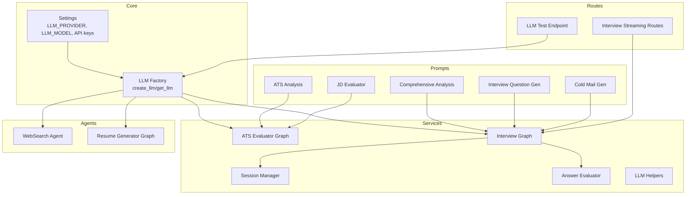
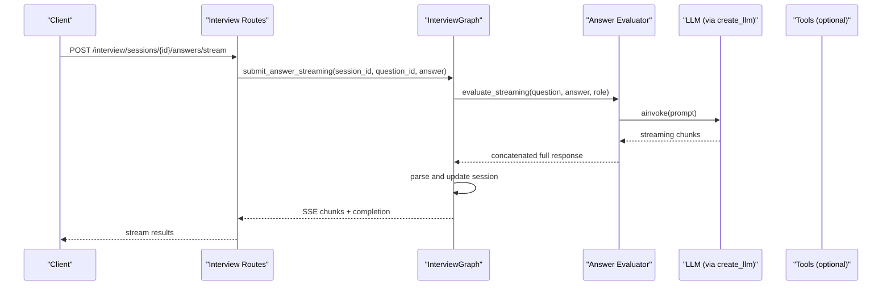
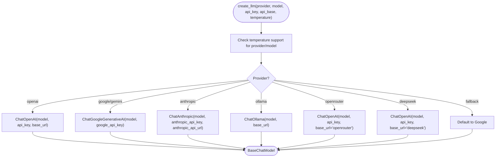
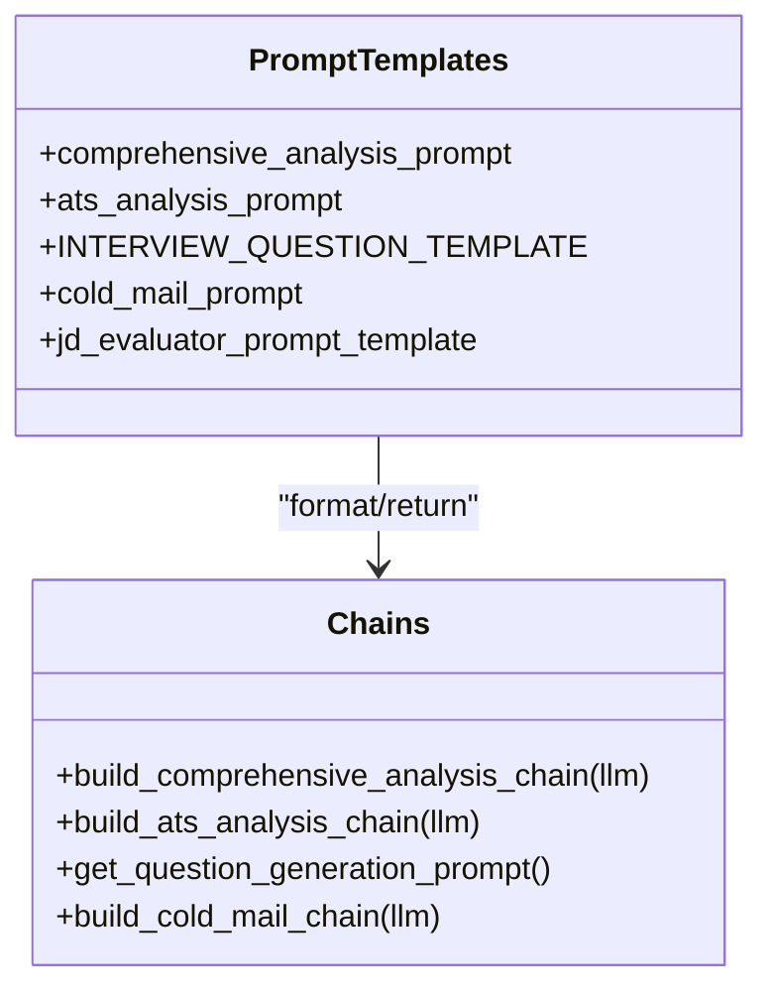
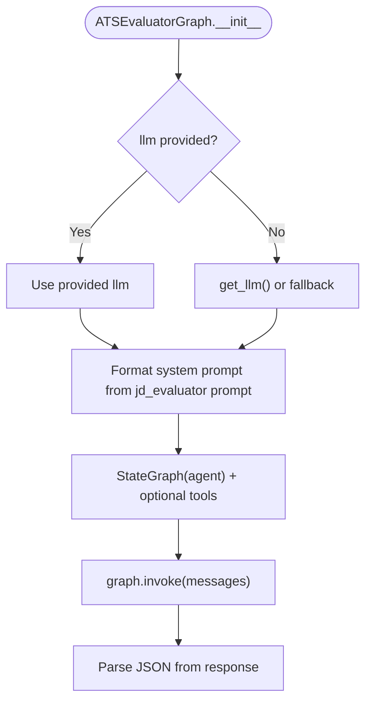
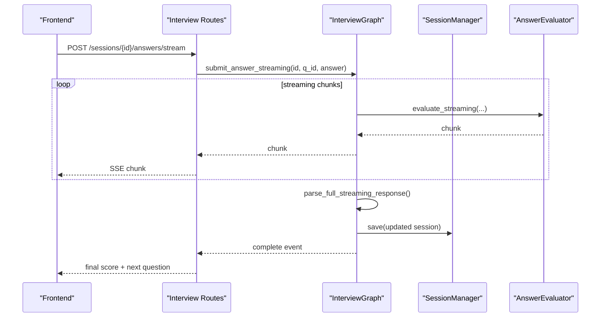
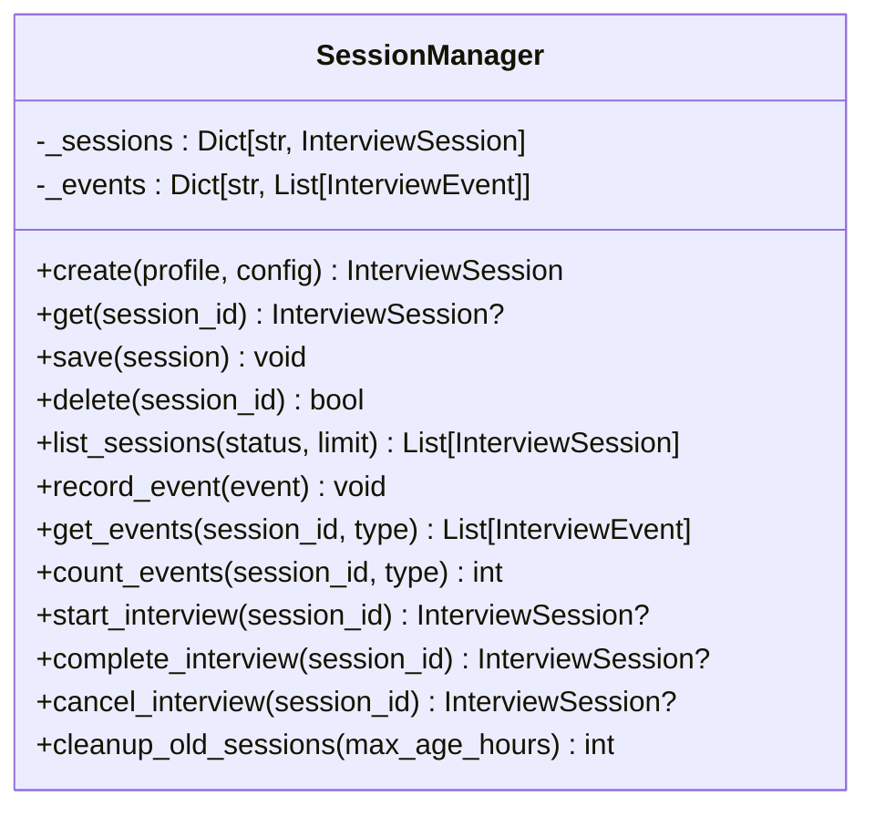
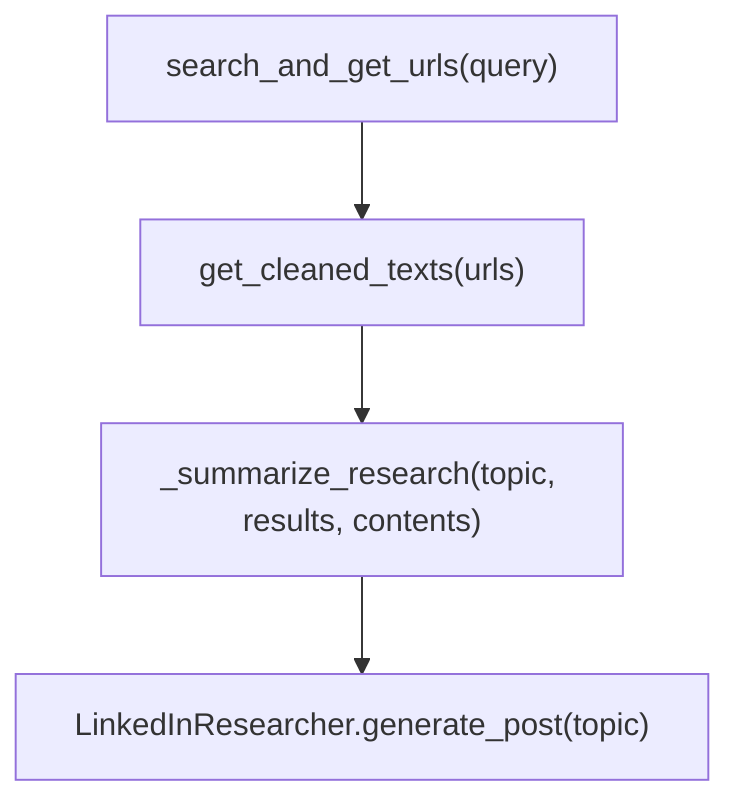
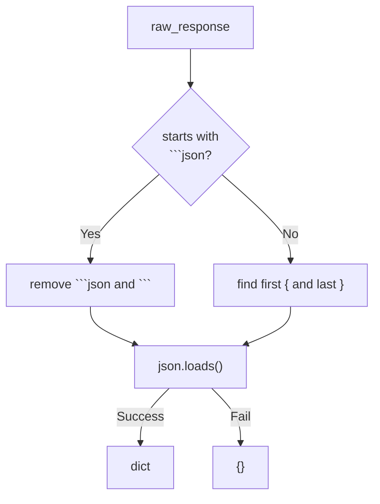
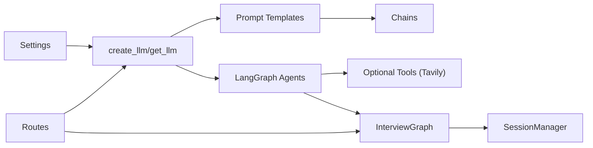

# LangChain Integration

<cite>
**Referenced Files in This Document**
- [llm.py](file://backend/app/core/llm.py)
- [settings.py](file://backend/app/core/settings.py)
- [llm.py](file://backend/app/routes/llm.py)
- [llm_helpers.py](file://backend/app/services/llm_helpers.py)
- [graph.py](file://backend/app/services/ats_evaluator/graph.py)
- [comprehensive_analysis.py](file://backend/app/data/prompt/comprehensive_analysis.py)
- [ats_analysis.py](file://backend/app/data/prompt/ats_analysis.py)
- [interview_question.py](file://backend/app/data/prompt/interview_question.py)
- [cold_mail_gen.py](file://backend/app/data/prompt/cold_mail_gen.py)
- [jd_evaluator.py](file://backend/app/data/prompt/jd_evaluator.py)
- [graph.py](file://backend/app/services/interview/graph.py)
- [session_manager.py](file://backend/app/services/interview/session_manager.py)
- [answer_evaluator.py](file://backend/app/services/interview/answer_evaluator.py)
- [websearch_agent.py](file://backend/app/agents/websearch_agent.py)
- [graph.py](file://backend/app/services/resume_generator/graph.py)
- [interview.py](file://backend/app/routes/interview.py)
</cite>

## Table of Contents
1. [Introduction](#introduction)
2. [Project Structure](#project-structure)
3. [Core Components](#core-components)
4. [Architecture Overview](#architecture-overview)
5. [Detailed Component Analysis](#detailed-component-analysis)
6. [Dependency Analysis](#dependency-analysis)
7. [Performance Considerations](#performance-considerations)
8. [Troubleshooting Guide](#troubleshooting-guide)
9. [Conclusion](#conclusion)
10. [Appendices](#appendices)

## Introduction
This document explains the LangChain integration in the TalentSync platform, focusing on multi-agent AI orchestration, prompt engineering, LLM provider abstraction, agent coordination, memory management, and streaming response handling. It covers how structured prompts enable tasks such as comprehensive resume analysis, ATS scoring, interview question generation, and cold email drafting, and how the system dynamically switches among OpenAI, Gemini, and Anthropic providers while maintaining consistent interfaces.

## Project Structure
LangChain is integrated primarily in the backend under the app directory:
- Provider abstraction and configuration in core
- Prompt engineering in data/prompt
- Agent orchestration and graphs in services
- Interview workflow orchestration and streaming in services/interview
- Agent tools and retrieval in agents
- Route-level testing and streaming endpoints in routes

**Diagram sources**
- [llm.py](file://backend/app/core/llm.py#L31-L107)
- [settings.py](file://backend/app/core/settings.py#L21-L32)
- [comprehensive_analysis.py](file://backend/app/data/prompt/comprehensive_analysis.py#L170-L172)
- [ats_analysis.py](file://backend/app/data/prompt/ats_analysis.py#L66-L68)
- [interview_question.py](file://backend/app/data/prompt/interview_question.py#L57-L59)
- [cold_mail_gen.py](file://backend/app/data/prompt/cold_mail_gen.py#L115-L117)
- [jd_evaluator.py](file://backend/app/data/prompt/jd_evaluator.py#L179-L181)
- [graph.py](file://backend/app/services/ats_evaluator/graph.py#L41-L113)
- [graph.py](file://backend/app/services/interview/graph.py#L23-L511)
- [session_manager.py](file://backend/app/services/interview/session_manager.py#L15-L257)
- [answer_evaluator.py](file://backend/app/services/interview/answer_evaluator.py#L46-L79)
- [websearch_agent.py](file://backend/app/agents/websearch_agent.py#L124-L200)
- [graph.py](file://backend/app/services/resume_generator/graph.py#L32-L57)
- [llm.py](file://backend/app/routes/llm.py#L23-L49)
- [interview.py](file://backend/app/routes/interview.py#L216-L265)

**Section sources**
- [llm.py](file://backend/app/core/llm.py#L1-L181)
- [settings.py](file://backend/app/core/settings.py#L1-L50)
- [llm.py](file://backend/app/routes/llm.py#L1-L50)
- [llm_helpers.py](file://backend/app/services/llm_helpers.py#L1-L94)
- [graph.py](file://backend/app/services/ats_evaluator/graph.py#L1-L209)
- [comprehensive_analysis.py](file://backend/app/data/prompt/comprehensive_analysis.py#L1-L173)
- [ats_analysis.py](file://backend/app/data/prompt/ats_analysis.py#L1-L69)
- [interview_question.py](file://backend/app/data/prompt/interview_question.py#L1-L60)
- [cold_mail_gen.py](file://backend/app/data/prompt/cold_mail_gen.py#L1-L118)
- [jd_evaluator.py](file://backend/app/data/prompt/jd_evaluator.py#L1-L184)
- [graph.py](file://backend/app/services/interview/graph.py#L1-L511)
- [session_manager.py](file://backend/app/services/interview/session_manager.py#L1-L257)
- [answer_evaluator.py](file://backend/app/services/interview/answer_evaluator.py#L1-L79)
- [websearch_agent.py](file://backend/app/agents/websearch_agent.py#L1-L272)
- [graph.py](file://backend/app/services/resume_generator/graph.py#L1-L57)
- [interview.py](file://backend/app/routes/interview.py#L216-L265)

## Core Components
- LLM provider abstraction: centralized factory supports OpenAI, Gemini (Google), Anthropic, Ollama, OpenRouter, DeepSeek, with temperature gating and fallback logic.
- Prompt engineering framework: structured templates for comprehensive analysis, ATS scoring, interview question generation, cold email generation, and JD evaluation.
- Agent orchestration: LangGraph-based graphs for ATS evaluation and resume generation; InterviewGraph coordinates lifecycle, evaluation, code execution, and summaries.
- Memory and state: InterviewGraph composes services with SessionManager for in-memory session and event tracking.
- Streaming responses: Interview routes support Server-Sent Events for streaming evaluation and code review.

**Section sources**
- [llm.py](file://backend/app/core/llm.py#L31-L107)
- [comprehensive_analysis.py](file://backend/app/data/prompt/comprehensive_analysis.py#L170-L172)
- [ats_analysis.py](file://backend/app/data/prompt/ats_analysis.py#L66-L68)
- [interview_question.py](file://backend/app/data/prompt/interview_question.py#L57-L59)
- [cold_mail_gen.py](file://backend/app/data/prompt/cold_mail_gen.py#L115-L117)
- [jd_evaluator.py](file://backend/app/data/prompt/jd_evaluator.py#L179-L181)
- [graph.py](file://backend/app/services/ats_evaluator/graph.py#L41-L113)
- [graph.py](file://backend/app/services/resume_generator/graph.py#L32-L57)
- [graph.py](file://backend/app/services/interview/graph.py#L23-L511)
- [session_manager.py](file://backend/app/services/interview/session_manager.py#L15-L257)
- [interview.py](file://backend/app/routes/interview.py#L216-L265)

## Architecture Overview
The system uses LangChain Core and LangGraph to construct multi-step workflows. Prompts define the instructions; LLMs execute; tools (e.g., Tavily search) augment reasoning; graphs coordinate nodes and conditional edges; services encapsulate domain logic; routes expose endpoints and streaming.

**Diagram sources**
- [graph.py](file://backend/app/services/interview/graph.py#L170-L242)
- [answer_evaluator.py](file://backend/app/services/interview/answer_evaluator.py#L46-L79)
- [llm.py](file://backend/app/core/llm.py#L31-L107)
- [interview.py](file://backend/app/routes/interview.py#L216-L265)

## Detailed Component Analysis

### LLM Provider Abstraction Layer
- Factory function creates provider-specific clients with temperature gating and provider-specific base URLs.
- Singleton defaults for server-wide LLM; separate faster model instance for lightweight tasks.
- Supports dynamic override via route-level LLM creation for per-request isolation.

**Diagram sources**
- [llm.py](file://backend/app/core/llm.py#L31-L107)

**Section sources**
- [llm.py](file://backend/app/core/llm.py#L21-L107)
- [settings.py](file://backend/app/core/settings.py#L21-L32)
- [llm.py](file://backend/app/routes/llm.py#L23-L49)

### Prompt Engineering Framework
Structured prompts are defined as templates and chained with LLMs:
- Comprehensive analysis: extracts structured UI-ready data from resumes.
- ATS analysis: scores resumes against job descriptions with keyword coverage and formatting metrics.
- Interview question generation: produces tailored questions with expected keywords and evaluation criteria.
- Cold email generation: produces subject/body JSON for outreach.
- JD evaluator: strict 100-point rubric with reasons and suggestions.

**Diagram sources**
- [comprehensive_analysis.py](file://backend/app/data/prompt/comprehensive_analysis.py#L162-L172)
- [ats_analysis.py](file://backend/app/data/prompt/ats_analysis.py#L57-L68)
- [interview_question.py](file://backend/app/data/prompt/interview_question.py#L18-L54)
- [cold_mail_gen.py](file://backend/app/data/prompt/cold_mail_gen.py#L99-L117)
- [jd_evaluator.py](file://backend/app/data/prompt/jd_evaluator.py#L179-L181)

**Section sources**
- [comprehensive_analysis.py](file://backend/app/data/prompt/comprehensive_analysis.py#L1-L173)
- [ats_analysis.py](file://backend/app/data/prompt/ats_analysis.py#L1-L69)
- [interview_question.py](file://backend/app/data/prompt/interview_question.py#L1-L60)
- [cold_mail_gen.py](file://backend/app/data/prompt/cold_mail_gen.py#L1-L118)
- [jd_evaluator.py](file://backend/app/data/prompt/jd_evaluator.py#L1-L184)

### Agent Coordination System
- ATS Evaluator Graph: builds a StateGraph with an agent node and optional tool node (Tavily search). The agent invokes the LLM with a system prompt assembled from templates and optional website content.
- Resume Generator Graph: binds tools to the LLM and executes a simple agent function that merges system messages with user input.

**Diagram sources**
- [graph.py](file://backend/app/services/ats_evaluator/graph.py#L41-L113)
- [graph.py](file://backend/app/services/resume_generator/graph.py#L32-L57)
- [jd_evaluator.py](file://backend/app/data/prompt/jd_evaluator.py#L179-L181)

**Section sources**
- [graph.py](file://backend/app/services/ats_evaluator/graph.py#L1-L209)
- [graph.py](file://backend/app/services/resume_generator/graph.py#L1-L57)

### Interview Workflow Orchestration and Streaming
- InterviewGraph composes services: session management, question generation, answer evaluation, code execution, and summary generation.
- Streaming endpoints emit SSE chunks during answer evaluation and code review; the graph concatenates chunks, parses the final response, updates the session, and yields completion metadata.

**Diagram sources**
- [graph.py](file://backend/app/services/interview/graph.py#L170-L242)
- [session_manager.py](file://backend/app/services/interview/session_manager.py#L65-L72)
- [answer_evaluator.py](file://backend/app/services/interview/answer_evaluator.py#L46-L79)
- [interview.py](file://backend/app/routes/interview.py#L216-L265)

**Section sources**
- [graph.py](file://backend/app/services/interview/graph.py#L1-L511)
- [session_manager.py](file://backend/app/services/interview/session_manager.py#L1-L257)
- [answer_evaluator.py](file://backend/app/services/interview/answer_evaluator.py#L1-L79)
- [interview.py](file://backend/app/routes/interview.py#L216-L265)

### Memory Management
- SessionManager maintains in-memory sessions and events, supports CRUD, listing, event recording, and cleanup of old sessions.
- InterviewGraph relies on SessionManager to persist state between steps and to finalize sessions upon completion.

**Diagram sources**
- [session_manager.py](file://backend/app/services/interview/session_manager.py#L15-L257)

**Section sources**
- [session_manager.py](file://backend/app/services/interview/session_manager.py#L1-L257)

### Retrieval-Augmented Agents
- WebSearchAgent integrates Tavily search and content extraction, optionally summarizing via LLM for LinkedIn posts.
- The ATS evaluator graph conditionally binds tools to the LLM for retrieval-augmented reasoning.

**Diagram sources**
- [websearch_agent.py](file://backend/app/agents/websearch_agent.py#L69-L199)
- [graph.py](file://backend/app/services/ats_evaluator/graph.py#L20-L33)

**Section sources**
- [websearch_agent.py](file://backend/app/agents/websearch_agent.py#L1-L272)
- [graph.py](file://backend/app/services/ats_evaluator/graph.py#L1-L113)

### JSON Parsing and LLM Helpers
- Utilities normalize LLM responses, handle fenced JSON blocks, and extract content safely for downstream parsing.

**Diagram sources**
- [llm_helpers.py](file://backend/app/services/llm_helpers.py#L30-L52)

**Section sources**
- [llm_helpers.py](file://backend/app/services/llm_helpers.py#L1-L94)

## Dependency Analysis
Key dependencies and relationships:
- LLM factory depends on settings and provider SDKs.
- Prompt modules depend on LangChain Core prompts and LLM interfaces.
- Graphs depend on LangGraph and optional tool integrations.
- InterviewGraph composes multiple services and depends on SessionManager.
- Routes depend on graph services and expose streaming endpoints.

**Diagram sources**
- [settings.py](file://backend/app/core/settings.py#L21-L32)
- [llm.py](file://backend/app/core/llm.py#L31-L107)
- [comprehensive_analysis.py](file://backend/app/data/prompt/comprehensive_analysis.py#L162-L172)
- [ats_analysis.py](file://backend/app/data/prompt/ats_analysis.py#L57-L68)
- [graph.py](file://backend/app/services/ats_evaluator/graph.py#L41-L113)
- [graph.py](file://backend/app/services/interview/graph.py#L23-L511)
- [session_manager.py](file://backend/app/services/interview/session_manager.py#L15-L257)
- [llm.py](file://backend/app/routes/llm.py#L23-L49)
- [interview.py](file://backend/app/routes/interview.py#L216-L265)

**Section sources**
- [settings.py](file://backend/app/core/settings.py#L1-L50)
- [llm.py](file://backend/app/core/llm.py#L1-L181)
- [llm.py](file://backend/app/routes/llm.py#L1-L50)
- [llm_helpers.py](file://backend/app/services/llm_helpers.py#L1-L94)
- [graph.py](file://backend/app/services/ats_evaluator/graph.py#L1-L209)
- [graph.py](file://backend/app/services/interview/graph.py#L1-L511)
- [session_manager.py](file://backend/app/services/interview/session_manager.py#L1-L257)
- [interview.py](file://backend/app/routes/interview.py#L216-L265)

## Performance Considerations
- Provider selection: choose models aligned with task complexity. Use faster model for preliminary passes and heavier models for nuanced reasoning.
- Temperature gating: disable temperature for certain OpenAI models to avoid unsupported parameters.
- Streaming: leverage SSE for long-running evaluations to improve perceived latency and UX.
- Tool availability: optional tool binding reduces hallucinations but adds latency; enable only when needed.
- JSON parsing: robust parsing avoids retries and improves throughput for structured outputs.

[No sources needed since this section provides general guidance]

## Troubleshooting Guide
- LLM connectivity: use the test endpoint to validate provider configuration and credentials.
- JSON parsing failures: ensure prompts instruct the model to return fenced JSON and use helper utilities to extract and parse reliably.
- Streaming issues: verify SSE headers and route handlers for streaming endpoints.
- Session persistence: confirm in-memory limits and cleanup policies; extend to persistent storage for production.

**Section sources**
- [llm.py](file://backend/app/routes/llm.py#L23-L49)
- [llm_helpers.py](file://backend/app/services/llm_helpers.py#L30-L52)
- [interview.py](file://backend/app/routes/interview.py#L216-L265)
- [session_manager.py](file://backend/app/services/interview/session_manager.py#L223-L244)

## Conclusion
TalentSync leverages LangChain to deliver a flexible, provider-agnostic AI infrastructure. Structured prompts, LangGraph-based agents, and service composition enable robust workflows spanning resume analysis, ATS scoring, interview orchestration, and content generation. The abstraction layer simplifies provider switching, while streaming and memory management enhance user experience and operational scalability.

## Appendices

### Configuration Examples
- Environment variables for multi-provider configuration:
  - LLM_PROVIDER, LLM_MODEL, LLM_API_KEY, LLM_API_BASE
  - GOOGLE_API_KEY (fallback provider)
  - TAVILY_API_KEY (optional tool)
- Example settings for Gemini:
  - LLM_PROVIDER=google
  - LLM_MODEL=gemini-2.5-flash
  - GOOGLE_API_KEY=<your-key>

**Section sources**
- [settings.py](file://backend/app/core/settings.py#L21-L36)

### Cost Optimization Strategies
- Use faster model variants for initial filtering and summaries.
- Limit tool usage to essential retrievals.
- Batch and cache repeated prompts where feasible.
- Monitor provider pricing and adjust model selection accordingly.

[No sources needed since this section provides general guidance]

### Performance Tuning Guidelines
- Provider-specific tuning:
  - OpenAI: adjust temperature and max tokens; avoid temperature for o1/o3 models.
  - Gemini: tune safety settings and response length limits.
  - Anthropic: leverage system messages and tool use for deterministic behavior.
- Graph optimization:
  - Reduce unnecessary tool calls.
  - Use smaller prompts for intermediate steps.
  - Enable streaming for long evaluations.

[No sources needed since this section provides general guidance]