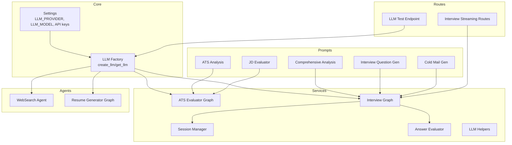
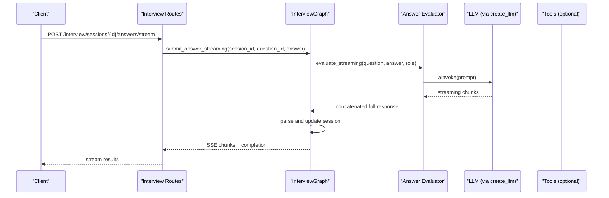
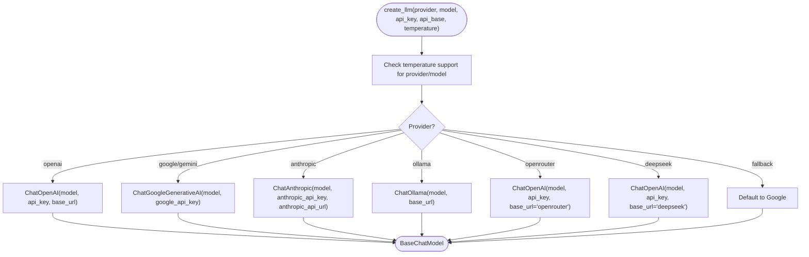
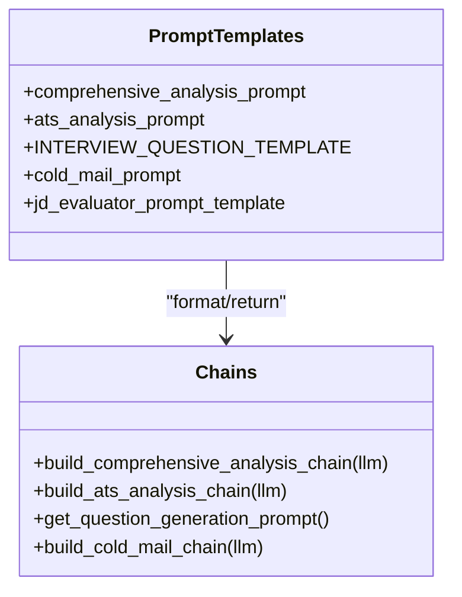
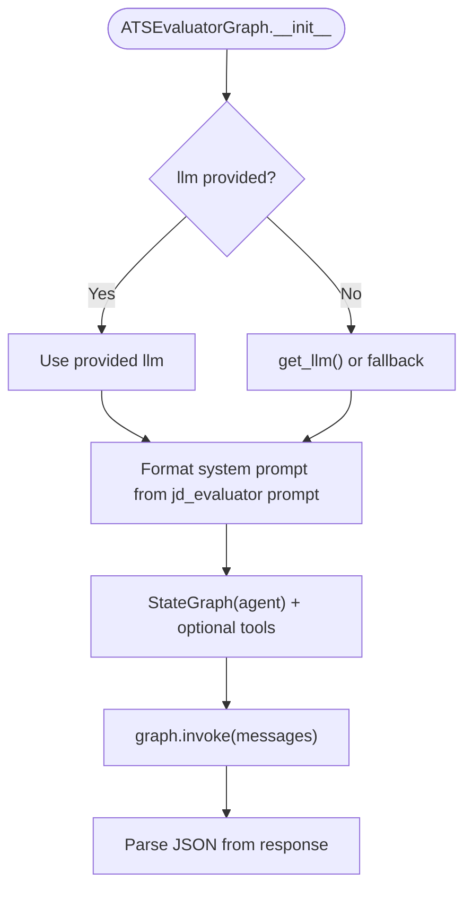
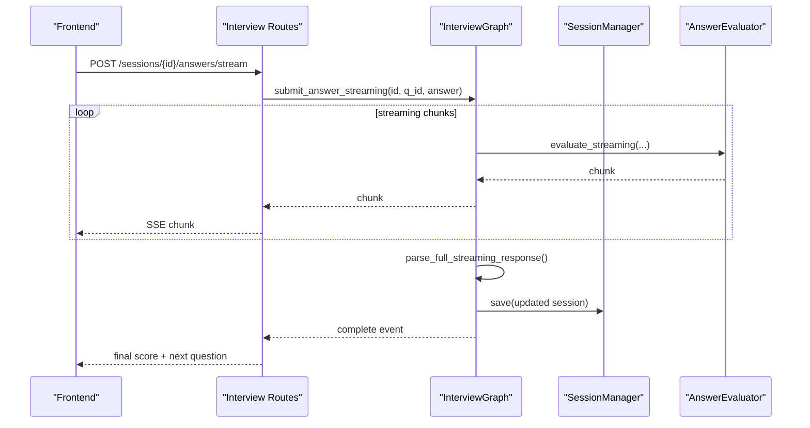
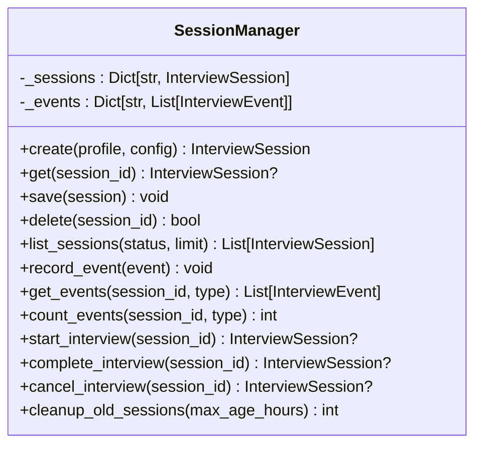
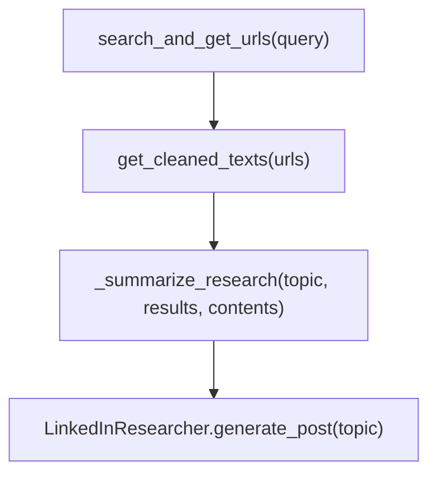
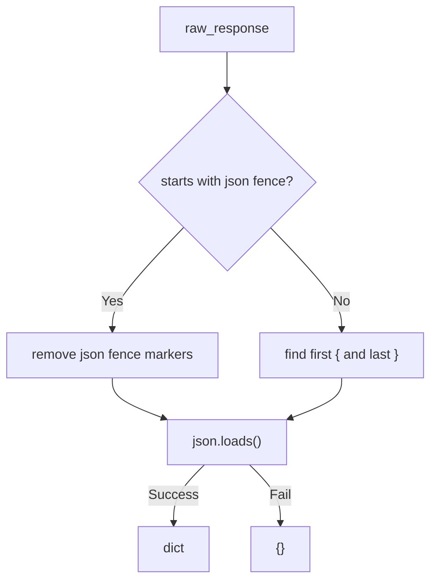
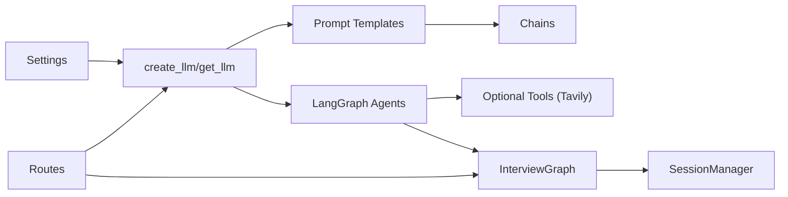

# LangChain integration

## Introduction
This page explains the LangChain integration in the TalentSync platform, focusing on multi-agent AI orchestration, prompt engineering, LLM provider abstraction, agent coordination, memory management, and streaming response handling. It covers how structured prompts enable tasks such as detailed resume analysis, ATS scoring, interview question generation, and cold email drafting, and how the system dynamically switches among OpenAI, Gemini, and Anthropic providers while maintaining consistent interfaces.

## Project structure
LangChain is integrated primarily in the backend under the app directory:
- Provider abstraction and configuration in core
- Prompt engineering in data/prompt
- Agent orchestration and graphs in services
- Interview workflow orchestration and streaming in services/interview
- Agent tools and retrieval in agents
- Route-level testing and streaming endpoints in routes

```mermaid
graph TB
subgraph "Core"
LLM["LLM Factory<br/>create_llm/get_llm"]
CFG["Settings<br/>LLM_PROVIDER, LLM_MODEL, API keys"]
end
subgraph "Prompts"
CA["Comprehensive Analysis"]
ATS["ATS Analysis"]
IQ["Interview Question Gen"]
CMG["Cold Mail Gen"]
JDE["JD Evaluator"]
end
subgraph "Services"
ATSG["ATS Evaluator Graph"]
INTG["Interview Graph"]
SESS["Session Manager"]
EVAL["Answer Evaluator"]
HELP["LLM Helpers"]
end
subgraph "Agents"
WSA["WebSearch Agent"]
RG["Resume Generator Graph"]
end
subgraph "Routes"
RT["LLM Test Endpoint"]
ISR["Interview Streaming Routes"]
end
CFG --> LLM
LLM --> ATSG
LLM --> INTG
LLM --> WSA
LLM --> RG
CA --> INTG
ATS --> ATSG
IQ --> INTG
CMG --> INTG
JDE --> ATSG
INTG --> SESS
INTG --> EVAL
RT --> LLM
ISR --> INTG
```

## Core components
- LLM provider abstraction: centralized factory supports OpenAI, Gemini (Google), Anthropic, Ollama, OpenRouter, DeepSeek, with temperature gating and fallback logic.
- Prompt engineering framework: structured templates for detailed analysis, ATS scoring, interview question generation, cold email generation, and JD evaluation.
- Agent orchestration: LangGraph-based graphs for ATS evaluation and resume generation; InterviewGraph coordinates lifecycle, evaluation, code execution, and summaries.
- Memory and state: InterviewGraph composes services with SessionManager for in-memory session and event tracking.
- Streaming responses: Interview routes support Server-Sent Events for streaming evaluation and code review.

## Architecture overview
The system uses LangChain Core and LangGraph to construct multi-step workflows. Prompts define the instructions; LLMs execute; tools (e.g., Tavily search) augment reasoning; graphs coordinate nodes and conditional edges; services encapsulate domain logic; routes expose endpoints and streaming.

```mermaid
sequenceDiagram
participant Client as "Client"
participant Route as "Interview Routes"
participant Graph as "InterviewGraph"
participant Eval as "Answer Evaluator"
participant LLM as "LLM (via create_llm)"
participant Tools as "Tools (optional)"
Client->>Route : POST /interview/sessions/{id}/answers/stream
Route->>Graph : submit_answer_streaming(session_id, question_id, answer)
Graph->>Eval : evaluate_streaming(question, answer, role)
Eval->>LLM : ainvoke(prompt)
LLM-->>Eval : streaming chunks
Eval-->>Graph : concatenated full response
Graph->>Graph : parse and update session
Graph-->>Route : SSE chunks + completion
Route-->>Client : stream results
```

## Detailed component analysis

### LLM provider abstraction layer
- Factory function creates provider-specific clients with temperature gating and provider-specific base URLs.
- Singleton defaults for server-wide LLM; separate faster model instance for lightweight tasks.
- Supports dynamic override via route-level LLM creation for per-request isolation.

```mermaid
flowchart TD
Start(["create_llm(provider, model, api_key, api_base, temperature)"]) --> CheckTemp["Check temperature support for provider/model"]
CheckTemp --> Provider{"Provider?"}
Provider --> |openai| OpenAI["ChatOpenAI(model, api_key, base_url)"]
Provider --> |google/gemini| Gemini["ChatGoogleGenerativeAI(model, google_api_key)"]
Provider --> |anthropic| Anthropic["ChatAnthropic(model, anthropic_api_key, anthropic_api_url)"]
Provider --> |ollama| Ollama["ChatOllama(model, base_url)"]
Provider --> |openrouter| OR["ChatOpenAI(model, api_key, base_url='openrouter')"]
Provider --> |deepseek| DS["ChatOpenAI(model, api_key, base_url='deepseek')"]
Provider --> |fallback| Fallback["Default to Google"]
OpenAI --> End(["BaseChatModel"])
Gemini --> End
Anthropic --> End
Ollama --> End
OR --> End
DS --> End
Fallback --> End
```

### Prompt engineering framework
Structured prompts are defined as templates and chained with LLMs:
- Detailed analysis: extracts structured UI-ready data from resumes.
- ATS analysis: scores resumes against job descriptions with keyword coverage and formatting metrics.
- Interview question generation: produces tailored questions with expected keywords and evaluation criteria.
- Cold email generation: produces subject/body JSON for outreach.
- JD evaluator: strict 100-point rubric with reasons and suggestions.

```mermaid
classDiagram
class PromptTemplates {
+comprehensive_analysis_prompt
+ats_analysis_prompt
+INTERVIEW_QUESTION_TEMPLATE
+cold_mail_prompt
+jd_evaluator_prompt_template
}
class Chains {
+build_comprehensive_analysis_chain(llm)
+build_ats_analysis_chain(llm)
+get_question_generation_prompt()
+build_cold_mail_chain(llm)
}
PromptTemplates --> Chains : "format/return"
```

### Agent coordination system
- ATS Evaluator Graph: builds a StateGraph with an agent node and optional tool node (Tavily search). The agent invokes the LLM with a system prompt assembled from templates and optional website content.
- Resume Generator Graph: binds tools to the LLM and executes a simple agent function that merges system messages with user input.

```mermaid
flowchart TD
Init(["ATSEvaluatorGraph.__init__"]) --> LLMChoice{"llm provided?"}
LLMChoice --> |Yes| UseProvided["Use provided llm"]
LLMChoice --> |No| GetDefault["get_llm() or fallback"]
UseProvided --> SysMsg["Format system prompt from jd_evaluator prompt"]
GetDefault --> SysMsg
SysMsg --> BuildGraph["StateGraph(agent) + optional tools"]
BuildGraph --> Invoke["graph.invoke(messages)"]
Invoke --> Parse["Parse JSON from response"]
```

### Interview workflow orchestration and streaming
- InterviewGraph composes services: session management, question generation, answer evaluation, code execution, and summary generation.
- Streaming endpoints emit SSE chunks during answer evaluation and code review; the graph concatenates chunks, parses the final response, updates the session, and yields completion metadata.

```mermaid
sequenceDiagram
participant FE as "Frontend"
participant API as "Interview Routes"
participant IG as "InterviewGraph"
participant SM as "SessionManager"
participant AE as "AnswerEvaluator"
FE->>API : POST /sessions/{id}/answers/stream
API->>IG : submit_answer_streaming(id, q_id, answer)
loop streaming chunks
IG->>AE : evaluate_streaming(...)
AE-->>IG : chunk
IG-->>API : chunk
API-->>FE : SSE chunk
end
IG->>IG : parse_full_streaming_response()
IG->>SM : save(updated session)
IG-->>API : complete event
API-->>FE : final score + next question
```

### Memory management
- SessionManager maintains in-memory sessions and events, supports CRUD, listing, event recording, and cleanup of old sessions.
- InterviewGraph relies on SessionManager to persist state between steps and to finalize sessions upon completion.

```mermaid
classDiagram
class SessionManager {
-_sessions : Dict[str, InterviewSession]
-_events : Dict[str, List[InterviewEvent]]
+create(profile, config) InterviewSession
+get(session_id) InterviewSession?
+save(session) void
+delete(session_id) bool
+list_sessions(status, limit) List[InterviewSession]
+record_event(event) void
+get_events(session_id, type) List[InterviewEvent]
+count_events(session_id, type) int
+start_interview(session_id) InterviewSession?
+complete_interview(session_id) InterviewSession?
+cancel_interview(session_id) InterviewSession?
+cleanup_old_sessions(max_age_hours) int
}
```

### Retrieval-Augmented agents
- WebSearchAgent integrates Tavily search and content extraction, optionally summarizing via LLM for LinkedIn posts.
- The ATS evaluator graph conditionally binds tools to the LLM for retrieval-augmented reasoning.

```mermaid
flowchart TD
Search["search_and_get_urls(query)"] --> Clean["get_cleaned_texts(urls)"]
Clean --> Summarize["_summarize_research(topic, results, contents)"]
Summarize --> Post["LinkedInResearcher.generate_post(topic)"]
```

### JSON parsing and LLM helpers
- Utilities normalize LLM responses, handle fenced JSON blocks, and extract content safely for downstream parsing.

```mermaid
flowchart TD
Raw["raw_response"] --> CheckFence{"starts with json fence?"}
  CheckFence -->|Yes| Strip["remove json fence markers"]
  CheckFence -->|No| FindBraces["find first { and last }"]
  Strip --> TryParse["json.loads()"]
  FindBraces --> TryParse
  TryParse -->|Success| Return["dict"]
  TryParse -->|Fail| ReturnEmpty["{}"]
```

## Dependency analysis
Key dependencies and relationships:
- LLM factory depends on settings and provider SDKs.
- Prompt modules depend on LangChain Core prompts and LLM interfaces.
- Graphs depend on LangGraph and optional tool integrations.
- InterviewGraph composes multiple services and depends on SessionManager.
- Routes depend on graph services and expose streaming endpoints.

```mermaid
graph LR
Settings["Settings"] --> LLMFactory["create_llm/get_llm"]
LLMFactory --> Prompts["Prompt Templates"]
Prompts --> Chains["Chains"]
LLMFactory --> Graphs["LangGraph Agents"]
Graphs --> Tools["Optional Tools (Tavily)"]
Graphs --> Interview["InterviewGraph"]
Interview --> SessionMgr["SessionManager"]
Routes["Routes"] --> LLMFactory
Routes --> Interview
```

## Performance considerations
- Provider selection: choose models aligned with task complexity. Use faster model for preliminary passes and heavier models for nuanced reasoning.
- Temperature gating: disable temperature for certain OpenAI models to avoid unsupported parameters.
- Streaming: use SSE for long-running evaluations to improve perceived latency and UX.
- Tool availability: optional tool binding reduces hallucinations but adds latency; enable only when needed.
- JSON parsing: reliable parsing avoids retries and improves throughput for structured outputs.

[No sources needed since this section provides general guidance]

## Troubleshooting guide
- LLM connectivity: use the test endpoint to validate provider configuration and credentials.
- JSON parsing failures: ensure prompts instruct the model to return fenced JSON and use helper utilities to extract and parse reliably.
- Streaming issues: verify SSE headers and route handlers for streaming endpoints.
- Session persistence: confirm in-memory limits and cleanup policies; extend to persistent storage for production.

## Conclusion
TalentSync uses LangChain to deliver a flexible, provider-agnostic AI infrastructure. Structured prompts, LangGraph-based agents, and service composition enable reliable workflows spanning resume analysis, ATS scoring, interview orchestration, and content generation. The abstraction layer simplifies provider switching, while streaming and memory management improve user experience and operational scalability.

## Appendices

### Configuration examples
- Environment variables for multi-provider configuration:
  - LLM_PROVIDER, LLM_MODEL, LLM_API_KEY, LLM_API_BASE
  - GOOGLE_API_KEY (fallback provider)
  - TAVILY_API_KEY (optional tool)
- Example settings for Gemini:
  - LLM_PROVIDER=google
  - LLM_MODEL=gemini-2.5-flash
  - GOOGLE_API_KEY=<your-key>

### Cost optimization strategies
- Use faster model variants for initial filtering and summaries.
- Limit tool usage to essential retrievals.
- Batch and cache repeated prompts where feasible.
- Monitor provider pricing and adjust model selection accordingly.

[No sources needed since this section provides general guidance]

### Performance tuning guidelines
- Provider-specific tuning:
  - OpenAI: adjust temperature and max tokens; avoid temperature for o1/o3 models.
  - Gemini: tune safety settings and response length limits.
  - Anthropic: use system messages and tool use for deterministic behavior.
- Graph optimization:
  - Reduce unnecessary tool calls.
  - Use smaller prompts for intermediate steps.
  - Enable streaming for long evaluations.

[No sources needed since this section provides general guidance]
