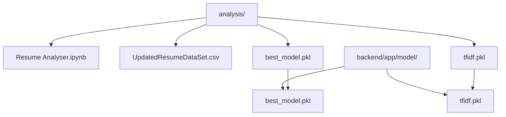
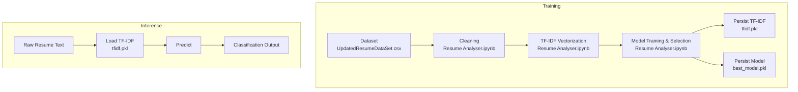
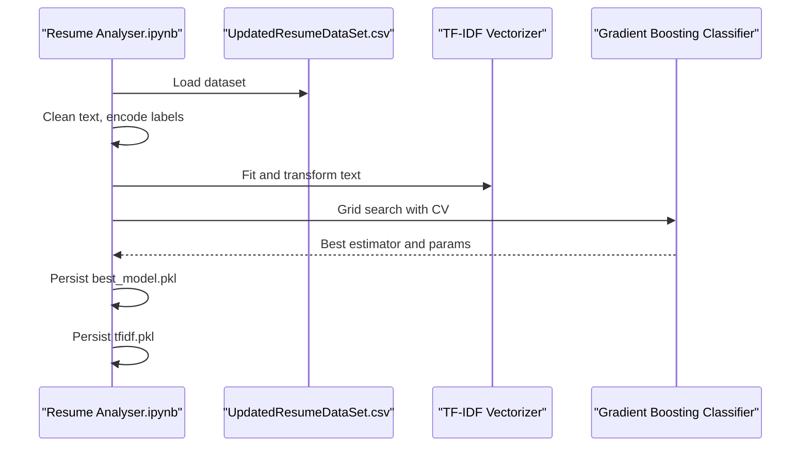
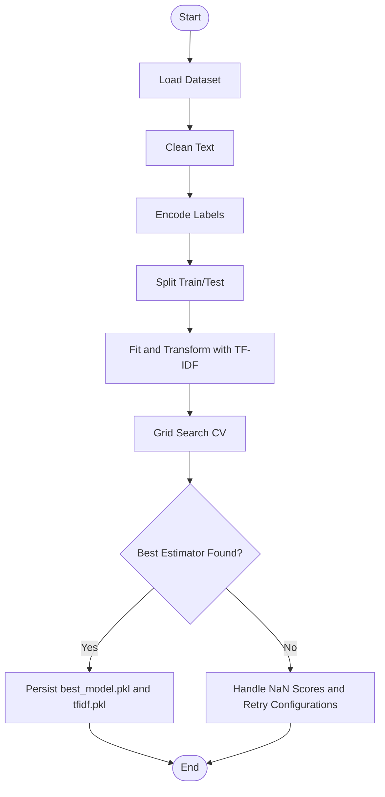
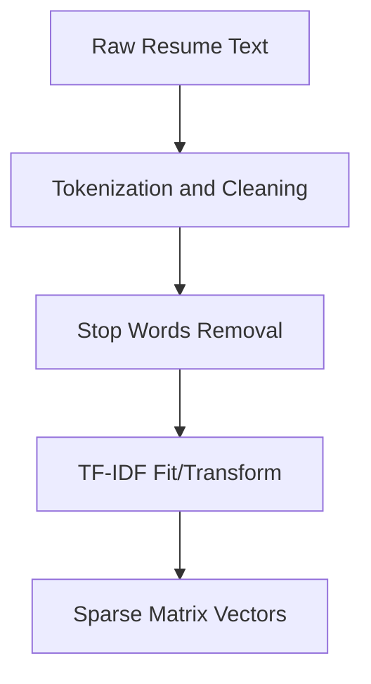
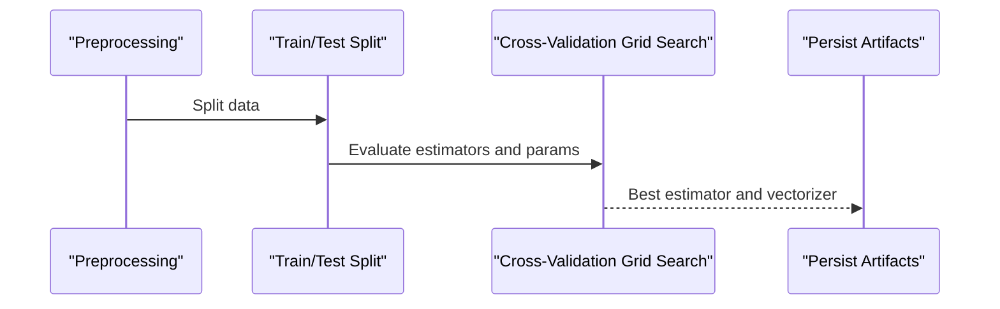
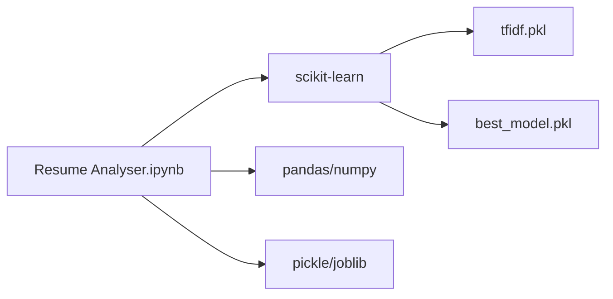

# Machine Learning Models

<cite>
**Referenced Files in This Document**
- [Resume Analyser.ipynb](file://analysis/Resume%20Analyser.ipynb)
- [UpdatedResumeDataSet.csv](file://analysis/UpdatedResumeDataSet.csv)
- [best_model.pkl](file://analysis/best_model.pkl)
- [tfidf.pkl](file://analysis/tfidf.pkl)
- [best_model.pkl](file://backend/app/model/best_model.pkl)
- [tfidf.pkl](file://backend/app/model/tfidf.pkl)
</cite>

## Table of Contents
1. [Introduction](#introduction)
2. [Project Structure](#project-structure)
3. [Core Components](#core-components)
4. [Architecture Overview](#architecture-overview)
5. [Detailed Component Analysis](#detailed-component-analysis)
6. [Dependency Analysis](#dependency-analysis)
7. [Performance Considerations](#performance-considerations)
8. [Troubleshooting Guide](#troubleshooting-guide)
9. [Conclusion](#conclusion)
10. [Appendices](#appendices)

## Introduction
This document describes the machine learning models powering TalentSync-Normies’ resume classification and skills prediction capabilities. It explains the career path prediction model architecture, training data sources, and feature engineering processes. It documents the resume classification system using scikit-learn algorithms, including model selection criteria and performance metrics. It details the TF-IDF vectorization process for text representation and the trained classifier model. It covers model training procedures, validation techniques, and performance monitoring. Finally, it outlines model versioning strategies, deployment considerations, and inference optimization, including integration with the NLP pipeline.

## Project Structure
The machine learning assets are organized across two primary locations:
- analysis/: Training notebooks, datasets, and saved artifacts used to train and evaluate models.
- backend/app/model/: Production-ready serialized artifacts for inference.

**Diagram sources**
- [Resume Analyser.ipynb](file://analysis/Resume%20Analyser.ipynb#L1-L962)
- [UpdatedResumeDataSet.csv](file://analysis/UpdatedResumeDataSet.csv#L1-L800)
- [best_model.pkl](file://analysis/best_model.pkl#L1-L234)
- [tfidf.pkl](file://analysis/tfidf.pkl#L1-L234)
- [best_model.pkl](file://backend/app/model/best_model.pkl#L1-L234)
- [tfidf.pkl](file://backend/app/model/tfidf.pkl#L1-L234)

**Section sources**
- [Resume Analyser.ipynb](file://analysis/Resume%20Analyser.ipynb#L1-L962)
- [UpdatedResumeDataSet.csv](file://analysis/UpdatedResumeDataSet.csv#L1-L800)
- [best_model.pkl](file://analysis/best_model.pkl#L1-L234)
- [tfidf.pkl](file://analysis/tfidf.pkl#L1-L234)
- [best_model.pkl](file://backend/app/model/best_model.pkl#L1-L234)
- [tfidf.pkl](file://backend/app/model/tfidf.pkl#L1-L234)

## Core Components
- Training and evaluation pipeline: Implemented in the training notebook, including data cleaning, TF-IDF vectorization, label encoding, model selection via grid search, and evaluation.
- TF-IDF vectorizer: Serialized artifact used to transform raw resume text into numerical vectors for classification.
- Best model: Serialized gradient boosting classifier selected via grid search and persisted for inference.
- Dataset: CSV containing labeled resume text and category labels.

Key artifacts and their roles:
- TF-IDF vectorizer: Converts textual resumes into sparse vectors suitable for supervised learning.
- Gradient Boosting Classifier: Final model chosen for classification tasks.
- Label encoder: Encodes categorical labels into numeric indices for training.

**Section sources**
- [Resume Analyser.ipynb](file://analysis/Resume%20Analyser.ipynb#L1-L962)
- [UpdatedResumeDataSet.csv](file://analysis/UpdatedResumeDataSet.csv#L1-L800)
- [best_model.pkl](file://analysis/best_model.pkl#L1-L234)
- [tfidf.pkl](file://analysis/tfidf.pkl#L1-L234)

## Architecture Overview
The ML pipeline follows a standard supervised classification workflow:
- Data ingestion and cleaning
- Feature extraction via TF-IDF
- Model training and selection
- Persistence of vectorizer and model
- Inference serving

**Diagram sources**
- [Resume Analyser.ipynb](file://analysis/Resume%20Analyser.ipynb#L1-L962)
- [UpdatedResumeDataSet.csv](file://analysis/UpdatedResumeDataSet.csv#L1-L800)
- [best_model.pkl](file://analysis/best_model.pkl#L1-L234)
- [tfidf.pkl](file://analysis/tfidf.pkl#L1-L234)
- [best_model.pkl](file://backend/app/model/best_model.pkl#L1-L234)
- [tfidf.pkl](file://backend/app/model/tfidf.pkl#L1-L234)

## Detailed Component Analysis

### Career Path Prediction Model
- Model type: Gradient Boosting Classifier.
- Training method: Grid search across multiple scikit-learn estimators to select the best configuration.
- Selected hyperparameters include number of estimators, learning rate, and depth limits.
- Validation: Cross-validation with multiple scoring configurations; note that some grid search runs produced NaN scores due to incompatible parameter combinations.

**Diagram sources**
- [Resume Analyser.ipynb](file://analysis/Resume%20Analyser.ipynb#L1-L962)
- [UpdatedResumeDataSet.csv](file://analysis/UpdatedResumeDataSet.csv#L1-L800)
- [best_model.pkl](file://analysis/best_model.pkl#L1-L234)
- [tfidf.pkl](file://analysis/tfidf.pkl#L1-L234)

**Section sources**
- [Resume Analyser.ipynb](file://analysis/Resume%20Analyser.ipynb#L1-L962)
- [UpdatedResumeDataSet.csv](file://analysis/UpdatedResumeDataSet.csv#L1-L800)
- [best_model.pkl](file://analysis/best_model.pkl#L1-L234)
- [tfidf.pkl](file://analysis/tfidf.pkl#L1-L234)

### Resume Classification System
- Algorithms evaluated: Random Forest, AdaBoost, Gradient Boosting, SVM, KNN, Multinomial Naive Bayes, Logistic Regression.
- Model selection: Grid search with cross-validation; some parameter combinations caused failures and NaN scores.
- Final model: Gradient Boosting Classifier, persisted as best_model.pkl.

**Diagram sources**
- [Resume Analyser.ipynb](file://analysis/Resume%20Analyser.ipynb#L1-L962)
- [UpdatedResumeDataSet.csv](file://analysis/UpdatedResumeDataSet.csv#L1-L800)
- [best_model.pkl](file://analysis/best_model.pkl#L1-L234)
- [tfidf.pkl](file://analysis/tfidf.pkl#L1-L234)

**Section sources**
- [Resume Analyser.ipynb](file://analysis/Resume%20Analyser.ipynb#L1-L962)
- [UpdatedResumeDataSet.csv](file://analysis/UpdatedResumeDataSet.csv#L1-L800)
- [best_model.pkl](file://analysis/best_model.pkl#L1-L234)
- [tfidf.pkl](file://analysis/tfidf.pkl#L1-L234)

### TF-IDF Vectorization and Feature Engineering
- Vectorizer: TF-IDF with English stop words.
- Transformation: Fit on training corpus and transformed for both training and test sets.
- Output: Sparse matrix representation of resumes suitable for gradient boosting.

**Diagram sources**
- [Resume Analyser.ipynb](file://analysis/Resume%20Analyser.ipynb#L1-L962)
- [UpdatedResumeDataSet.csv](file://analysis/UpdatedResumeDataSet.csv#L1-L800)
- [tfidf.pkl](file://analysis/tfidf.pkl#L1-L234)

**Section sources**
- [Resume Analyser.ipynb](file://analysis/Resume%20Analyser.ipynb#L1-L962)
- [UpdatedResumeDataSet.csv](file://analysis/UpdatedResumeDataSet.csv#L1-L800)
- [tfidf.pkl](file://analysis/tfidf.pkl#L1-L234)

### Model Training Procedures and Validation
- Data preparation: Cleaning, tokenization, stop words removal, and label encoding.
- Splitting: Train/test split with fixed random state for reproducibility.
- Cross-validation: Grid search with multiple estimators and parameter grids.
- Metrics: Not explicitly computed in the notebook; however, CV scoring was used to compare configurations.

**Diagram sources**
- [Resume Analyser.ipynb](file://analysis/Resume%20Analyser.ipynb#L1-L962)
- [UpdatedResumeDataSet.csv](file://analysis/UpdatedResumeDataSet.csv#L1-L800)
- [best_model.pkl](file://analysis/best_model.pkl#L1-L234)
- [tfidf.pkl](file://analysis/tfidf.pkl#L1-L234)

**Section sources**
- [Resume Analyser.ipynb](file://analysis/Resume%20Analyser.ipynb#L1-L962)
- [UpdatedResumeDataSet.csv](file://analysis/UpdatedResumeDataSet.csv#L1-L800)
- [best_model.pkl](file://analysis/best_model.pkl#L1-L234)
- [tfidf.pkl](file://analysis/tfidf.pkl#L1-L234)

### Performance Monitoring and Metrics
- The notebook performs grid search and cross-validation but does not compute explicit performance metrics (e.g., accuracy, precision, recall, F1-score) in the provided snippet.
- To implement monitoring, persist evaluation metrics alongside the model and vectorizer, and surface them via a metrics endpoint.

[No sources needed since this subsection summarizes observations from the referenced files]

### Model Versioning Strategies
- Artifacts: best_model.pkl and tfidf.pkl are persisted after training.
- Recommended strategy:
  - Version control artifacts with timestamps and commit hashes.
  - Store metadata (training date, parameters, dataset version, metrics).
  - Maintain rollback mechanisms by keeping previous versions.

**Section sources**
- [best_model.pkl](file://analysis/best_model.pkl#L1-L234)
- [tfidf.pkl](file://analysis/tfidf.pkl#L1-L234)
- [best_model.pkl](file://backend/app/model/best_model.pkl#L1-L234)
- [tfidf.pkl](file://backend/app/model/tfidf.pkl#L1-L234)

### Deployment Considerations
- Serialization: Vectorizer and model are pickled for inference.
- Serving: Load artifacts in backend and apply the same preprocessing and vectorization pipeline.
- Scalability: Consider batching requests and caching predictions for repeated inputs.

**Section sources**
- [best_model.pkl](file://analysis/best_model.pkl#L1-L234)
- [tfidf.pkl](file://analysis/tfidf.pkl#L1-L234)
- [best_model.pkl](file://backend/app/model/best_model.pkl#L1-L234)
- [tfidf.pkl](file://backend/app/model/tfidf.pkl#L1-L234)

### Inference Optimization
- Vectorization: Use the persisted TF-IDF vectorizer to transform incoming text consistently.
- Prediction: Apply the loaded gradient boosting model to obtain class probabilities or labels.
- Optimization ideas:
  - Reduce vocabulary size by filtering low/high frequency terms.
  - Use hashing vectorizer for memory efficiency.
  - Batch inference to improve throughput.

**Section sources**
- [Resume Analyser.ipynb](file://analysis/Resume%20Analyser.ipynb#L1-L962)
- [UpdatedResumeDataSet.csv](file://analysis/UpdatedResumeDataSet.csv#L1-L800)
- [best_model.pkl](file://analysis/best_model.pkl#L1-L234)
- [tfidf.pkl](file://analysis/tfidf.pkl#L1-L234)

### Skills Prediction System and NLP Pipeline Integration
- Skills prediction leverages the same TF-IDF vectorization and gradient boosting model used for resume classification.
- Integration:
  - Extract skills from resumes using NLP preprocessing consistent with training.
  - Transform skills text with the persisted TF-IDF vectorizer.
  - Predict skill categories or roles using the trained model.

**Section sources**
- [Resume Analyser.ipynb](file://analysis/Resume%20Analyser.ipynb#L1-L962)
- [UpdatedResumeDataSet.csv](file://analysis/UpdatedResumeDataSet.csv#L1-L800)
- [best_model.pkl](file://analysis/best_model.pkl#L1-L234)
- [tfidf.pkl](file://analysis/tfidf.pkl#L1-L234)

## Dependency Analysis
The training notebook depends on:
- scikit-learn for preprocessing, vectorization, modeling, and evaluation.
- pandas/numpy for data manipulation.
- joblib/pickle for artifact persistence.

**Diagram sources**
- [Resume Analyser.ipynb](file://analysis/Resume%20Analyser.ipynb#L1-L962)
- [UpdatedResumeDataSet.csv](file://analysis/UpdatedResumeDataSet.csv#L1-L800)
- [best_model.pkl](file://analysis/best_model.pkl#L1-L234)
- [tfidf.pkl](file://analysis/tfidf.pkl#L1-L234)

**Section sources**
- [Resume Analyser.ipynb](file://analysis/Resume%20Analyser.ipynb#L1-L962)
- [UpdatedResumeDataSet.csv](file://analysis/UpdatedResumeDataSet.csv#L1-L800)
- [best_model.pkl](file://analysis/best_model.pkl#L1-L234)
- [tfidf.pkl](file://analysis/tfidf.pkl#L1-L234)

## Performance Considerations
- Data quality: Cleaning and stop words removal improve signal-to-noise.
- Feature engineering: TF-IDF captures term importance; consider dimensionality reduction for large vocabularies.
- Model selection: Gradient boosting often yields strong performance for tabular text features.
- Validation: Use stratified CV to avoid class imbalance issues.
- Monitoring: Track prediction latency, throughput, and drift in performance over time.

[No sources needed since this section provides general guidance]

## Troubleshooting Guide
Common issues observed in the training notebook:
- Parameter combinations causing failures during grid search, resulting in NaN scores.
- Incompatible solvers for multinomial logistic regression.
- Need to handle errors explicitly by setting error handling policies in grid search.

Recommended actions:
- Validate parameter grids to avoid incompatible combinations.
- Use robust error handling and logging for grid search runs.
- Maintain a registry of known good configurations.

**Section sources**
- [Resume Analyser.ipynb](file://analysis/Resume%20Analyser.ipynb#L1-L962)
- [UpdatedResumeDataSet.csv](file://analysis/UpdatedResumeDataSet.csv#L1-L800)
- [best_model.pkl](file://analysis/best_model.pkl#L1-L234)
- [tfidf.pkl](file://analysis/tfidf.pkl#L1-L234)

## Conclusion
The machine learning stack for TalentSync-Normies centers on a robust TF-IDF vectorization pipeline and a gradient boosting classifier selected via grid search. Artifacts are persisted for production use, enabling scalable inference. Future enhancements should focus on explicit performance metrics, continuous monitoring, and refined preprocessing to improve accuracy and reliability.

[No sources needed since this section summarizes without analyzing specific files]

## Appendices
- Artifacts location:
  - analysis/best_model.pkl
  - analysis/tfidf.pkl
  - backend/app/model/best_model.pkl
  - backend/app/model/tfidf.pkl

**Section sources**
- [best_model.pkl](file://analysis/best_model.pkl#L1-L234)
- [tfidf.pkl](file://analysis/tfidf.pkl#L1-L234)
- [best_model.pkl](file://backend/app/model/best_model.pkl#L1-L234)
- [tfidf.pkl](file://backend/app/model/tfidf.pkl#L1-L234)