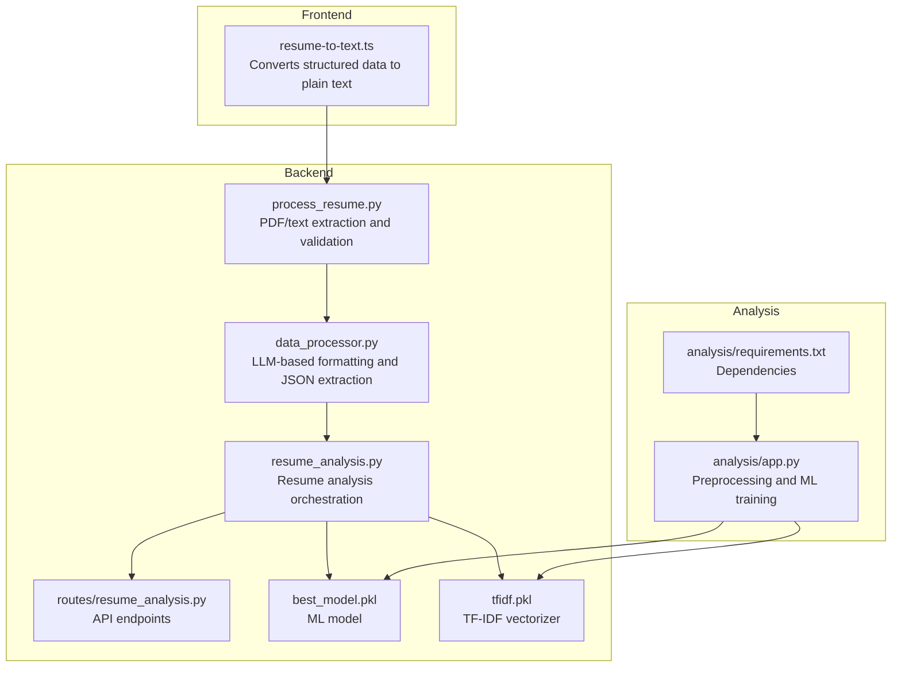
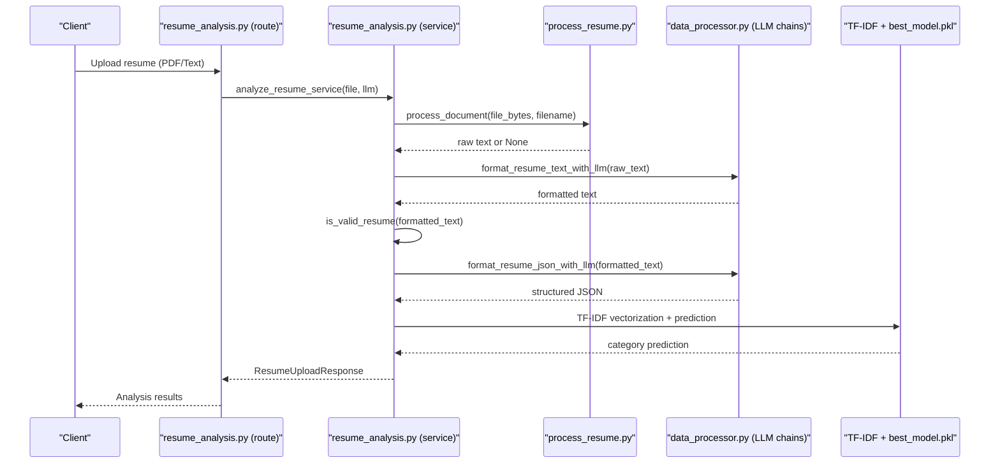
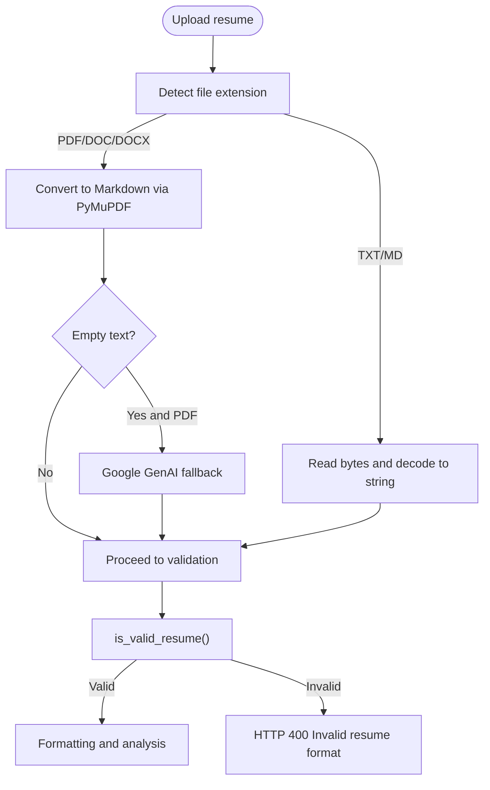
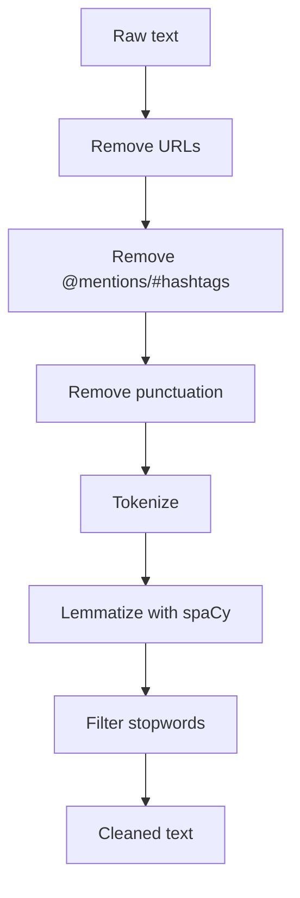
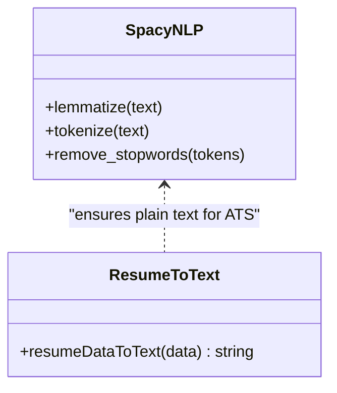
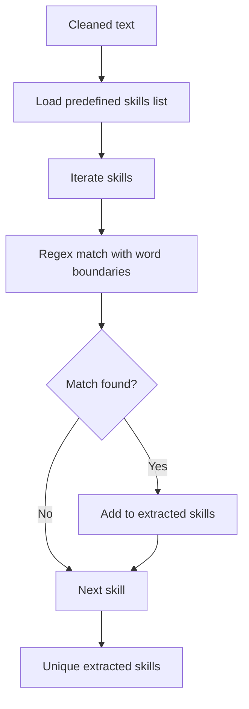
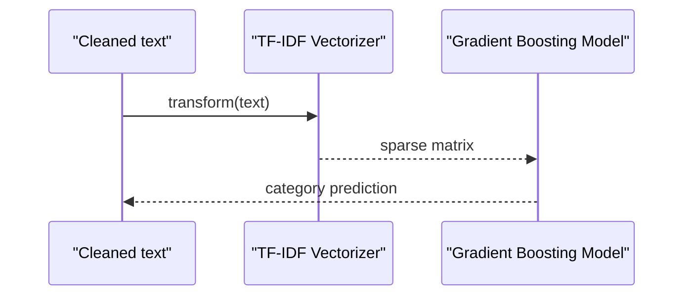
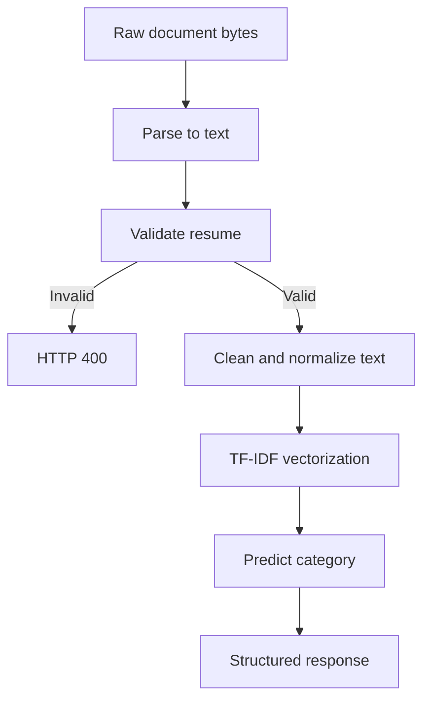
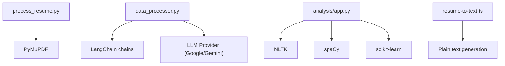

# NLP Processing Pipeline

<cite>
**Referenced Files in This Document**
- [process_resume.py](file://backend/app/services/process_resume.py)
- [resume_analysis.py](file://backend/app/services/resume_analysis.py)
- [data_processor.py](file://backend/app/services/data_processor.py)
- [resume_analysis.py](file://backend/app/routes/resume_analysis.py)
- [schemas.py](file://backend/app/models/schemas.py)
- [resume-to-text.ts](file://frontend/lib/resume-to-text.ts)
- [app.py](file://analysis/app.py)
- [requirements.txt](file://analysis/requirements.txt)
- [best_model.pkl](file://backend/app/model/best_model.pkl)
- [tfidf.pkl](file://backend/app/model/tfidf.pkl)
</cite>

## Table of Contents
1. [Introduction](#introduction)
2. [Project Structure](#project-structure)
3. [Core Components](#core-components)
4. [Architecture Overview](#architecture-overview)
5. [Detailed Component Analysis](#detailed-component-analysis)
6. [Dependency Analysis](#dependency-analysis)
7. [Performance Considerations](#performance-considerations)
8. [Troubleshooting Guide](#troubleshooting-guide)
9. [Conclusion](#conclusion)

## Introduction
This document describes the NLP processing pipeline used in TalentSync-Normies for extracting and analyzing resume text from PDF and text files. The pipeline encompasses document parsing, text cleaning, named entity recognition, lemmatization, stopword removal, skill extraction via regex and predefined lists, and machine learning-based category prediction using TF-IDF vectorization. It also covers error handling for malformed resumes and validation mechanisms for extracted information.

## Project Structure
The NLP pipeline spans both backend services and frontend utilities:
- Backend services handle document ingestion, parsing, formatting, and ML-driven analysis.
- Frontend utilities convert structured resume data into clean text suitable for ATS evaluation.
- Analysis notebooks demonstrate preprocessing and ML training workflows.

**Diagram sources**
- [resume-to-text.ts](file://frontend/lib/resume-to-text.ts#L1-L159)
- [process_resume.py](file://backend/app/services/process_resume.py#L1-L117)
- [data_processor.py](file://backend/app/services/data_processor.py#L1-L409)
- [resume_analysis.py](file://backend/app/services/resume_analysis.py#L1-L364)
- [resume_analysis.py](file://backend/app/routes/resume_analysis.py#L1-L68)
- [app.py](file://analysis/app.py#L1-L347)
- [requirements.txt](file://analysis/requirements.txt#L1-L69)
- [best_model.pkl](file://backend/app/model/best_model.pkl#L1-L234)
- [tfidf.pkl](file://backend/app/model/tfidf.pkl)

**Section sources**
- [resume-to-text.ts](file://frontend/lib/resume-to-text.ts#L1-L159)
- [process_resume.py](file://backend/app/services/process_resume.py#L1-L117)
- [data_processor.py](file://backend/app/services/data_processor.py#L1-L409)
- [resume_analysis.py](file://backend/app/services/resume_analysis.py#L1-L364)
- [resume_analysis.py](file://backend/app/routes/resume_analysis.py#L1-L68)
- [app.py](file://analysis/app.py#L1-L347)
- [requirements.txt](file://analysis/requirements.txt#L1-L69)
- [best_model.pkl](file://backend/app/model/best_model.pkl#L1-L234)
- [tfidf.pkl](file://backend/app/model/tfidf.pkl)

## Core Components
- Document extraction and validation: Parses PDFs and text files, validates resume content, and falls back to LLM-based conversion when needed.
- Text cleaning and preprocessing: Removes URLs, mentions, punctuation, lemmatizes tokens, and filters stopwords.
- Named entity recognition and linguistic features: Uses spaCy for lemmatization and POS-based filtering.
- Skill extraction: Regex-based matching against predefined skill lists.
- ML-based category prediction: TF-IDF vectorization and gradient boosting classification.
- Structured text generation: Converts structured resume data to plain text for ATS compatibility.

**Section sources**
- [process_resume.py](file://backend/app/services/process_resume.py#L1-L117)
- [app.py](file://analysis/app.py#L1-L347)
- [resume-to-text.ts](file://frontend/lib/resume-to-text.ts#L1-L159)

## Architecture Overview
The pipeline integrates frontend text generation with backend extraction, formatting, and ML analysis.

**Diagram sources**
- [resume_analysis.py](file://backend/app/routes/resume_analysis.py#L1-L68)
- [resume_analysis.py](file://backend/app/services/resume_analysis.py#L1-L364)
- [process_resume.py](file://backend/app/services/process_resume.py#L1-L117)
- [data_processor.py](file://backend/app/services/data_processor.py#L1-L409)
- [best_model.pkl](file://backend/app/model/best_model.pkl#L1-L234)
- [tfidf.pkl](file://backend/app/model/tfidf.pkl)

## Detailed Component Analysis

### Document Extraction and Validation
- Supports TXT, MD, PDF, DOC, DOCX.
- Uses PyMuPDF to render documents to Markdown for consistent parsing.
- Validates resumes using keyword presence checks.
- Falls back to Google GenAI when PDF parsing yields empty text and provider is Google/Gemini.

**Diagram sources**
- [process_resume.py](file://backend/app/services/process_resume.py#L68-L91)

**Section sources**
- [process_resume.py](file://backend/app/services/process_resume.py#L1-L117)

### Text Cleaning and Preprocessing
- Removes URLs, mentions, and punctuation.
- Lemmatizes tokens using spaCy.
- Filters stopwords for English.
- Applies regex-based cleanup and tokenization.

**Diagram sources**
- [app.py](file://analysis/app.py#L21-L31)

**Section sources**
- [app.py](file://analysis/app.py#L1-L347)

### Named Entity Recognition and Linguistic Features
- Uses spaCy for lemmatization and token-level transformations.
- Integrates with frontend utility to generate plain text from structured data for consistent ATS evaluation.

**Diagram sources**
- [app.py](file://analysis/app.py#L13-L16)
- [resume-to-text.ts](file://frontend/lib/resume-to-text.ts#L1-L159)

**Section sources**
- [app.py](file://analysis/app.py#L1-L347)
- [resume-to-text.ts](file://frontend/lib/resume-to-text.ts#L1-L159)

### Skill Extraction Algorithm
- Predefined skill list compiled from domain expertise.
- Regex-based matching with word boundaries to avoid partial matches.
- Case-insensitive matching for robustness.

**Diagram sources**
- [app.py](file://analysis/app.py#L168-L194)

**Section sources**
- [app.py](file://analysis/app.py#L168-L194)

### Machine Learning Model Integration
- TF-IDF vectorization transforms cleaned text into numerical features.
- Gradient Boosting Classifier trained on labeled resume dataset predicts categories.
- Vectorizer and model persisted as pickle artifacts for inference.

**Diagram sources**
- [app.py](file://analysis/app.py#L120-L135)
- [best_model.pkl](file://backend/app/model/best_model.pkl#L1-L234)
- [tfidf.pkl](file://backend/app/model/tfidf.pkl)

**Section sources**
- [app.py](file://analysis/app.py#L1-L347)
- [best_model.pkl](file://backend/app/model/best_model.pkl#L1-L234)
- [tfidf.pkl](file://backend/app/model/tfidf.pkl)

### Complete Preprocessing Pipeline (From Raw Text to ML-Ready Features)
- Document ingestion and fallback conversion.
- LLM-based formatting for non-text files.
- Resume validation via keyword checks.
- Structured JSON extraction for downstream tasks.
- TF-IDF vectorization and category prediction.

**Diagram sources**
- [resume_analysis.py](file://backend/app/services/resume_analysis.py#L28-L144)
- [data_processor.py](file://backend/app/services/data_processor.py#L26-L130)
- [process_resume.py](file://backend/app/services/process_resume.py#L68-L91)
- [app.py](file://analysis/app.py#L120-L135)

**Section sources**
- [resume_analysis.py](file://backend/app/services/resume_analysis.py#L1-L364)
- [data_processor.py](file://backend/app/services/data_processor.py#L1-L409)
- [process_resume.py](file://backend/app/services/process_resume.py#L1-L117)
- [app.py](file://analysis/app.py#L1-L347)

## Dependency Analysis
- Backend services depend on:
  - PyMuPDF for PDF parsing.
  - spaCy for lemmatization and tokenization.
  - scikit-learn for TF-IDF and classification.
  - LangChain chains for LLM-based formatting and JSON extraction.
- Frontend depends on structured resume data to produce plain text for ATS.

**Diagram sources**
- [process_resume.py](file://backend/app/services/process_resume.py#L1-L117)
- [data_processor.py](file://backend/app/services/data_processor.py#L1-L409)
- [app.py](file://analysis/app.py#L1-L347)
- [requirements.txt](file://analysis/requirements.txt#L1-L69)
- [resume-to-text.ts](file://frontend/lib/resume-to-text.ts#L1-L159)

**Section sources**
- [requirements.txt](file://analysis/requirements.txt#L1-L69)
- [process_resume.py](file://backend/app/services/process_resume.py#L1-L117)
- [data_processor.py](file://backend/app/services/data_processor.py#L1-L409)
- [app.py](file://analysis/app.py#L1-L347)
- [resume-to-text.ts](file://frontend/lib/resume-to-text.ts#L1-L159)

## Performance Considerations
- Prefer native text formats (TXT/MD) to bypass expensive PDF parsing.
- Cache TF-IDF vectorizer and model artifacts to avoid reloading overhead.
- Limit LLM calls by validating early and formatting only when necessary.
- Use streaming or chunked processing for large documents to reduce memory pressure.
- Normalize text once and reuse cleaned text across tasks to minimize repeated computation.

## Troubleshooting Guide
Common issues and resolutions:
- Unsupported file type: Ensure file extension is TXT, MD, PDF, DOC, or DOCX.
- Malformed PDF: Enable fallback conversion when provider supports Google GenAI; otherwise, advise uploading a text-based resume.
- Empty or invalid resume text: Validate using keyword checks; reject with HTTP 400 if validation fails.
- LLM errors: Handle rate limits and authentication failures gracefully by falling back to original text.
- JSON extraction failures: Validate and sanitize LLM responses; fall back to empty dict on parse errors.

**Section sources**
- [process_resume.py](file://backend/app/services/process_resume.py#L68-L91)
- [data_processor.py](file://backend/app/services/data_processor.py#L49-L129)
- [resume_analysis.py](file://backend/app/services/resume_analysis.py#L48-L74)

## Conclusion
The NLP processing pipeline in TalentSync-Normies combines robust document parsing, intelligent text cleaning, linguistic normalization, skill extraction, and ML-powered categorization. By integrating frontend plain-text generation and backend LLM-based formatting, it ensures consistent ATS evaluation while maintaining flexibility for diverse input formats. Proper error handling and validation guarantee reliable processing of malformed or ambiguous resumes, and performance optimizations enable scalable inference.