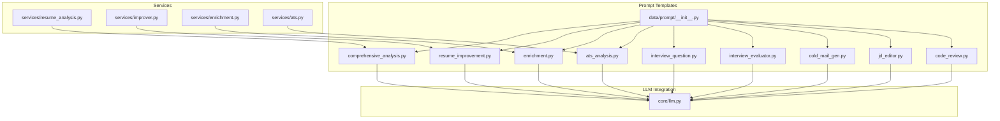
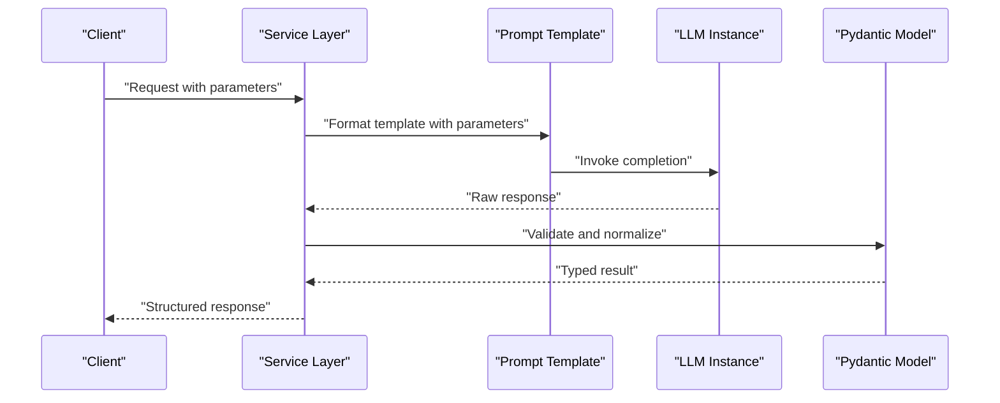
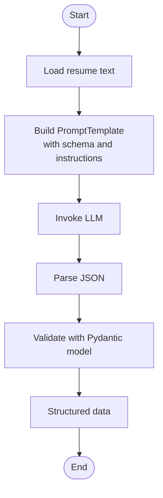
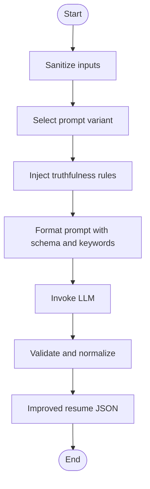
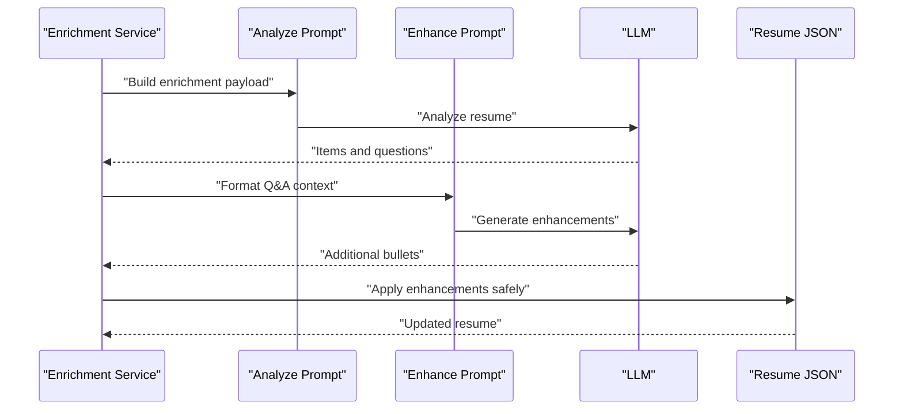
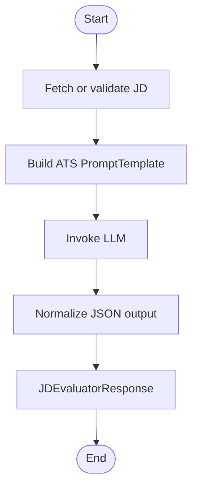
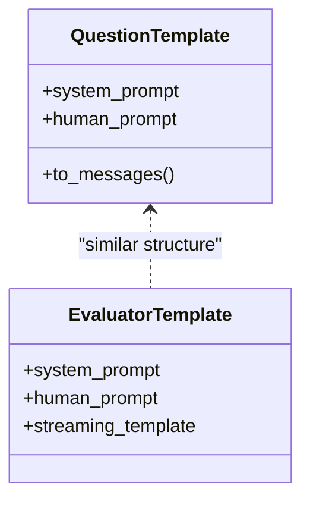
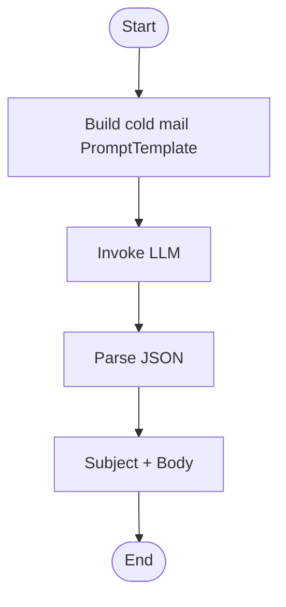
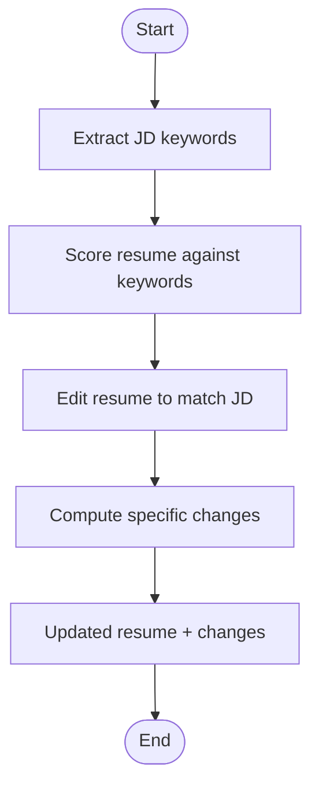
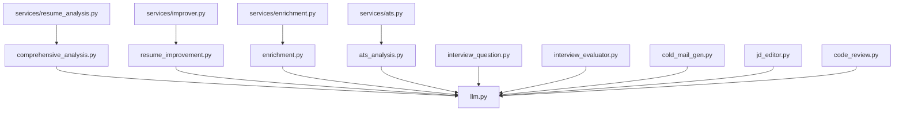

# Prompt Engineering System

<cite>
**Referenced Files in This Document**
- [prompt/__init__.py](file://backend/app/data/prompt/__init__.py)
- [comprehensive_analysis.py](file://backend/app/data/prompt/comprehensive_analysis.py)
- [resume_improvement.py](file://backend/app/data/prompt/resume_improvement.py)
- [enrichment.py](file://backend/app/data/prompt/enrichment.py)
- [ats_analysis.py](file://backend/app/data/prompt/ats_analysis.py)
- [interview_question.py](file://backend/app/data/prompt/interview_question.py)
- [interview_evaluator.py](file://backend/app/data/prompt/interview_evaluator.py)
- [cold_mail_gen.py](file://backend/app/data/prompt/cold_mail_gen.py)
- [jd_editor.py](file://backend/app/data/prompt/jd_editor.py)
- [code_review.py](file://backend/app/data/prompt/code_review.py)
- [llm.py](file://backend/app/core/llm.py)
- [resume_analysis.py](file://backend/app/services/resume_analysis.py)
- [improver.py](file://backend/app/services/improver.py)
- [enrichment.py](file://backend/app/services/enrichment.py)
- [ats.py](file://backend/app/services/ats.py)
</cite>

## Table of Contents
1. [Introduction](#introduction)
2. [Project Structure](#project-structure)
3. [Core Components](#core-components)
4. [Architecture Overview](#architecture-overview)
5. [Detailed Component Analysis](#detailed-component-analysis)
6. [Dependency Analysis](#dependency-analysis)
7. [Performance Considerations](#performance-considerations)
8. [Troubleshooting Guide](#troubleshooting-guide)
9. [Conclusion](#conclusion)

## Introduction
This document describes the prompt engineering system powering TalentSync’s AI-driven talent tools. It covers structured prompt design patterns for resume analysis, ATS optimization, interview preparation, and communication assistance. It documents the template system, parameter injection, validation, and integration with LangChain. It also outlines versioning, A/B testing strategies, performance optimization, and best practices for iterative improvement.

## Project Structure
The prompt system is organized under a dedicated module that exposes reusable templates and builders. Services orchestrate LLM calls, inject parameters, and validate outputs.

**Diagram sources**
- [prompt/__init__.py](file://backend/app/data/prompt/__init__.py#L1-L44)
- [comprehensive_analysis.py](file://backend/app/data/prompt/comprehensive_analysis.py#L1-L173)
- [resume_improvement.py](file://backend/app/data/prompt/resume_improvement.py#L1-L225)
- [enrichment.py](file://backend/app/data/prompt/enrichment.py#L1-L258)
- [ats_analysis.py](file://backend/app/data/prompt/ats_analysis.py#L1-L69)
- [interview_question.py](file://backend/app/data/prompt/interview_question.py#L1-L60)
- [interview_evaluator.py](file://backend/app/data/prompt/interview_evaluator.py#L1-L97)
- [cold_mail_gen.py](file://backend/app/data/prompt/cold_mail_gen.py#L1-L118)
- [jd_editor.py](file://backend/app/data/prompt/jd_editor.py#L1-L121)
- [code_review.py](file://backend/app/data/prompt/code_review.py#L1-L124)
- [llm.py](file://backend/app/core/llm.py#L1-L181)
- [resume_analysis.py](file://backend/app/services/resume_analysis.py#L1-L364)
- [improver.py](file://backend/app/services/improver.py#L1-L549)
- [enrichment.py](file://backend/app/services/enrichment.py#L1-L800)
- [ats.py](file://backend/app/services/ats.py#L1-L214)

**Section sources**
- [prompt/__init__.py](file://backend/app/data/prompt/__init__.py#L1-L44)
- [llm.py](file://backend/app/core/llm.py#L1-L181)

## Core Components
- Template registry and exports: Centralized exports of prompt templates and builders for reuse across services.
- LLM factory: Provider-agnostic creation of chat models with temperature support and fallbacks.
- Task-specific prompt libraries:
  - Comprehensive resume parsing and structuring
  - Resume improvement with truthfulness rules and keyword alignment
  - Resume enrichment via guided questioning and iterative refinement
  - ATS analysis scoring and recommendations
  - Interview question and answer evaluation
  - Cold email generation
  - JD-targeted resume editing
  - Code review prompting

**Section sources**
- [prompt/__init__.py](file://backend/app/data/prompt/__init__.py#L1-L44)
- [llm.py](file://backend/app/core/llm.py#L1-L181)
- [comprehensive_analysis.py](file://backend/app/data/prompt/comprehensive_analysis.py#L1-L173)
- [resume_improvement.py](file://backend/app/data/prompt/resume_improvement.py#L1-L225)
- [enrichment.py](file://backend/app/data/prompt/enrichment.py#L1-L258)
- [ats_analysis.py](file://backend/app/data/prompt/ats_analysis.py#L1-L69)
- [interview_question.py](file://backend/app/data/prompt/interview_question.py#L1-L60)
- [interview_evaluator.py](file://backend/app/data/prompt/interview_evaluator.py#L1-L97)
- [cold_mail_gen.py](file://backend/app/data/prompt/cold_mail_gen.py#L1-L118)
- [jd_editor.py](file://backend/app/data/prompt/jd_editor.py#L1-L121)
- [code_review.py](file://backend/app/data/prompt/code_review.py#L1-L124)

## Architecture Overview
The system composes LangChain prompt templates with LLM instances to produce structured outputs for each feature. Services sanitize inputs, inject parameters, and validate outputs against Pydantic models.

**Diagram sources**
- [resume_analysis.py](file://backend/app/services/resume_analysis.py#L28-L144)
- [improver.py](file://backend/app/services/improver.py#L82-L128)
- [enrichment.py](file://backend/app/services/enrichment.py#L227-L269)
- [ats.py](file://backend/app/services/ats.py#L22-L191)
- [comprehensive_analysis.py](file://backend/app/data/prompt/comprehensive_analysis.py#L162-L173)
- [resume_improvement.py](file://backend/app/data/prompt/resume_improvement.py#L217-L225)
- [enrichment.py](file://backend/app/data/prompt/enrichment.py#L1-L258)
- [ats_analysis.py](file://backend/app/data/prompt/ats_analysis.py#L57-L69)
- [llm.py](file://backend/app/core/llm.py#L110-L176)

## Detailed Component Analysis

### Structured Resume Analysis
- Purpose: Convert raw resume text into a structured JSON aligned with UI models.
- Pattern: PromptTemplate with explicit schema and instructions; chained with an LLM.
- Validation: Pydantic model validates and normalizes output.

**Diagram sources**
- [comprehensive_analysis.py](file://backend/app/data/prompt/comprehensive_analysis.py#L5-L173)
- [resume_analysis.py](file://backend/app/services/resume_analysis.py#L75-L104)

**Section sources**
- [comprehensive_analysis.py](file://backend/app/data/prompt/comprehensive_analysis.py#L1-L173)
- [resume_analysis.py](file://backend/app/services/resume_analysis.py#L28-L144)

### Resume Improvement and Truthfulness
- Purpose: Tailor resumes to job descriptions while preserving truthfulness.
- Pattern: Multiple prompt variants (nudge, keywords, full) with critical truthfulness rules injected.
- Validation: Post-processing checks for truncation and Pydantic validation.

**Diagram sources**
- [resume_improvement.py](file://backend/app/data/prompt/resume_improvement.py#L74-L128)
- [improver.py](file://backend/app/services/improver.py#L82-L128)

**Section sources**
- [resume_improvement.py](file://backend/app/data/prompt/resume_improvement.py#L1-L225)
- [improver.py](file://backend/app/services/improver.py#L82-L128)

### Resume Enrichment via Guided Questioning
- Purpose: Identify weak spots and generate targeted questions; iteratively refine enhancements.
- Pattern: Analyze → Generate questions → Enhance/add bullets → Apply to resume.
- Validation: Strict formatting and safety checks; safe application by item identifiers.

**Diagram sources**
- [enrichment.py](file://backend/app/data/prompt/enrichment.py#L1-L258)
- [enrichment.py](file://backend/app/services/enrichment.py#L227-L388)

**Section sources**
- [enrichment.py](file://backend/app/data/prompt/enrichment.py#L1-L258)
- [enrichment.py](file://backend/app/services/enrichment.py#L227-L585)

### ATS Optimization and Scoring
- Purpose: Score resume-JD alignment, detect missing keywords, and provide recommendations.
- Pattern: PromptTemplate with scoring rubrics; service normalizes outputs to a consistent response model.

**Diagram sources**
- [ats_analysis.py](file://backend/app/data/prompt/ats_analysis.py#L4-L69)
- [ats.py](file://backend/app/services/ats.py#L22-L191)

**Section sources**
- [ats_analysis.py](file://backend/app/data/prompt/ats_analysis.py#L1-L69)
- [ats.py](file://backend/app/services/ats.py#L1-L214)

### Interview Preparation Tools
- Question Generation: ChatPromptTemplate with system + human messages; returns structured question metadata.
- Answer Evaluation: Structured scoring and feedback with streaming-friendly alternatives.

**Diagram sources**
- [interview_question.py](file://backend/app/data/prompt/interview_question.py#L18-L60)
- [interview_evaluator.py](file://backend/app/data/prompt/interview_evaluator.py#L23-L97)

**Section sources**
- [interview_question.py](file://backend/app/data/prompt/interview_question.py#L1-L60)
- [interview_evaluator.py](file://backend/app/data/prompt/interview_evaluator.py#L1-L97)

### Communication Tools: Cold Email Generation
- Purpose: Generate personalized cold emails with subject/body in a structured JSON format.
- Pattern: PromptTemplate with resume and contextual fields; service builds chain and invokes LLM.

**Diagram sources**
- [cold_mail_gen.py](file://backend/app/data/prompt/cold_mail_gen.py#L5-L118)

**Section sources**
- [cold_mail_gen.py](file://backend/app/data/prompt/cold_mail_gen.py#L1-L118)

### JD-Targeted Resume Editing
- Purpose: Extract JD keywords, score resume alignment, edit to match JD while preserving facts, and compute changes.
- Pattern: Multiple specialized prompts with consistent truthfulness constraints.

**Diagram sources**
- [jd_editor.py](file://backend/app/data/prompt/jd_editor.py#L1-L121)

**Section sources**
- [jd_editor.py](file://backend/app/data/prompt/jd_editor.py#L1-L121)

### Code Review Prompting
- Purpose: Evaluate code submissions with structured scoring and feedback; supports streaming and non-streaming modes.
- Pattern: ChatPromptTemplate with system + human messages and JSON output instructions.

**Section sources**
- [code_review.py](file://backend/app/data/prompt/code_review.py#L1-L124)

## Dependency Analysis
- Prompt templates depend on LangChain’s PromptTemplate or ChatPromptTemplate.
- Services depend on prompt templates and LLM factories.
- Validation depends on Pydantic models defined in prompt templates and service schemas.

**Diagram sources**
- [comprehensive_analysis.py](file://backend/app/data/prompt/comprehensive_analysis.py#L1-L173)
- [resume_improvement.py](file://backend/app/data/prompt/resume_improvement.py#L1-L225)
- [enrichment.py](file://backend/app/data/prompt/enrichment.py#L1-L258)
- [ats_analysis.py](file://backend/app/data/prompt/ats_analysis.py#L1-L69)
- [interview_question.py](file://backend/app/data/prompt/interview_question.py#L1-L60)
- [interview_evaluator.py](file://backend/app/data/prompt/interview_evaluator.py#L1-L97)
- [cold_mail_gen.py](file://backend/app/data/prompt/cold_mail_gen.py#L1-L118)
- [jd_editor.py](file://backend/app/data/prompt/jd_editor.py#L1-L121)
- [code_review.py](file://backend/app/data/prompt/code_review.py#L1-L124)
- [llm.py](file://backend/app/core/llm.py#L1-L181)
- [resume_analysis.py](file://backend/app/services/resume_analysis.py#L1-L364)
- [improver.py](file://backend/app/services/improver.py#L1-L549)
- [enrichment.py](file://backend/app/services/enrichment.py#L1-L800)
- [ats.py](file://backend/app/services/ats.py#L1-L214)

**Section sources**
- [prompt/__init__.py](file://backend/app/data/prompt/__init__.py#L1-L44)
- [llm.py](file://backend/app/core/llm.py#L1-L181)

## Performance Considerations
- Token limits: Many prompts set generous max token budgets; tune based on expected output sizes.
- Streaming vs. non-streaming: Prefer streaming for interactive UX; non-streaming for strict JSON parsing.
- Provider temperature: Respect provider-specific constraints; avoid temperature for certain models.
- Retry and fallback: Implement retry with exponential backoff and provider fallbacks.
- Caching: Cache repeated prompts with identical parameters; invalidate on prompt updates.
- Batch processing: For bulk operations, batch prompts and deduplicate repeated contexts.

## Troubleshooting Guide
- Empty or truncated outputs: Validate required sections and log warnings for missing fields.
- JSON parsing failures: Ensure system prompts enforce JSON-only outputs; normalize LLM responses.
- Injection risks: Sanitize user inputs to prevent prompt injection; redact suspicious patterns.
- Validation errors: Catch Pydantic validation errors and return structured error responses.
- Provider misconfiguration: Verify API keys and base URLs; handle initialization failures gracefully.

**Section sources**
- [improver.py](file://backend/app/services/improver.py#L61-L70)
- [improver.py](file://backend/app/services/improver.py#L54-L58)
- [resume_analysis.py](file://backend/app/services/resume_analysis.py#L96-L103)
- [llm.py](file://backend/app/core/llm.py#L120-L145)

## Conclusion
The prompt engineering system in TalentSync leverages structured templates, robust validation, and provider-agnostic LLM integration to deliver reliable AI-powered talent tools. By centralizing templates, enforcing truthfulness, and applying consistent validation, the system supports iterative improvement, A/B testing, and scalable performance across resume analysis, ATS optimization, interview prep, and communication assistance.