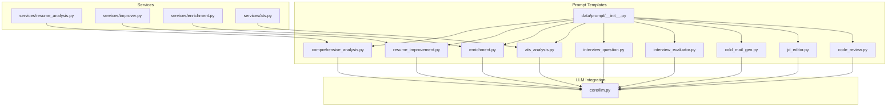
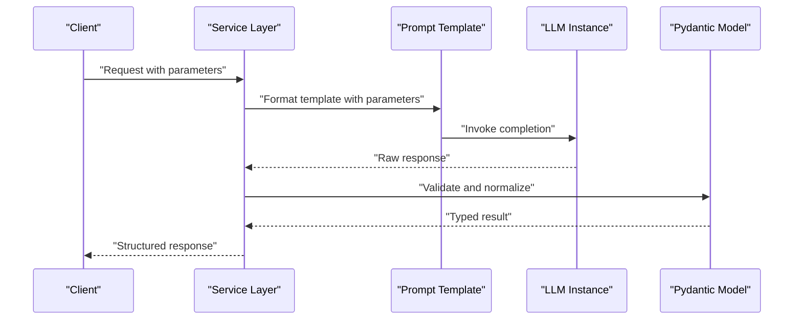
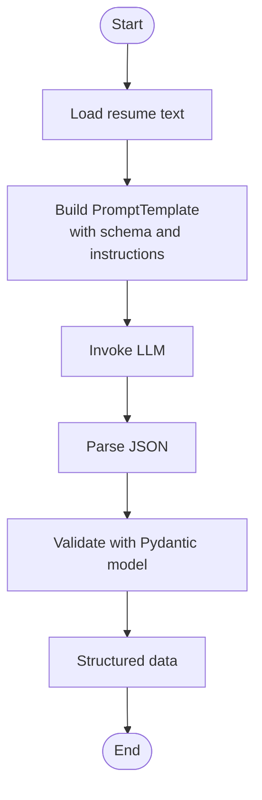
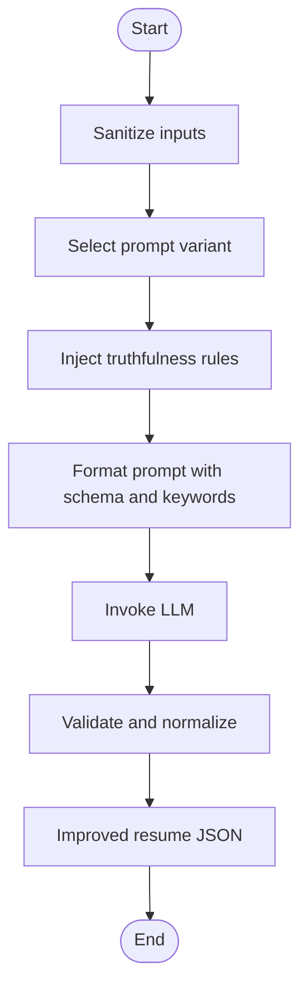
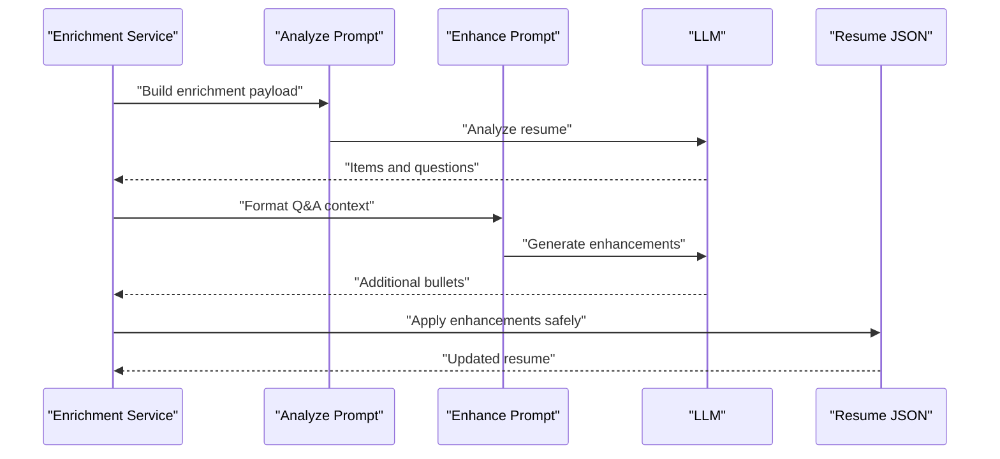
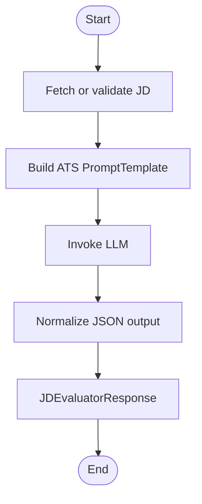
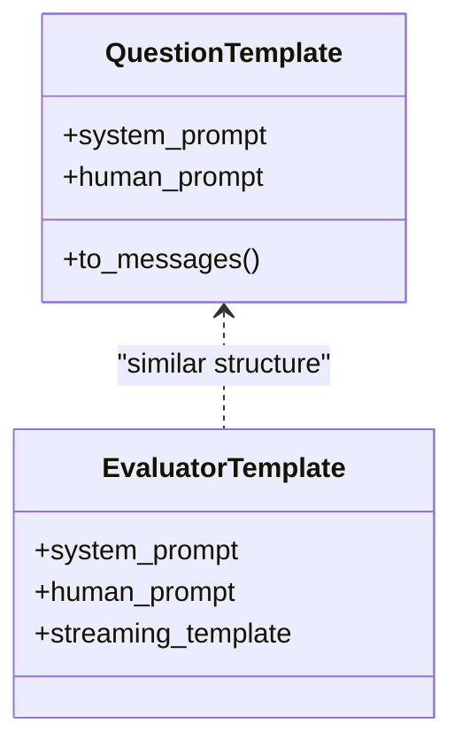
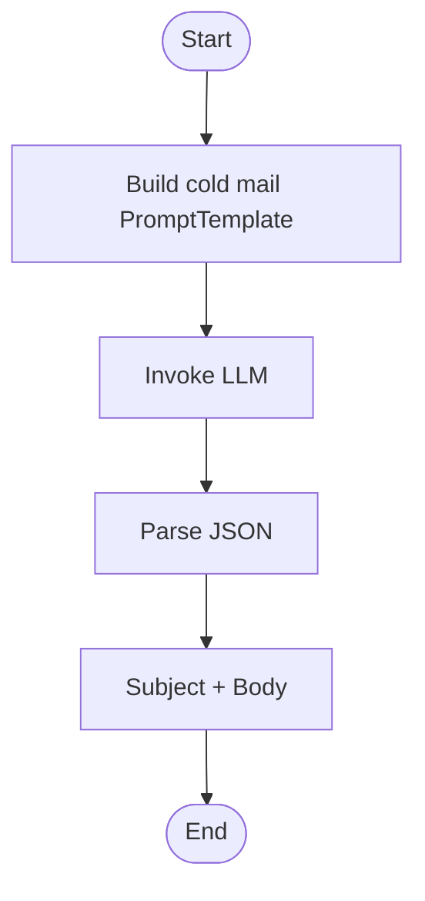
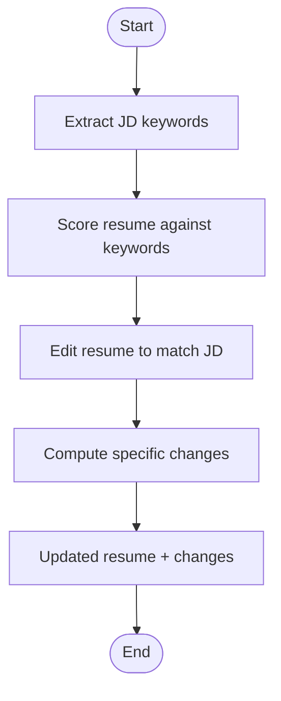
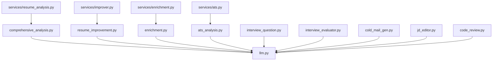

# Prompt engineering system

## Introduction
This page describes the prompt engineering system powering TalentSync's AI-driven talent tools. It covers structured prompt design patterns for resume analysis, ATS optimization, interview preparation, and communication assistance. It documents the template system, parameter injection, validation, and integration with LangChain. It also outlines versioning, A/B testing strategies, performance optimization, and best practices for iterative improvement.

## Project structure
The prompt system is organized under a dedicated module that exposes reusable templates and builders. Services orchestrate LLM calls, inject parameters, and validate outputs.

```mermaid
graph TB
subgraph "Prompt Templates"
PInit["data/prompt/__init__.py"]
PComp["comprehensive_analysis.py"]
PImpr["resume_improvement.py"]
PEnr["enrichment.py"]
PAts["ats_analysis.py"]
PIntQ["interview_question.py"]
PIntE["interview_evaluator.py"]
PCold["cold_mail_gen.py"]
PJd["jd_editor.py"]
PCrv["code_review.py"]
end
subgraph "LLM Integration"
LLM["core/llm.py"]
end
subgraph "Services"
SRes["services/resume_analysis.py"]
Simpr["services/improver.py"]
Senr["services/enrichment.py"]
Sats["services/ats.py"]
end
PInit --> PComp
PInit --> PImpr
PInit --> PEnr
PInit --> PAts
PInit --> PIntQ
PInit --> PIntE
PInit --> PCold
PInit --> PJd
PInit --> PCrv
PComp --> LLM
PImpr --> LLM
PEnr --> LLM
PAts --> LLM
PIntQ --> LLM
PIntE --> LLM
PCold --> LLM
PJd --> LLM
PCrv --> LLM
SRes --> PComp
Simpr --> PImpr
Senr --> PEnr
Sats --> PAts
```

## Core components
- Template registry and exports: Centralized exports of prompt templates and builders for reuse across services.
- LLM factory: Provider-agnostic creation of chat models with temperature support and fallbacks.
- Task-specific prompt libraries:
  - Detailed resume parsing and structuring
  - Resume improvement with truthfulness rules and keyword alignment
  - Resume enrichment via guided questioning and iterative refinement
  - ATS analysis scoring and recommendations
  - Interview question and answer evaluation
  - Cold email generation
  - JD-targeted resume editing
  - Code review prompting

## Architecture overview
The system composes LangChain prompt templates with LLM instances to produce structured outputs for each feature. Services sanitize inputs, inject parameters, and validate outputs against Pydantic models.

```mermaid
sequenceDiagram
participant Client as "Client"
participant Service as "Service Layer"
participant Prompt as "Prompt Template"
participant LLM as "LLM Instance"
participant Validator as "Pydantic Model"
Client->>Service : "Request with parameters"
Service->>Prompt : "Format template with parameters"
Prompt->>LLM : "Invoke completion"
LLM-->>Service : "Raw response"
Service->>Validator : "Validate and normalize"
Validator-->>Service : "Typed result"
Service-->>Client : "Structured response"
```

## Detailed component analysis

### Structured resume analysis
- Purpose: Convert raw resume text into a structured JSON aligned with UI models.
- Pattern: PromptTemplate with explicit schema and instructions; chained with an LLM.
- Validation: Pydantic model validates and normalizes output.

```mermaid
flowchart TD
Start(["Start"]) --> LoadText["Load resume text"]
LoadText --> BuildPrompt["Build PromptTemplate<br/>with schema and instructions"]
BuildPrompt --> InvokeLLM["Invoke LLM"]
InvokeLLM --> ParseJSON["Parse JSON"]
ParseJSON --> Validate["Validate with Pydantic model"]
Validate --> Output["Structured data"]
Output --> End(["End"])
```

### Resume improvement and truthfulness
- Purpose: Tailor resumes to job descriptions while preserving truthfulness.
- Pattern: Multiple prompt variants (nudge, keywords, full) with critical truthfulness rules injected.
- Validation: Post-processing checks for truncation and Pydantic validation.

```mermaid
flowchart TD
Start(["Start"]) --> Sanitize["Sanitize inputs"]
Sanitize --> SelectPrompt["Select prompt variant"]
SelectPrompt --> InjectRules["Inject truthfulness rules"]
InjectRules --> BuildPrompt["Format prompt with schema and keywords"]
BuildPrompt --> InvokeLLM["Invoke LLM"]
InvokeLLM --> Validate["Validate and normalize"]
Validate --> Output["Improved resume JSON"]
Output --> End(["End"])
```

### Resume enrichment via guided questioning
- Purpose: Identify weak spots and generate targeted questions; iteratively refine enhancements.
- Pattern: Analyze → Generate questions → Improve/add bullets → Apply to resume.
- Validation: Strict formatting and safety checks; safe application by item identifiers.

```mermaid
sequenceDiagram
participant Svc as "Enrichment Service"
participant Analyze as "Analyze Prompt"
participant Enhance as "Enhance Prompt"
participant LLM as "LLM"
participant Resume as "Resume JSON"
Svc->>Analyze : "Build enrichment payload"
Analyze->>LLM : "Analyze resume"
LLM-->>Svc : "Items and questions"
Svc->>Enhance : "Format Q&A context"
Enhance->>LLM : "Generate enhancements"
LLM-->>Svc : "Additional bullets"
Svc->>Resume : "Apply enhancements safely"
Resume-->>Svc : "Updated resume"
```

### ATS optimization and scoring
- Purpose: Score resume-JD alignment, detect missing keywords, and provide recommendations.
- Pattern: PromptTemplate with scoring rubrics; service normalizes outputs to a consistent response model.

```mermaid
flowchart TD
Start(["Start"]) --> FetchJD["Fetch or validate JD"]
FetchJD --> BuildPrompt["Build ATS PromptTemplate"]
BuildPrompt --> InvokeLLM["Invoke LLM"]
InvokeLLM --> Normalize["Normalize JSON output"]
Normalize --> Response["JDEvaluatorResponse"]
Response --> End(["End"])
```

### Interview preparation tools
- Question Generation: ChatPromptTemplate with system + human messages; returns structured question metadata.
- Answer Evaluation: Structured scoring and feedback with streaming-friendly alternatives.

```mermaid
classDiagram
class QuestionTemplate {
+system_prompt
+human_prompt
+to_messages()
}
class EvaluatorTemplate {
+system_prompt
+human_prompt
+streaming_template
}
QuestionTemplate <.. EvaluatorTemplate : "similar structure"
```

### Communication tools: cold email generation
- Purpose: Generate personalized cold emails with subject/body in a structured JSON format.
- Pattern: PromptTemplate with resume and contextual fields; service builds chain and invokes LLM.

```mermaid
flowchart TD
Start(["Start"]) --> BuildPrompt["Build cold mail PromptTemplate"]
BuildPrompt --> InvokeLLM["Invoke LLM"]
InvokeLLM --> Parse["Parse JSON"]
Parse --> Output["Subject + Body"]
Output --> End(["End"])
```

### JD-Targeted resume editing
- Purpose: Extract JD keywords, score resume alignment, edit to match JD while preserving facts, and compute changes.
- Pattern: Multiple specialized prompts with consistent truthfulness constraints.

```mermaid
flowchart TD
Start(["Start"]) --> Extract["Extract JD keywords"]
Extract --> Score["Score resume against keywords"]
Score --> Edit["Edit resume to match JD"]
Edit --> Changes["Compute specific changes"]
Changes --> Output["Updated resume + changes"]
Output --> End(["End"])
```

### Code review prompting
- Purpose: Evaluate code submissions with structured scoring and feedback; supports streaming and non-streaming modes.
- Pattern: ChatPromptTemplate with system + human messages and JSON output instructions.

## Dependency analysis
- Prompt templates depend on LangChain's PromptTemplate or ChatPromptTemplate.
- Services depend on prompt templates and LLM factories.
- Validation depends on Pydantic models defined in prompt templates and service schemas.

```mermaid
graph TB
PComp["comprehensive_analysis.py"] --> LLM["llm.py"]
PImpr["resume_improvement.py"] --> LLM
PEnr["enrichment.py"] --> LLM
PAts["ats_analysis.py"] --> LLM
PIntQ["interview_question.py"] --> LLM
PIntE["interview_evaluator.py"] --> LLM
PCold["cold_mail_gen.py"] --> LLM
PJd["jd_editor.py"] --> LLM
PCrv["code_review.py"] --> LLM
SRes["services/resume_analysis.py"] --> PComp
Simpr["services/improver.py"] --> PImpr
Senr["services/enrichment.py"] --> PEnr
Sats["services/ats.py"] --> PAts
```

## Performance considerations
- Token limits: Many prompts set generous max token budgets; tune based on expected output sizes.
- Streaming vs. non-streaming: Prefer streaming for interactive UX; non-streaming for strict JSON parsing.
- Provider temperature: Respect provider-specific constraints; avoid temperature for certain models.
- Retry and fallback: Implement retry with exponential backoff and provider fallbacks.
- Caching: Cache repeated prompts with identical parameters; invalidate on prompt updates.
- Batch processing: For bulk operations, batch prompts and deduplicate repeated contexts.

## Troubleshooting guide
- Empty or truncated outputs: Validate required sections and log warnings for missing fields.
- JSON parsing failures: Ensure system prompts enforce JSON-only outputs; normalize LLM responses.
- Injection risks: Sanitize user inputs to prevent prompt injection; redact suspicious patterns.
- Validation errors: Catch Pydantic validation errors and return structured error responses.
- Provider misconfiguration: Verify API keys and base URLs; handle initialization failures gracefully.

## Conclusion
The prompt engineering system in TalentSync uses structured templates, reliable validation, and provider-agnostic LLM integration to deliver reliable AI-powered talent tools. By centralizing templates, enforcing truthfulness, and applying consistent validation, the system supports iterative improvement, A/B testing, and scalable performance across resume analysis, ATS optimization, interview prep, and communication assistance.
