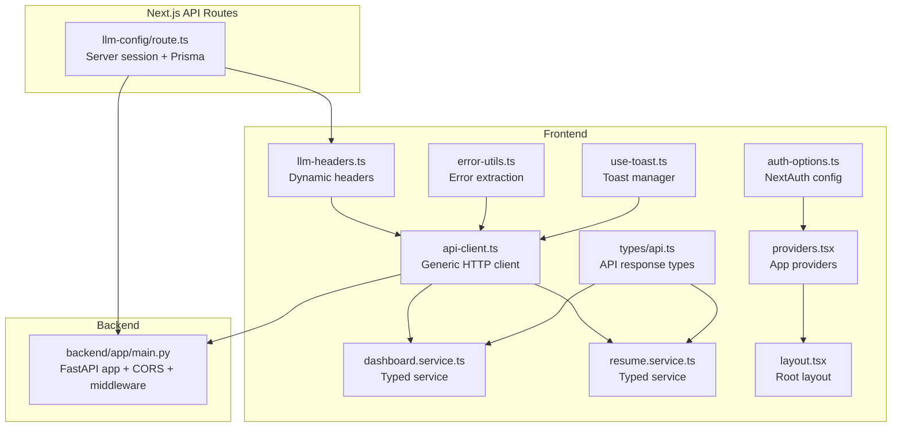
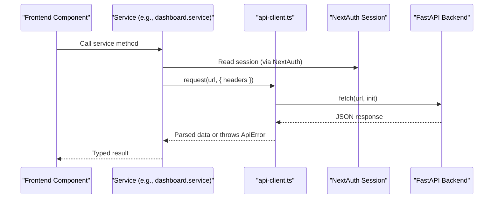
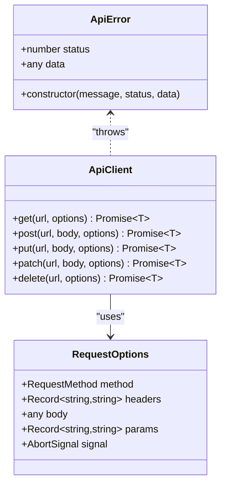
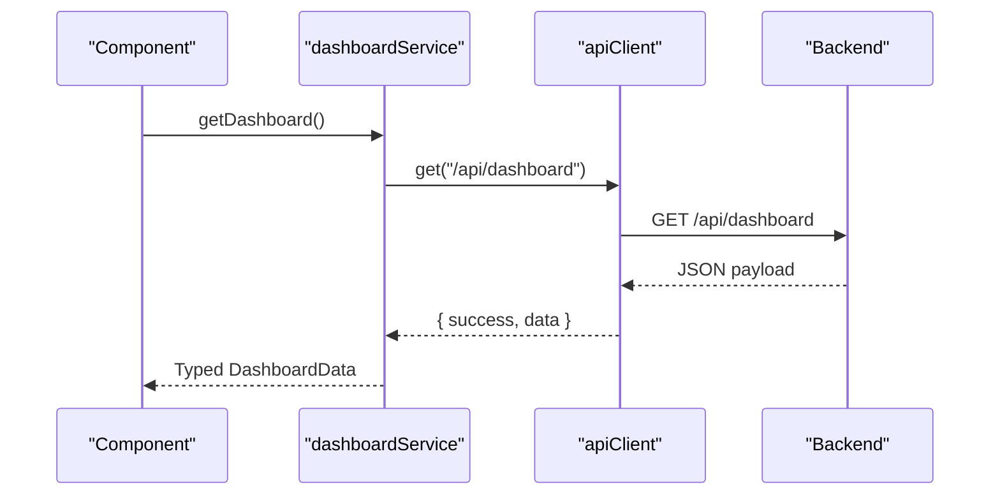
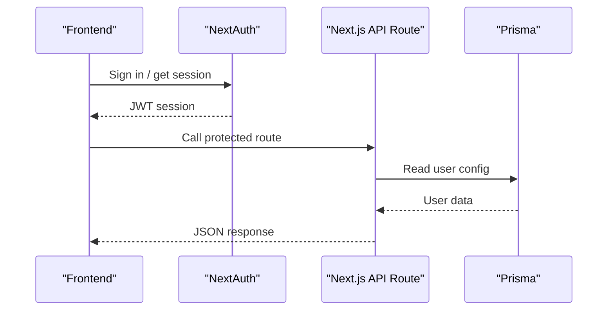
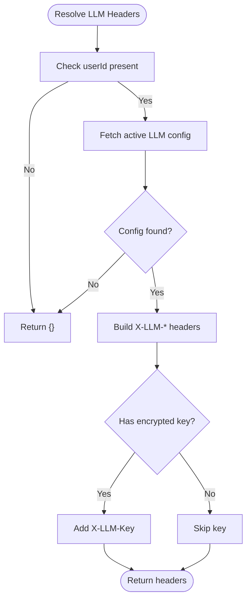
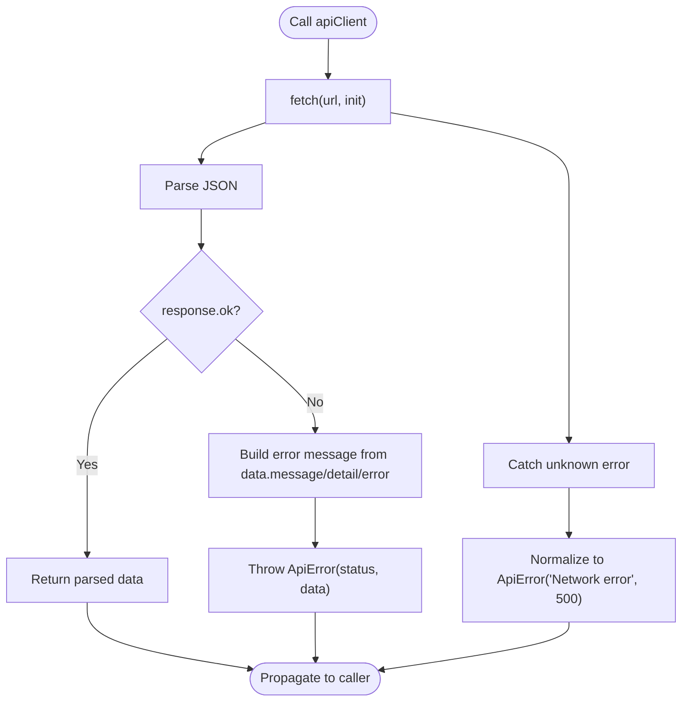
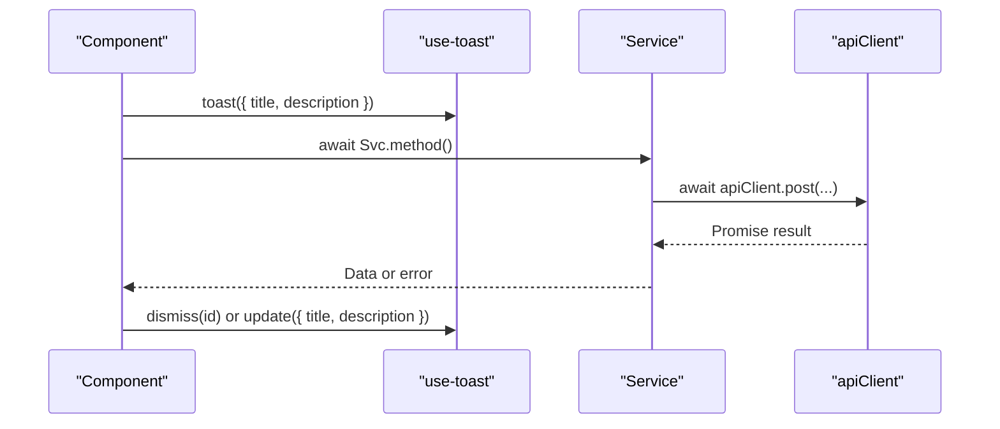
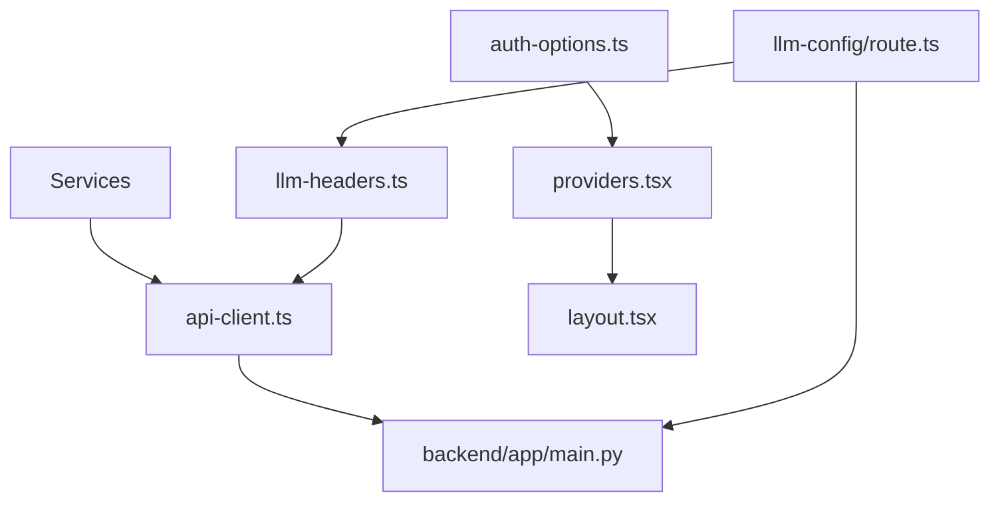

# API Client Libraries

<cite>
**Referenced Files in This Document**
- [api-client.ts](file://frontend/services/api-client.ts)
- [index.ts](file://frontend/services/index.ts)
- [dashboard.service.ts](file://frontend/services/dashboard.service.ts)
- [resume.service.ts](file://frontend/services/resume.service.ts)
- [llm-headers.ts](file://frontend/lib/llm-headers.ts)
- [auth-options.ts](file://frontend/lib/auth-options.ts)
- [error-utils.ts](file://frontend/lib/error-utils.ts)
- [api.ts](file://frontend/types/api.ts)
- [route.ts](file://frontend/app/api/llm-config/route.ts)
- [main.py](file://backend/app/main.py)
- [layout.tsx](file://frontend/app/layout.tsx)
- [providers.tsx](file://frontend/app/providers.tsx)
- [use-toast.ts](file://frontend/hooks/use-toast.ts)
</cite>

## Table of Contents
1. [Introduction](#introduction)
2. [Project Structure](#project-structure)
3. [Core Components](#core-components)
4. [Architecture Overview](#architecture-overview)
5. [Detailed Component Analysis](#detailed-component-analysis)
6. [Dependency Analysis](#dependency-analysis)
7. [Performance Considerations](#performance-considerations)
8. [Troubleshooting Guide](#troubleshooting-guide)
9. [Conclusion](#conclusion)
10. [Appendices](#appendices)

## Introduction
This document provides comprehensive API client documentation for the TalentSync-Normies platform. It focuses on the frontend service layer, authentication header configuration, request/response processing, error handling, and loading state management. It also outlines backend integration approaches, async/await patterns, and practical guidance for extending client functionality, adding custom headers, implementing custom error handling, and optimizing performance. The content is grounded in the repository’s actual implementation and is designed to be accessible to both frontend and backend developers.

## Project Structure
The API client ecosystem spans the frontend services and Next.js API routes that proxy to the backend, along with authentication and error-handling utilities. The backend exposes REST endpoints under versioned prefixes.

**Diagram sources**
- [api-client.ts](file://frontend/services/api-client.ts#L1-L125)
- [dashboard.service.ts](file://frontend/services/dashboard.service.ts#L1-L8)
- [resume.service.ts](file://frontend/services/resume.service.ts#L1-L66)
- [llm-headers.ts](file://frontend/lib/llm-headers.ts#L1-L41)
- [auth-options.ts](file://frontend/lib/auth-options.ts#L1-L202)
- [error-utils.ts](file://frontend/lib/error-utils.ts#L1-L17)
- [api.ts](file://frontend/types/api.ts#L1-L18)
- [providers.tsx](file://frontend/app/providers.tsx#L1-L200)
- [layout.tsx](file://frontend/app/layout.tsx#L1-L52)
- [use-toast.ts](file://frontend/hooks/use-toast.ts#L1-L192)
- [route.ts](file://frontend/app/api/llm-config/route.ts#L1-L120)
- [main.py](file://backend/app/main.py#L1-L203)

**Section sources**
- [api-client.ts](file://frontend/services/api-client.ts#L1-L125)
- [index.ts](file://frontend/services/index.ts#L1-L15)
- [main.py](file://backend/app/main.py#L1-L203)

## Core Components
- Generic HTTP client with typed requests and robust error handling
- Typed service layer wrapping endpoints for specific features
- Authentication and session management via NextAuth
- Dynamic LLM provider headers resolved per user
- Shared error extraction utility
- API response typing for consistent frontend contracts
- Toast-based loading and error notifications

Key implementation references:
- Generic client and error types: [api-client.ts](file://frontend/services/api-client.ts#L1-L125)
- Service exports and usage: [index.ts](file://frontend/services/index.ts#L1-L15)
- Dashboard service example: [dashboard.service.ts](file://frontend/services/dashboard.service.ts#L1-L8)
- Resume service example: [resume.service.ts](file://frontend/services/resume.service.ts#L1-L66)
- LLM headers resolution: [llm-headers.ts](file://frontend/lib/llm-headers.ts#L1-L41)
- NextAuth configuration: [auth-options.ts](file://frontend/lib/auth-options.ts#L1-L202)
- Error extraction utility: [error-utils.ts](file://frontend/lib/error-utils.ts#L1-L17)
- API response types: [api.ts](file://frontend/types/api.ts#L1-L18)
- Toast manager: [use-toast.ts](file://frontend/hooks/use-toast.ts#L1-L192)

**Section sources**
- [api-client.ts](file://frontend/services/api-client.ts#L1-L125)
- [index.ts](file://frontend/services/index.ts#L1-L15)
- [dashboard.service.ts](file://frontend/services/dashboard.service.ts#L1-L8)
- [resume.service.ts](file://frontend/services/resume.service.ts#L1-L66)
- [llm-headers.ts](file://frontend/lib/llm-headers.ts#L1-L41)
- [auth-options.ts](file://frontend/lib/auth-options.ts#L1-L202)
- [error-utils.ts](file://frontend/lib/error-utils.ts#L1-L17)
- [api.ts](file://frontend/types/api.ts#L1-L18)
- [use-toast.ts](file://frontend/hooks/use-toast.ts#L1-L192)

## Architecture Overview
The frontend consumes backend endpoints through a generic HTTP client. Services encapsulate endpoint-specific logic and return strongly typed responses. Authentication is handled by NextAuth, and dynamic LLM headers are injected based on user configuration. The backend runs FastAPI with CORS and request/response logging middleware.

**Diagram sources**
- [dashboard.service.ts](file://frontend/services/dashboard.service.ts#L1-L8)
- [api-client.ts](file://frontend/services/api-client.ts#L25-L98)
- [auth-options.ts](file://frontend/lib/auth-options.ts#L1-L202)
- [main.py](file://backend/app/main.py#L157-L203)

## Detailed Component Analysis

### Generic HTTP Client
The generic client provides a strongly typed wrapper around fetch with:
- Method helpers: get, post, put, patch, delete
- Automatic JSON serialization for non-FormData bodies
- Query string building from params
- Robust error handling via ApiError
- Network error normalization

**Diagram sources**
- [api-client.ts](file://frontend/services/api-client.ts#L3-L125)

**Section sources**
- [api-client.ts](file://frontend/services/api-client.ts#L1-L125)

### Typed Service Layer
Services encapsulate endpoint logic and return typed responses. Examples:
- Dashboard service: retrieves dashboard data
- Resume service: CRUD and analysis operations for resumes

**Diagram sources**
- [dashboard.service.ts](file://frontend/services/dashboard.service.ts#L1-L8)
- [api-client.ts](file://frontend/services/api-client.ts#L100-L125)

**Section sources**
- [dashboard.service.ts](file://frontend/services/dashboard.service.ts#L1-L8)
- [resume.service.ts](file://frontend/services/resume.service.ts#L1-L66)

### Authentication and Session Management
NextAuth manages authentication and JWT-based sessions. The frontend reads session data to inform API calls and UI behavior. The backend enforces CORS and logs request/response payloads for observability.

**Diagram sources**
- [auth-options.ts](file://frontend/lib/auth-options.ts#L1-L202)
- [route.ts](file://frontend/app/api/llm-config/route.ts#L1-L120)
- [main.py](file://backend/app/main.py#L148-L154)

**Section sources**
- [auth-options.ts](file://frontend/lib/auth-options.ts#L1-L202)
- [route.ts](file://frontend/app/api/llm-config/route.ts#L1-L120)
- [main.py](file://backend/app/main.py#L148-L154)

### Dynamic LLM Headers
The LLM headers utility resolves provider, model, and optional API key for a given user and injects them into requests. This enables per-user routing to external LLM providers.

**Diagram sources**
- [llm-headers.ts](file://frontend/lib/llm-headers.ts#L1-L41)

**Section sources**
- [llm-headers.ts](file://frontend/lib/llm-headers.ts#L1-L41)

### Error Handling Strategies
The generic client normalizes network and server errors into ApiError instances. A shared utility extracts human-readable messages from thrown values. Components should catch ApiError and display user-friendly messages.

**Diagram sources**
- [api-client.ts](file://frontend/services/api-client.ts#L56-L98)
- [error-utils.ts](file://frontend/lib/error-utils.ts#L1-L17)

**Section sources**
- [api-client.ts](file://frontend/services/api-client.ts#L56-L98)
- [error-utils.ts](file://frontend/lib/error-utils.ts#L1-L17)

### Loading State Management
The toast manager provides a lightweight, imperative way to surface loading and error notifications. Components can trigger toasts while awaiting API responses and dismiss them upon completion.

**Diagram sources**
- [use-toast.ts](file://frontend/hooks/use-toast.ts#L1-L192)
- [resume.service.ts](file://frontend/services/resume.service.ts#L43-L49)

**Section sources**
- [use-toast.ts](file://frontend/hooks/use-toast.ts#L1-L192)
- [resume.service.ts](file://frontend/services/resume.service.ts#L43-L49)

### Request/Response Processing and Endpoint Consumption
- Query parameters are appended via URLSearchParams
- Non-FormData bodies are serialized to JSON
- Responses are parsed and returned; non-OK responses raise ApiError
- Typed services wrap endpoints and return ApiResponse<T>

References:
- [api-client.ts](file://frontend/services/api-client.ts#L25-L98)
- [api.ts](file://frontend/types/api.ts#L1-L18)

**Section sources**
- [api-client.ts](file://frontend/services/api-client.ts#L25-L98)
- [api.ts](file://frontend/types/api.ts#L1-L18)

### Backend Integration Approaches
- Frontend calls Next.js API routes that validate sessions and interact with Prisma
- Backend FastAPI app defines CORS and request/response logging middleware
- Routes are grouped under versioned prefixes (/api/v1, /api/v2)

References:
- [route.ts](file://frontend/app/api/llm-config/route.ts#L1-L120)
- [main.py](file://backend/app/main.py#L148-L203)

**Section sources**
- [route.ts](file://frontend/app/api/llm-config/route.ts#L1-L120)
- [main.py](file://backend/app/main.py#L148-L203)

### Async/Await Patterns and Error Propagation
- All service methods are async and await apiClient methods
- ApiError carries HTTP status and raw payload for granular handling
- Components should handle ApiError and use the toast manager for UX

References:
- [dashboard.service.ts](file://frontend/services/dashboard.service.ts#L1-L8)
- [resume.service.ts](file://frontend/services/resume.service.ts#L1-L66)
- [api-client.ts](file://frontend/services/api-client.ts#L13-L23)

**Section sources**
- [dashboard.service.ts](file://frontend/services/dashboard.service.ts#L1-L8)
- [resume.service.ts](file://frontend/services/resume.service.ts#L1-L66)
- [api-client.ts](file://frontend/services/api-client.ts#L13-L23)

### Extending Client Functionality
- Add custom headers: pass additional headers in RequestOptions; the client merges them
- Add new endpoints: define a new service method returning apiClient.get/post/etc.
- Extend error handling: catch ApiError in components and branch on status/data

References:
- [api-client.ts](file://frontend/services/api-client.ts#L5-L11)
- [index.ts](file://frontend/services/index.ts#L1-L15)

**Section sources**
- [api-client.ts](file://frontend/services/api-client.ts#L5-L11)
- [index.ts](file://frontend/services/index.ts#L1-L15)

### Adding Custom Headers
- For LLM routing, use the LLM headers utility to inject provider/model/key
- For other needs, pass headers in RequestOptions when calling apiClient methods

References:
- [llm-headers.ts](file://frontend/lib/llm-headers.ts#L1-L41)
- [api-client.ts](file://frontend/services/api-client.ts#L38-L54)

**Section sources**
- [llm-headers.ts](file://frontend/lib/llm-headers.ts#L1-L41)
- [api-client.ts](file://frontend/services/api-client.ts#L38-L54)

### Implementing Custom Error Handling
- Use the shared error extraction utility to derive user-friendly messages
- In components, catch ApiError and decide whether to show a toast or redirect

References:
- [error-utils.ts](file://frontend/lib/error-utils.ts#L1-L17)

**Section sources**
- [error-utils.ts](file://frontend/lib/error-utils.ts#L1-L17)

### Client-Side Caching Strategies
- No explicit caching is implemented in the client. Consider integrating a caching layer (e.g., in-memory cache keyed by URL+params) to reduce redundant requests for identical queries.
- For immutable resources, cache responses keyed by endpoint and parameters; invalidate on mutations.

[No sources needed since this section provides general guidance]

### Retry Mechanisms
- No built-in retry logic exists in the client. Implement retries with exponential backoff for transient failures (e.g., network errors, 5xx).
- Respect AbortSignal to cancel ongoing requests during unmount or rapid successive calls.

[No sources needed since this section provides general guidance]

### Timeout Handling
- Use AbortSignal to enforce timeouts. Pass a signal with a timeout to apiClient methods and handle AbortError appropriately.

[No sources needed since this section provides general guidance]

### Rate Limiting
- No explicit rate limiting is enforced in the client. Implement client-side throttling or queueing for high-frequency operations.
- Observe server-side rate limits and back off on 429 responses.

[No sources needed since this section provides general guidance]

### Bulk Operations
- Design batch endpoints on the backend and expose them via Next.js routes. On the frontend, split large lists into chunks and process sequentially or in controlled concurrency.

[No sources needed since this section provides general guidance]

### Streaming Response Handling
- The current client parses entire JSON responses. For streaming responses, consider using a streaming parser or backend changes to support chunked responses.

[No sources needed since this section provides general guidance]

## Dependency Analysis
The frontend services depend on the generic HTTP client and NextAuth for session data. The Next.js API routes depend on NextAuth and Prisma to resolve user configurations. The backend depends on FastAPI and middleware for CORS and logging.

**Diagram sources**
- [api-client.ts](file://frontend/services/api-client.ts#L1-L125)
- [llm-headers.ts](file://frontend/lib/llm-headers.ts#L1-L41)
- [auth-options.ts](file://frontend/lib/auth-options.ts#L1-L202)
- [providers.tsx](file://frontend/app/providers.tsx#L1-L200)
- [layout.tsx](file://frontend/app/layout.tsx#L1-L52)
- [route.ts](file://frontend/app/api/llm-config/route.ts#L1-L120)
- [main.py](file://backend/app/main.py#L1-L203)

**Section sources**
- [api-client.ts](file://frontend/services/api-client.ts#L1-L125)
- [llm-headers.ts](file://frontend/lib/llm-headers.ts#L1-L41)
- [auth-options.ts](file://frontend/lib/auth-options.ts#L1-L202)
- [providers.tsx](file://frontend/app/providers.tsx#L1-L200)
- [layout.tsx](file://frontend/app/layout.tsx#L1-L52)
- [route.ts](file://frontend/app/api/llm-config/route.ts#L1-L120)
- [main.py](file://backend/app/main.py#L1-L203)

## Performance Considerations
- Minimize unnecessary re-fetches by caching responses and invalidating on mutation
- Use AbortSignal to cancel stale requests
- Batch frequent updates and debounce user-triggered actions
- Prefer incremental loading for large datasets
- Avoid blocking UI on long-running operations; leverage toasts and optimistic updates where appropriate

[No sources needed since this section provides general guidance]

## Troubleshooting Guide
Common issues and resolutions:
- Unauthorized access: Verify NextAuth session presence and route protection
- Network errors: Inspect AbortError and ensure signals are not prematurely aborted
- Unexpected server errors: Log ApiError.status and ApiError.data for debugging
- Message parsing: Use the shared error extraction utility to normalize messages

References:
- [api-client.ts](file://frontend/services/api-client.ts#L89-L98)
- [error-utils.ts](file://frontend/lib/error-utils.ts#L1-L17)

**Section sources**
- [api-client.ts](file://frontend/services/api-client.ts#L89-L98)
- [error-utils.ts](file://frontend/lib/error-utils.ts#L1-L17)

## Conclusion
The TalentSync-Normies API client layer provides a clean, typed, and extensible foundation for consuming backend endpoints. By leveraging NextAuth for authentication, dynamic LLM headers for provider routing, and robust error handling, teams can build reliable integrations. The included patterns for loading states, error messaging, and service composition enable scalable frontend development. Extensibility is straightforward: add headers via RequestOptions, introduce new endpoints via services, and enhance error handling with the shared utilities.

[No sources needed since this section summarizes without analyzing specific files]

## Appendices

### API Endpoint Consumption Examples
- GET dashboard data: [dashboard.service.ts](file://frontend/services/dashboard.service.ts#L5-L7)
- Upload resume (multipart/form-data): [resume.service.ts](file://frontend/services/resume.service.ts#L43-L49)
- Delete resume with query param: [resume.service.ts](file://frontend/services/resume.service.ts#L27-L31)

**Section sources**
- [dashboard.service.ts](file://frontend/services/dashboard.service.ts#L5-L7)
- [resume.service.ts](file://frontend/services/resume.service.ts#L43-L49)
- [resume.service.ts](file://frontend/services/resume.service.ts#L27-L31)

### Authentication Flows
- NextAuth providers and callbacks: [auth-options.ts](file://frontend/lib/auth-options.ts#L10-L202)
- Protected Next.js API route using server session: [route.ts](file://frontend/app/api/llm-config/route.ts#L8-L12)

**Section sources**
- [auth-options.ts](file://frontend/lib/auth-options.ts#L10-L202)
- [route.ts](file://frontend/app/api/llm-config/route.ts#L8-L12)

### Data Processing Workflows
- Resume analysis pipeline (upload → analysis → update): [resume.service.ts](file://frontend/services/resume.service.ts#L43-L58)

**Section sources**
- [resume.service.ts](file://frontend/services/resume.service.ts#L43-L58)